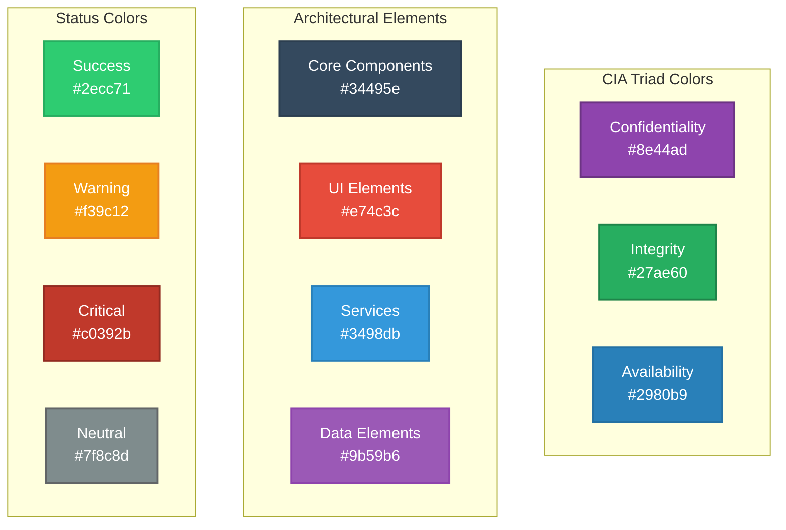
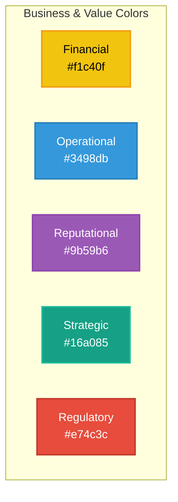
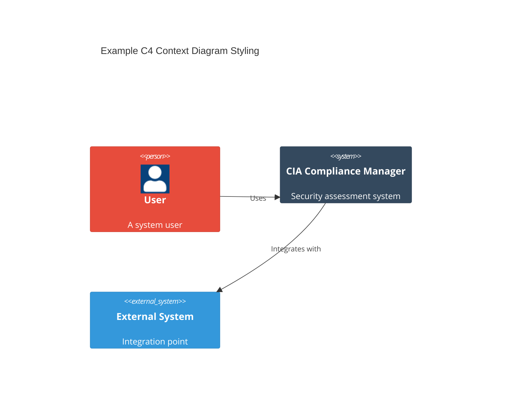
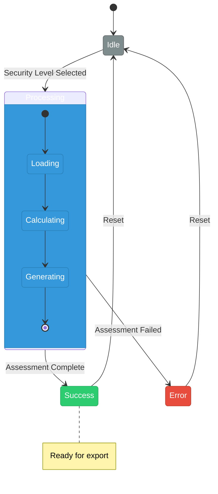
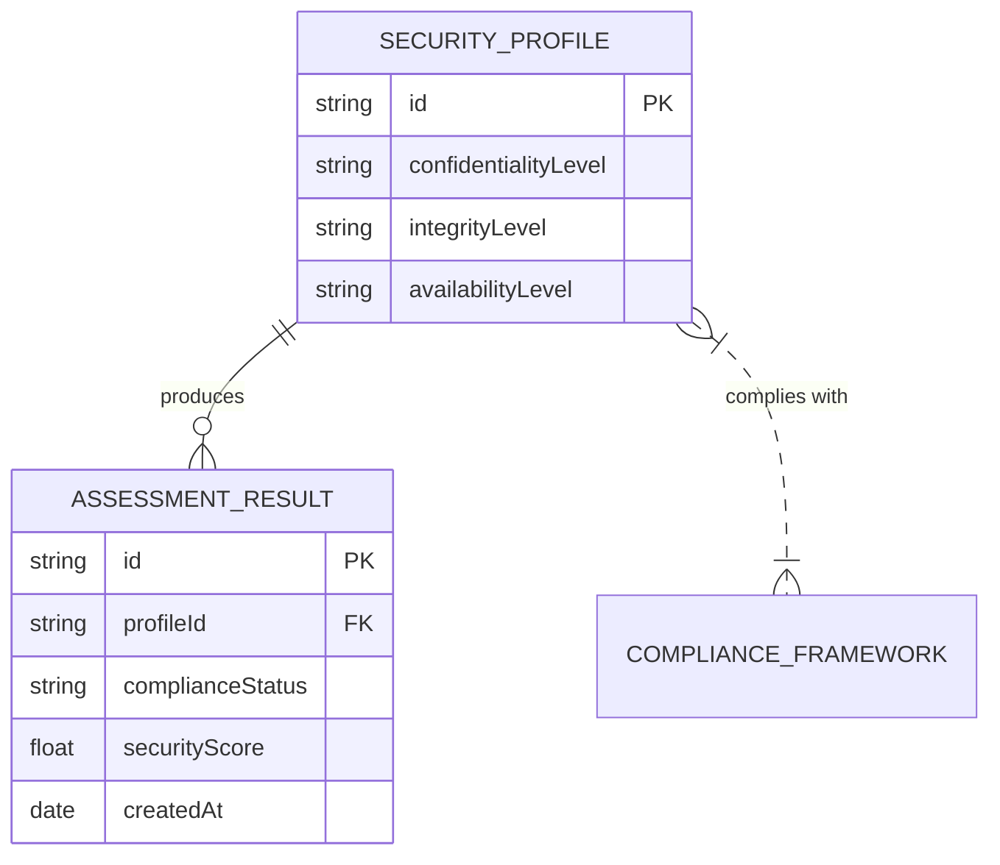

# 🎨 Architecture Documentation Style Guide

This style guide provides standards and best practices for creating consistent, readable, and visually appealing architecture documentation for the CIA Compliance Manager project.

## 📚 General Documentation Principles

- **Clear, concise language** - Use straightforward language and avoid unnecessary jargon
- **Progressive disclosure** - Start with high-level concepts before diving into details
- **Consistent terminology** - Use the same terms throughout all documentation
- **Visual + text** - Always complement diagrams with explanatory text
- **Audience awareness** - Consider both technical and non-technical readers

## 🎯 Document Structure

### Standard Document Sections

1. **Title** - Clear, descriptive title with emoji prefix
2. **Introduction** - Brief overview of the document's purpose (1-2 paragraphs)
3. **Related Documentation** - Table of related architecture documents
4. **Main Content** - Organized into logical sections with clear headers
5. **Visual Elements** - Diagrams, tables, and other visuals to support content
6. **Explanatory Text** - Context and explanation for each visual element
7. **Conclusion/Summary** - When appropriate for longer documents

### Header Hierarchy

- **Level 1 (#)** - Document title with emoji prefix
- **Level 2 (##)** - Major sections with emoji prefix
- **Level 3 (###)** - Subsections with optional emoji prefix
- **Level 4 (####)** - Minor subsections, typically without emoji

## 🎨 Visual Design Elements

### 🎭 Emoji Usage

Use consistent emoji prefixes for common section types:

| Section Type | Emoji | Example |
|--------------|-------|---------|
| Architecture | 🏛️ | 🏛️ System Architecture |
| Security | 🔒 | 🔒 Security Controls |
| Process | 🔄 | 🔄 Assessment Workflow |
| Data | 📊 | 📊 Data Model |
| Business | 💼 | 💼 Business Impact |
| Integration | 🔌 | 🔌 External Systems |
| Users | 👥 | 👥 User Roles |
| Technical | 🔧 | 🔧 Implementation Details |
| DevOps | 🚀 | 🚀 Deployment Process |
| Status | ✅ | ✅ Current Status |
| Risk | ⚠️ | ⚠️ Risk Analysis |
| Performance | ⚡ | ⚡ Performance Metrics |
| Compliance | 🔍 | 🔍 Compliance Mapping |
| Availability | ⏱️ | ⏱️ Availability Controls |
| Integrity | ✓ | ✓ Integrity Verification |
| Confidentiality | 🛡️ | 🛡️ Data Protection |
| Testing | 🧪 | 🧪 Test Strategy |
| Analytics | 📈 | 📈 Metrics & Monitoring |
| Design | 🎭 | 🎭 UI/UX Components |
| Documentation | 📝 | 📝 Documentation Structure |

### 🎨 Color Palette

Use this enhanced color palette for all diagrams:



#### Business & Value Colors



#### Color Usage Guide

| Component Type | Primary Color | Stroke Color | Use Case |
|----------------|---------------|-------------|----------|
| Confidentiality | #8e44ad (Purple) | #6c3483 | Confidentiality components, data protection |
| Integrity | #27ae60 (Green) | #1e8449 | Integrity components, validation |
| Availability | #2980b9 (Blue) | #2471a3 | Availability components, uptime |
| Architecture | #34495e (Dark Blue) | #2c3e50 | Core architectural elements |
| Services | #3498db (Light Blue) | #2980b9 | Service layer components |
| UI Components | #e74c3c (Red) | #c0392b | User interface elements |
| Business | #f1c40f (Yellow) | #f39c12 | Business impact, value creation |
| Utilities | #1abc9c (Teal) | #16a085 | Utility functions, helpers |

### 🖼️ Diagram Styles

#### C4 Diagrams

For C4 model diagrams, use these enhanced styling guidelines:



#### Flowcharts

For process flowcharts, use these enhanced styling guidelines:

```mermaid
flowchart TD
    A([Start Assessment]) --> B{Select<br>Security Level}
    B -->|Basic| C[Configure<br>Low Security]
    B -->|Enhanced| D[Configure<br>High Security]
    C --> E[Generate<br>Assessment]
    D --> E
    E --> F([Complete])

    classDef start fill:#3498db,stroke:#2980b9,stroke-width:2px,color:white,rx:25
    classDef process fill:#34495e,stroke:#2c3e50,stroke-width:2px,color:white
    classDef decision fill:#9b59b6,stroke:#8e44ad,stroke-width:2px,color:white
    classDef end fill:#2ecc71,stroke:#27ae60,stroke-width:2px,color:white,rx:25

    class A start
    class B decision
    class C,D process
    class E process
    class F end
```

#### State Diagrams

For state diagrams, use these enhanced styling guidelines:



#### Entity Relationship Diagrams

For data models, use these enhanced styling guidelines:



## 📝 Text Formatting

### Bold and Italic

- Use **bold** for emphasis on important concepts
- Use *italic* for introducing new terms
- Use ***bold italic*** sparingly for very high emphasis

### Code Formatting

- Use `inline code` for code references, file names, and technical identifiers
- Use code blocks with language specification for longer code samples

```typescript
// Example of a properly formatted code block
interface SecurityProfile {
  confidentiality: SecurityLevel;
  integrity: SecurityLevel;
  availability: SecurityLevel;
  getOverallScore(): number;
}
```

### Lists

- Use bulleted lists for unordered items
- Use numbered lists for sequential steps or prioritized items
- Maintain parallel structure in list items

### Tables

- Include headers for all tables
- Align column content appropriately (left for text, right for numbers)
- Use consistent formatting within tables

## 🌐 Cross-References

### Document References

When referencing other architecture documents:

- Use the exact document title
- Make the reference a hyperlink to the document
- Provide context for why you're referencing the document

Example: For more information on deployment processes, see the [CI/CD Workflows](WORKFLOWS.md) documentation.

### Diagram References

When referencing diagrams within or across documents:

- Refer to diagrams by their exact titles
- Specify the document if referencing a diagram in another document
- Briefly explain the diagram's relevance

## 📊 Diagram Best Practices

### General Diagram Guidelines

1. **Keep diagrams focused** on a single concept or relationship set
2. **Provide clear titles** that explain the diagram's purpose
3. **Include legends** when using multiple colors, shapes, or line styles
4. **Add contextual information** in the surrounding text
5. **Balance detail level** – show enough detail to be useful without overwhelming
6. **Use consistent orientation** (typically top-to-bottom or left-to-right)
7. **Group related elements** visually
8. **Highlight critical paths** or elements

### Diagram-Specific Guidelines

#### C4 Model Diagrams

- Follow the standard C4 model hierarchy (Context → Container → Component → Code)
- Clearly indicate system boundaries
- Show external dependencies and integrations
- Use consistent shapes for system types

#### Process Flowcharts

- Start with a clear beginning and end
- Use standard flowchart symbols consistently
- Label decision points with questions
- Show all possible paths
- Use color to indicate process types or outcomes

#### State Diagrams

- Label all transitions between states
- Use substates for complex state logic
- Indicate the initial and final states clearly
- Group related states visually

## 📏 Style Enforcement

To ensure consistency across all architecture documentation:

1. **Documentation reviews** should check for style compliance
2. **Templates and examples** are provided for common document types
3. **Automation tools** can be used to check for basic style issues
4. **Diagram reviews** should focus on clarity, consistency, and compliance with style guide

By following these style guidelines, we ensure that all architecture documentation for the CIA Compliance Manager is consistent, readable, and visually appealing, making it more accessible and useful for all stakeholders.
