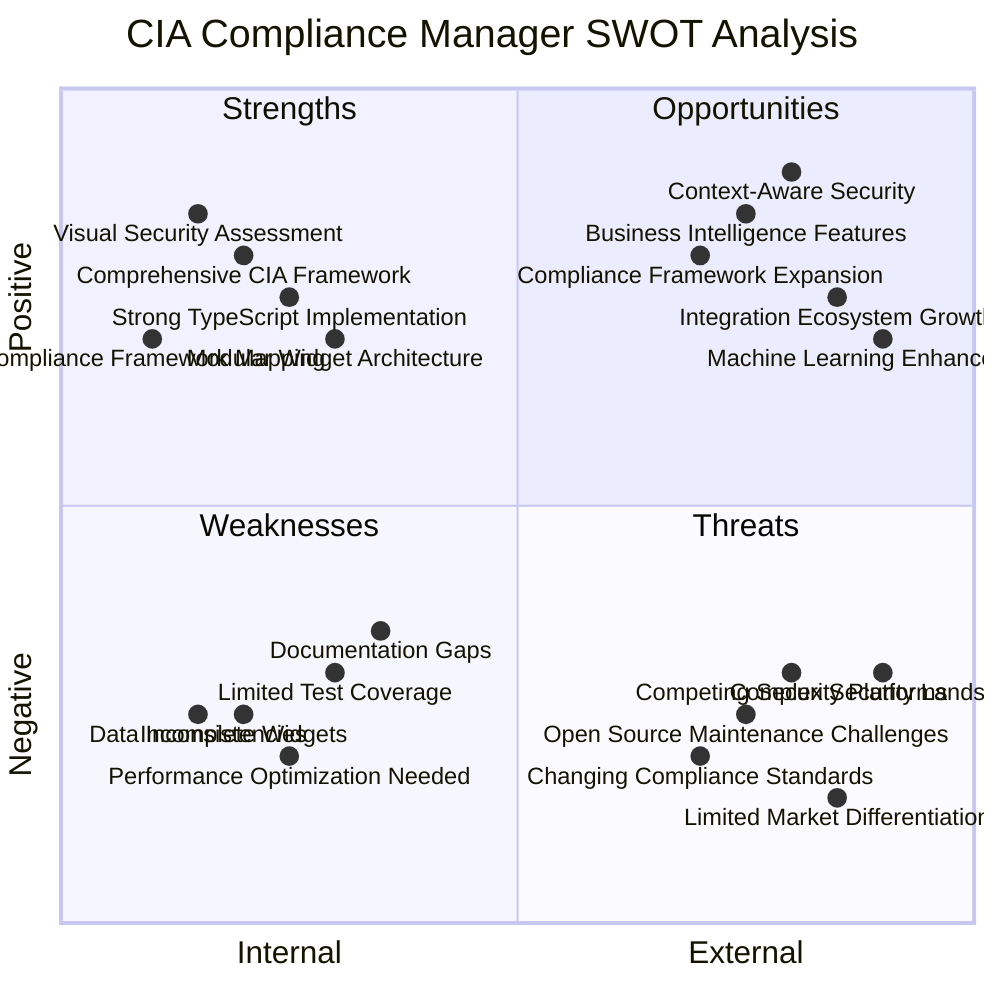
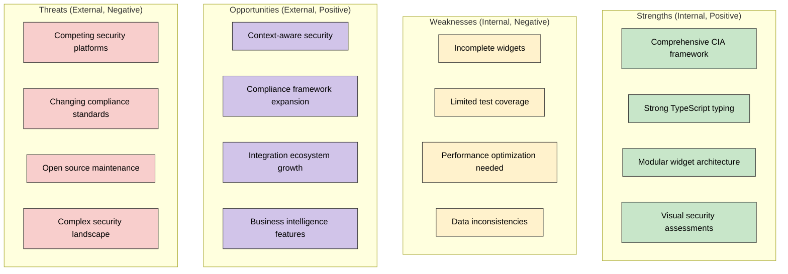
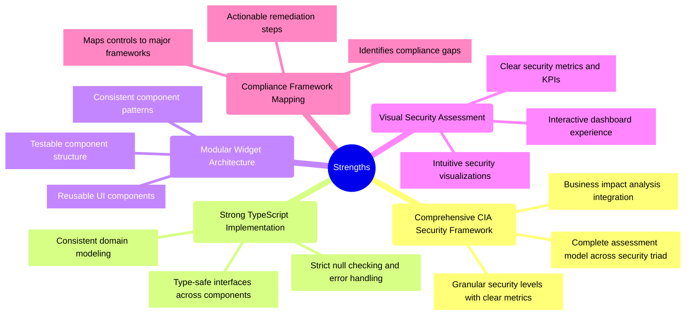
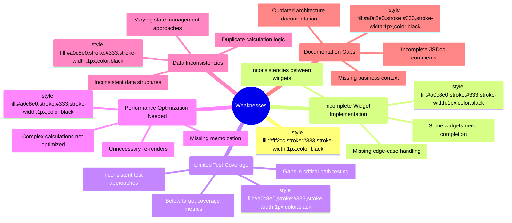
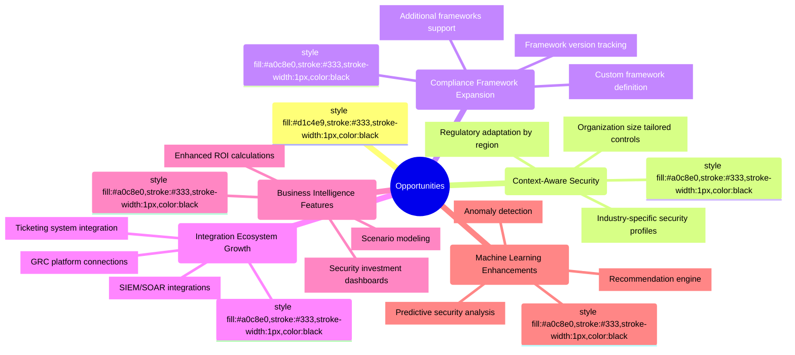
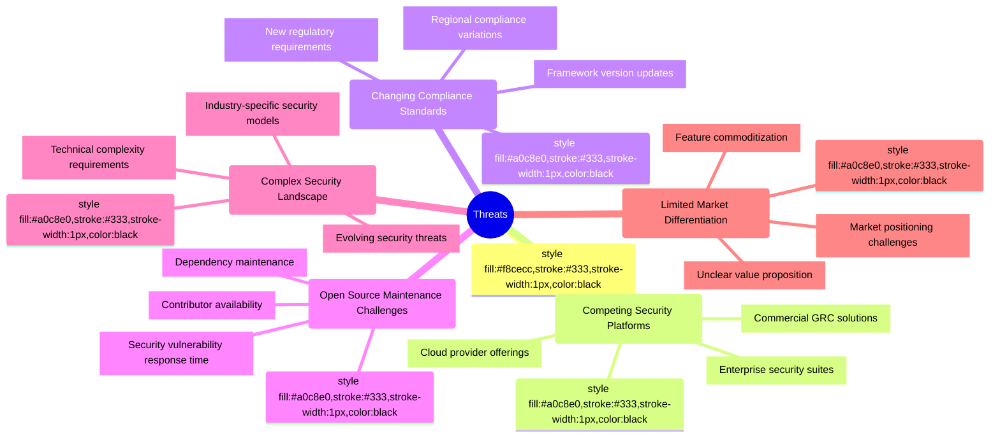

# CIA Compliance Manager SWOT Analysis

This document provides a strategic analysis of the CIA Compliance Manager's current strengths, weaknesses, opportunities, and threats as of version 0.8.4. This analysis helps inform the roadmap toward the v1.0 release and beyond.

## 📚 Related Architecture Documentation

| Document                                            | Focus           | Description                               |
| --------------------------------------------------- | --------------- | ----------------------------------------- |
| **[Current Architecture](ARCHITECTURE.md)**         | 🏛️ Architecture | C4 model showing current system structure |
| **[Future Architecture](FUTURE_ARCHITECTURE.md)**   | 🏛️ Architecture | Vision for context-aware platform         |
| **[State Diagrams](STATEDIAGRAM.md)**               | 🔄 Behavior     | Current system state transitions          |
| **[Future State Diagrams](FUTURE_STATEDIAGRAM.md)** | 🔄 Behavior     | Enhanced adaptive state transitions       |
| **[Process Flowcharts](FLOWCHART.md)**              | 🔄 Process      | Current security workflows                |
| **[Future Flowcharts](FUTURE_FLOWCHART.md)**        | 🔄 Process      | Enhanced context-aware workflows          |
| **[Mindmaps](MINDMAP.md)**                          | 🧠 Concept      | Current system component relationships    |
| **[Future Mindmaps](FUTURE_MINDMAP.md)**            | 🧠 Concept      | Future capability evolution               |
| **[Future SWOT Analysis](FUTURE_SWOT.md)**          | 💼 Business     | Future strategic opportunities            |
| **[CI/CD Workflows](WORKFLOWS.md)**                 | 🔧 DevOps       | Current automation processes              |
| **[Future Workflows](FUTURE_WORKFLOWS.md)**         | 🔧 DevOps       | Enhanced CI/CD with ML                    |
| **[Future Data Model](FUTURE_DATA_MODEL.md)**       | 📊 Data         | Context-aware data architecture           |

## SWOT Overview

### Traditional SWOT Quadrant Chart

**Strategic Focus:** This quadrant chart provides a visual representation of the CIA Compliance Manager's strengths, weaknesses, opportunities, and threats arranged by their internal/external nature and positive/negative impact.

### Alternative Network Visualization

<!-- Quadrant charts are not well supported in GitHub Markdown, so providing an alternative mermaid diagram -->

## Strengths

### Current Strengths Analysis

The CIA Compliance Manager has established several key strengths that provide a solid foundation for the v1.0 release:

1. **Comprehensive CIA Security Framework**: The application fully implements the Confidentiality, Integrity, and Availability security triad with well-defined security levels and metrics for each component. This provides a thorough approach to security assessment that covers all critical domains.

2. **Strong TypeScript Implementation**: The codebase leverages TypeScript's type system effectively with strict typing, interfaces, and proper error handling. This reduces bugs and improves maintainability.

3. **Modular Widget Architecture**: The application uses a consistent widget-based dashboard architecture that promotes reusability and separation of concerns. Components follow standard patterns and are designed for testability.

4. **Visual Security Assessment**: The application provides intuitive visualizations of security levels and impacts, making complex security concepts more accessible to users through interactive dashboards.

5. **Compliance Framework Mapping**: The system successfully maps security controls to major compliance frameworks like NIST, ISO, GDPR, HIPAA, and SOC2, helping organizations understand their compliance posture.

## Weaknesses

### Current Weaknesses Analysis

As the project approaches v1.0, several weaknesses must be addressed:

1. **Incomplete Widget Implementation**: Several widgets need completion before v1.0 release. Some components lack proper error handling for edge cases and have inconsistencies in behavior and styling across the application.

2. **Limited Test Coverage**: Current test coverage falls below the target metrics, with inconsistent testing approaches and gaps in critical path coverage. This poses a risk for stability and increases the potential for regressions.

3. **Performance Optimization Needed**: Performance issues include unnecessary re-renders, missing memoization for complex calculations, and potential bottlenecks in data processing. These issues may impact user experience, especially with larger datasets.

4. **Data Inconsistencies**: There are inconsistencies in data structures across components, duplicate calculation logic with potential divergence, and varying approaches to state management that could lead to bugs and maintenance challenges.

5. **Documentation Gaps**: Missing or incomplete documentation in key areas including JSDoc comments on public APIs, business context explanations, and outdated architecture documentation.

## Opportunities

### Future Opportunities Analysis

Looking beyond v1.0, several opportunities exist for growth and expansion:

1. **Context-Aware Security**: Enhancing the platform with industry-specific security profiles, regulatory adaptation by region, and organization size-tailored controls would provide significant value to diverse users.

2. **Compliance Framework Expansion**: Supporting additional compliance frameworks, tracking framework versions as they evolve, and enabling custom framework definitions would broaden the application's utility across industries.

3. **Integration Ecosystem Growth**: Building integration capabilities with SIEM/SOAR solutions, GRC platforms, and ticketing systems would improve workflow efficiency and adoption within enterprise environments.

4. **Business Intelligence Features**: Enhancing ROI calculations, developing security investment dashboards, and enabling scenario modeling would help justify security investments to business stakeholders.

5. **Machine Learning Enhancements**: Implementing recommendation engines, anomaly detection, and predictive security analysis would provide additional value through smart automation and insights.

## Threats

### Current Threats Analysis

Several external threats could impact the project's success:

1. **Competing Security Platforms**: Commercial GRC solutions, enterprise security suites, and cloud provider security offerings present alternatives that may have more features or integration capabilities.

2. **Changing Compliance Standards**: Keeping pace with evolving framework versions, new regulatory requirements, and regional compliance variations requires ongoing maintenance and updates.

3. **Open Source Maintenance Challenges**: The project faces typical open-source challenges including contributor availability, dependency maintenance, and timely response to security vulnerabilities.

4. **Complex Security Landscape**: Evolving security threats, industry-specific security models, and increasing technical complexity make it challenging to provide comprehensive security assessment.

5. **Limited Market Differentiation**: Without clear differentiation, the project faces threats from feature commoditization, unclear value proposition, and positioning challenges in the security tool market.

## Strategic Recommendations for v1.0 Release

Based on this SWOT analysis, the following strategic priorities are recommended to successfully reach the v1.0 release:

1. **Complete Existing Widgets**: Focus on completing all existing widgets with proper error handling, consistent behavior, and thorough testing to address the primary weakness.

2. **Increase Test Coverage**: Implement additional tests for critical paths and edge cases to improve stability and reduce regression risks.

3. **Optimize Performance**: Address performance issues by adding proper memoization, reducing re-renders, and optimizing complex calculations.

4. **Standardize Data Structures**: Eliminate data inconsistencies by standardizing data structures and centralizing calculation logic.

5. **Improve Documentation**: Complete JSDoc comments, add business context documentation, and update architecture documentation to reflect the current state.

## Post-v1.0 Strategic Direction

After achieving v1.0 stability, these opportunities can be explored:

1. **Context-Aware Security**: Develop industry-specific security profiles and organization size adaptations.

2. **Integration Capabilities**: Build integration points with security and GRC platforms.

3. **Business Intelligence**: Enhance ROI and business impact calculations to improve decision support.

4. **Framework Expansion**: Add support for additional compliance frameworks and regional variations.

5. **Machine Learning Features**: Implement recommendation engines and anomaly detection to add intelligence.

The color scheme used in these diagrams follows the cool color palette established in other architectural documentation, with:

- **Strengths** (Green - #c8e6c9): Represents positive internal factors
- **Weaknesses** (Yellow - #fff2cc): Represents negative internal factors
- **Opportunities** (Purple - #d1c4e9): Represents positive external factors
- **Threats** (Red - #f8cecc): Represents negative external factors
- **Detail Categories** (Blue - #a0c8e0): Used for specific items within each category

