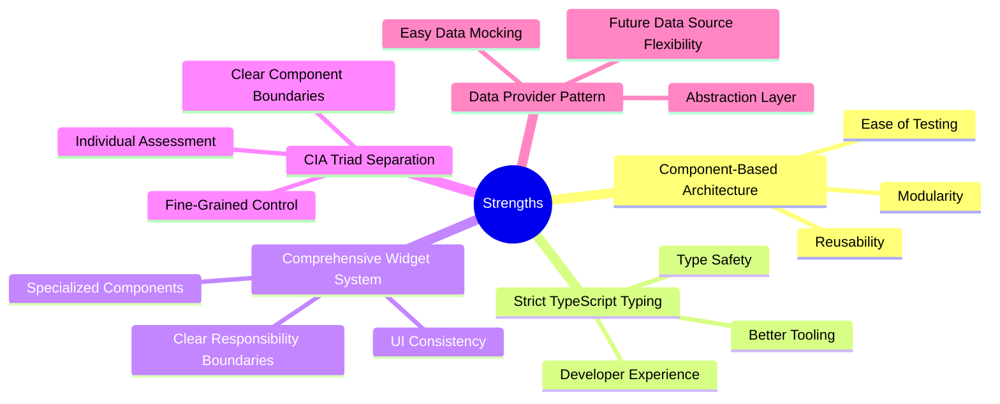
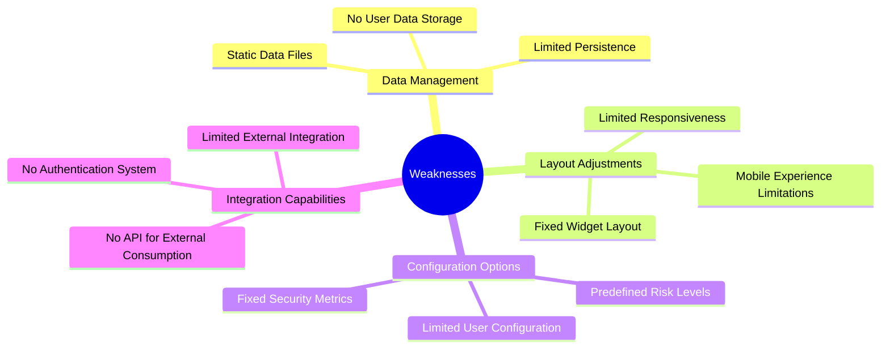
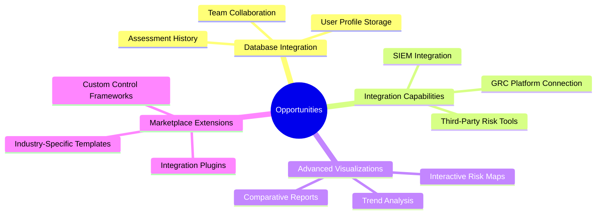
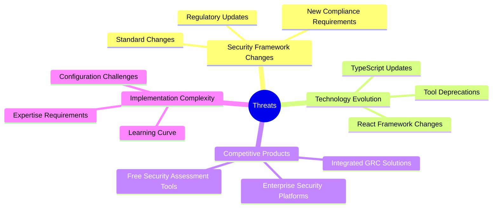

# 📊 CIA Compliance Manager SWOT Analysis

## 📚 Related Documentation

| Document                                          | Focus           | Description                               |
| ------------------------------------------------- | --------------- | ----------------------------------------- |
| **[System Architecture](SYSTEM_ARCHITECTURE.md)** | 🏛️ System       | Layered architecture and component details |
| **[Architecture](ARCHITECTURE.md)**               | 🏗️ C4 Model     | C4 model showing system structure          |
| **[Process Flows](FLOWCHART.md)**                 | 🔄 Process      | Security assessment workflows             |

## Strategic Analysis Overview

This SWOT analysis evaluates the current architecture of the CIA Compliance Manager from business, architectural, and security perspectives.

## Strengths 💪

### Key Architecture Strengths

1. **Modular Widget Architecture**
   - Clear separation of concerns between widgets
   - Widgets can be independently developed and tested
   - Flexible UI composition for different use cases

2. **Centralized Security Level Control**
   - Security Level Widget acts as central configuration point
   - Changes propagate consistently to all dependent widgets
   - Provides clear security level visualization

3. **Service-Based Design**
   - Business logic encapsulated in service classes
   - Services accessed through custom React hooks
   - Clear API boundaries between layers

4. **Robust Type System**
   - Comprehensive TypeScript interfaces and types
   - Type guards for runtime safety
   - Utility types for code reuse

5. **Comprehensive Test Coverage**
   - Vitest for unit and component testing
   - Consistent mocking approach
   - Test IDs for reliable UI testing

## Weaknesses 🔍

### Current Architectural Limitations

1. **Data Persistence**
   - Current implementation uses static data files
   - No database integration for saving user configurations
   - Limited history tracking for security assessments

2. **Performance Considerations**
   - Some calculations may be redundant across components
   - Re-renders might occur when security levels change
   - Limited memoization in some components

3. **Mobile Responsiveness**
   - Some widgets may not render optimally on small screens
   - Complex visualizations need better mobile adaptations
   - Touch interactions not fully optimized

4. **Documentation Gaps**
   - Some utility functions lack comprehensive documentation
   - Runtime behavior documentation could be improved
   - Missing component interaction diagrams for some areas

## Opportunities 🚀

### Potential Enhancements

1. **Data Persistence Layer**
   - Add database integration for saving assessments
   - Implement user profiles and organizations
   - Enable sharing and collaboration features

2. **API Development**
   - Create public API for external integrations
   - Develop webhooks for event notifications
   - Enable data import/export capabilities

3. **Advanced Features**
   - Implement customizable frameworks and controls
   - Develop comparison and trending features
   - Add scenario planning capabilities

4. **Ecosystem Development**
   - Create plugin architecture for extensions
   - Develop a marketplace for security templates
   - Support for industry-specific compliance modules

## Threats ⚠️

### Risk Factors

1. **Technical Debt**
   - Type definitions may need updates as features evolve
   - Widget complexity might increase over time
   - Maintainability challenges with growing codebase

2. **Integration Challenges**
   - Future database integration might require refactoring
   - External API integration could increase complexity
   - Authentication and authorization implementation

3. **Security Framework Evolution**
   - Regulatory and compliance frameworks change over time
   - New security controls and best practices emerge
   - Difficulty keeping security metrics current

4. **User Adoption Barriers**
   - Learning curve for security concepts
   - Setup complexity for first-time users
   - Configuration overhead for specific industries

## Architectural Recommendations

Based on this SWOT analysis, the following architectural recommendations are proposed:

1. **Short-term Improvements**
   - Implement caching mechanisms for performance optimization
   - Enhance mobile responsiveness for key widgets
   - Improve test coverage for critical components

2. **Medium-term Initiatives**
   - Develop data persistence layer for saving assessments
   - Create a public API for external integrations
   - Implement user authentication and profiles

3. **Long-term Vision**
   - Develop a plugin architecture for extensions
   - Create a collaborative assessment platform
   - Build advanced analytics and reporting features