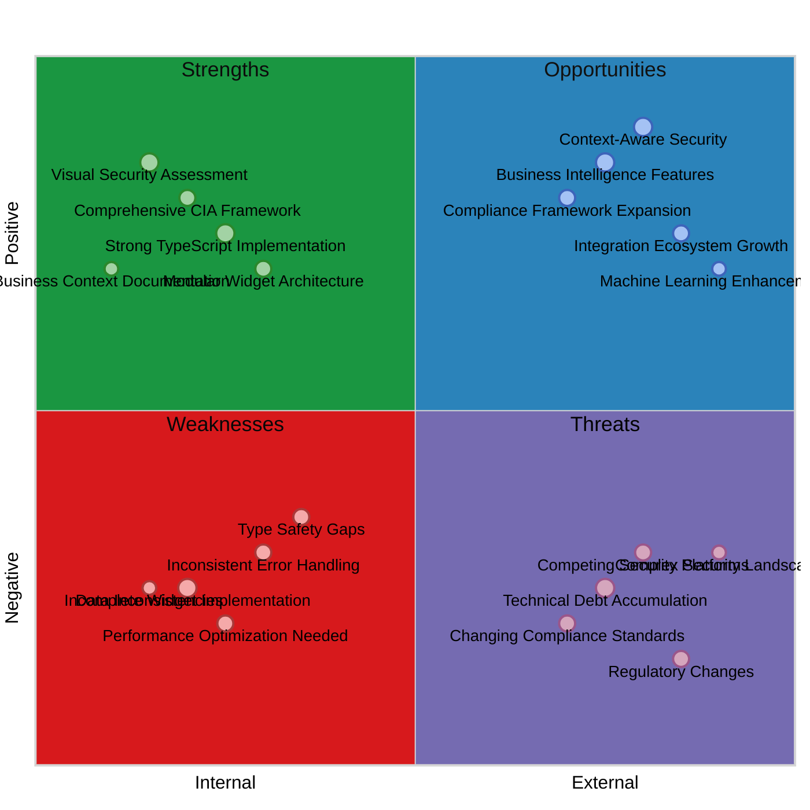
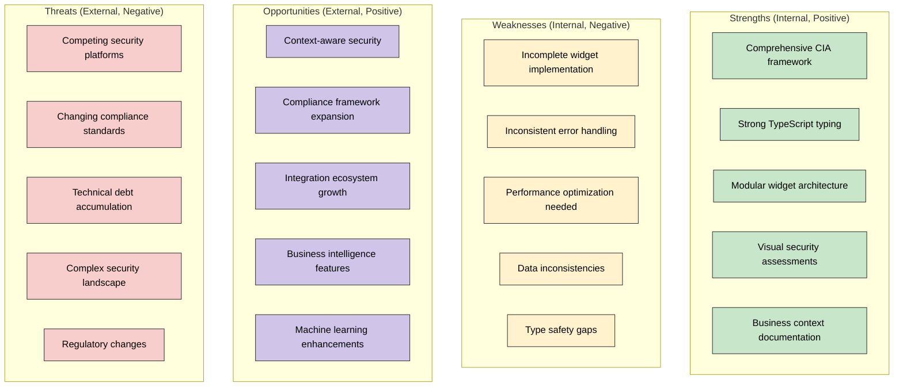
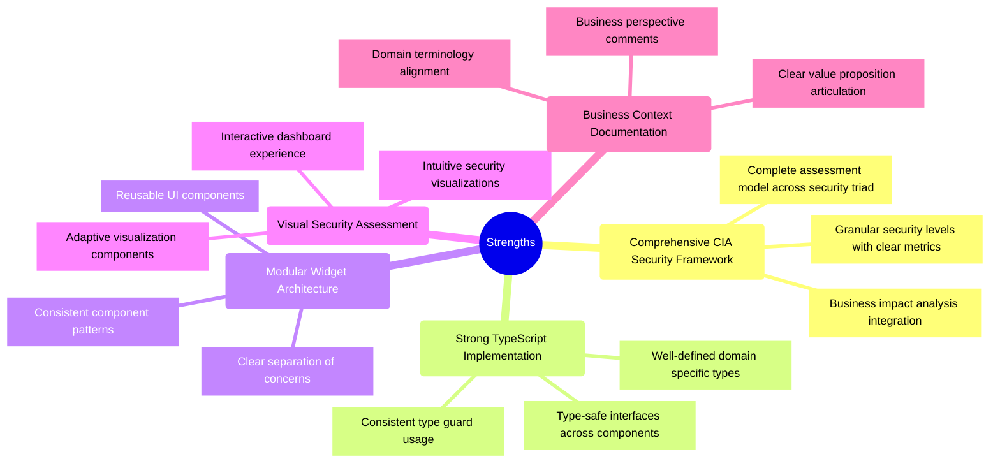
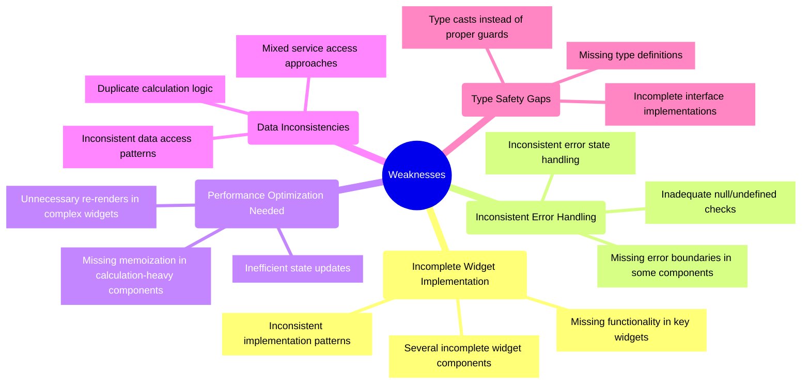
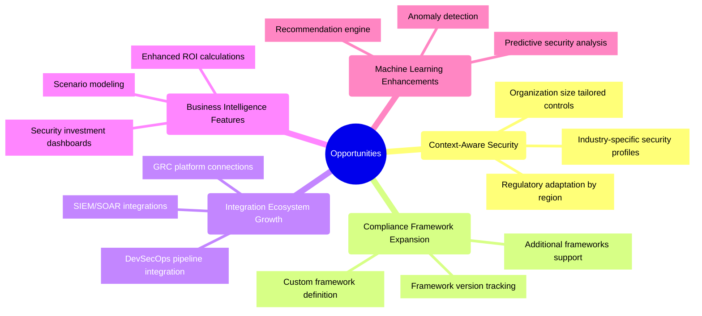
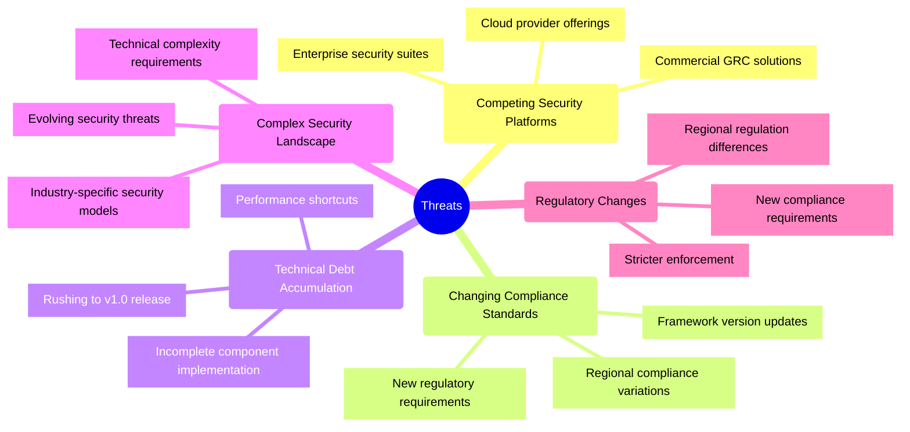

# CIA Compliance Manager SWOT Analysis

This document provides a strategic analysis of the CIA Compliance Manager's current strengths, weaknesses, opportunities, and threats as of version 0.8.5. This analysis helps inform the roadmap toward the v1.0 release and beyond.

## 📚 Related Architecture Documentation

| Document                                            | Focus           | Description                               |
| --------------------------------------------------- | --------------- | ----------------------------------------- |
| **[Current Architecture](ARCHITECTURE.md)**         | 🏛️ Architecture | C4 model showing current system structure |
| **[Future Architecture](FUTURE_ARCHITECTURE.md)**   | 🏛️ Architecture | Vision for context-aware platform         |
| **[State Diagrams](STATEDIAGRAM.md)**               | 🔄 Behavior     | Current system state transitions          |
| **[Future State Diagrams](FUTURE_STATEDIAGRAM.md)** | 🔄 Behavior     | Enhanced adaptive state transitions       |
| **[Process Flowcharts](FLOWCHART.md)**              | 🔄 Process      | Current security workflows                |
| **[Future Flowcharts](FUTURE_FLOWCHART.md)**        | 🔄 Process      | Enhanced context-aware workflows          |
| **[Mindmaps](MINDMAP.md)**                          | 🧠 Concept      | Current system component relationships    |
| **[Future Mindmaps](FUTURE_MINDMAP.md)**            | 🧠 Concept      | Future capability evolution               |
| **[Future SWOT Analysis](FUTURE_SWOT.md)**          | 💼 Business     | Future strategic opportunities            |
| **[CI/CD Workflows](WORKFLOWS.md)**                 | 🔧 DevOps       | Current automation processes              |
| **[Future Workflows](FUTURE_WORKFLOWS.md)**         | 🔧 DevOps       | Enhanced CI/CD with ML                    |
| **[Future Data Model](FUTURE_DATA_MODEL.md)**       | 📊 Data         | Context-aware data architecture           |

## SWOT Overview

### Traditional SWOT Quadrant Chart

**Strategic Focus:** This quadrant chart provides a visual representation of the CIA Compliance Manager's strengths, weaknesses, opportunities, and threats arranged by their internal/external nature and positive/negative impact.

### Alternative Network Visualization

<!-- Quadrant charts are not well supported in GitHub Markdown, so providing an alternative mermaid diagram -->

## Strengths

### Current Strengths Analysis

The CIA Compliance Manager has established several key strengths that provide a solid foundation for the v1.0 release:

1. **Comprehensive CIA Security Framework**: The application fully implements the Confidentiality, Integrity, and Availability security triad with well-defined security levels and metrics for each component, providing a thorough approach to security assessment.

2. **Strong TypeScript Implementation**: The codebase demonstrates excellent use of TypeScript with strict typing, comprehensive interfaces, and appropriate type guards for domain-specific concepts like `SecurityLevel` and `CIAComponentType`.

3. **Modular Widget Architecture**: The application employs a consistent widget-based dashboard architecture with well-defined component hierarchies, clear separation of concerns, and reusable UI patterns that enhance maintainability.

4. **Visual Security Assessment**: The application provides intuitive visualizations of security levels and impacts through components like `SecurityVisualizationWidget` and `SecurityRiskScore`, making complex security concepts accessible.

5. **Business Context Documentation**: Components and services include "Business Perspective" documentation sections that explain their business value and purpose, helping engineers understand how technical implementations support business needs.

## Weaknesses

### Current Weaknesses Analysis

As the project approaches v1.0, several weaknesses must be addressed:

1. **Incomplete Widget Implementation**: Multiple widgets have unfinished implementations or missing functionality, such as `TechnicalDetailsWidget`, `ConfidentialityImpactWidget`, and others that have incomplete rendering logic or placeholder returns.

2. **Inconsistent Error Handling**: Error handling varies significantly across components with some using error boundaries (`SecurityResourcesWidget`), while others lack proper null checks or fallback UI for data loading states.

3. **Performance Optimization Needed**: Several components lack proper memoization for expensive calculations, have unnecessary re-renders, or implement inefficient state transformations that could impact performance with larger datasets.

4. **Data Inconsistencies**: The application shows inconsistent data access patterns with some components using direct imports while others use hooks for the same data, and mixed approaches to service consumption.

5. **Type Safety Gaps**: Despite good overall TypeScript usage, there are areas with type safety issues including components that cast types with `as` instead of using proper type guards, and incomplete interface implementations.

## Opportunities

### Future Opportunities Analysis

Looking beyond v1.0, several opportunities exist for growth and expansion:

1. **Context-Aware Security**: Enhancing the platform with industry-specific security profiles, regulatory adaptation by region, and organization size-tailored controls would provide significant value to diverse users.

2. **Compliance Framework Expansion**: Supporting additional compliance frameworks, tracking framework versions as they evolve, and enabling custom framework definitions would broaden the application's utility across industries.

3. **Integration Ecosystem Growth**: Building integration capabilities with SIEM/SOAR solutions, GRC platforms, and DevSecOps pipelines would improve workflow efficiency and adoption within enterprise environments.

4. **Business Intelligence Features**: Enhancing ROI calculations, developing security investment dashboards, and enabling scenario modeling would help justify security investments to business stakeholders.

5. **Machine Learning Enhancements**: Implementing recommendation engines, anomaly detection, and predictive security analysis would provide additional value through smart automation and insights.

## Threats

### Current Threats Analysis

Several external threats could impact the project's success:

1. **Competing Security Platforms**: Commercial GRC solutions, enterprise security suites, and cloud provider security offerings present alternatives that may have more features or integration capabilities.

2. **Changing Compliance Standards**: Keeping pace with evolving framework versions, new regulatory requirements, and regional compliance variations requires ongoing maintenance and updates.

3. **Technical Debt Accumulation**: Rushing to v1.0 without properly addressing current weaknesses could lead to mounting technical debt, making future enhancements more difficult and costly.

4. **Complex Security Landscape**: Evolving security threats, industry-specific security models, and increasing technical complexity make it challenging to provide comprehensive security assessment.

5. **Regulatory Changes**: Shifting compliance landscapes may require frequent updates to compliance mappings, potentially causing gaps in coverage if not addressed promptly.

## Path to v1.0 - Critical Focus Areas

Based on the SWOT analysis and code examination, the following areas require immediate attention before v1.0:

1. **Complete Existing Widget Implementation**:
   - Finish implementation of all widgets, especially Technical Details and Impact widgets
   - Ensure consistent behavior across all security levels
   - Add proper error states and loading indicators 

2. **Improve Error Handling and Edge Cases**:
   - Implement consistent error boundary usage
   - Add proper null/undefined checks
   - Create meaningful error states and recovery mechanisms

3. **Enhance Type Safety**:
   - Replace type casting with proper type guards
   - Ensure consistent interface implementation
   - Add missing type definitions

4. **Optimize Performance**:
   - Add proper memoization to calculation-heavy components
   - Optimize rendering performance 
   - Ensure consistent dependencies in hooks

5. **Standardize Data Access**:
   - Establish consistent patterns for data fetching and access
   - Create unified approach to service consumption
   - Implement proper data validation

## Post-v1.0 Strategic Direction

After achieving v1.0 stability, these opportunities can be explored:

1. **Context-Aware Security**: Develop industry-specific security profiles and organization size adaptations.

2. **Integration Capabilities**: Build integration points with security and GRC platforms.

3. **Business Intelligence**: Enhance ROI and business impact calculations to improve decision support.

4. **Framework Expansion**: Add support for additional compliance frameworks and regional variations.

5. **Machine Learning Features**: Implement recommendation engines and anomaly detection to add intelligence.

The color scheme used in these diagrams follows the cool color palette established in other architectural documentation, with:

- **Strengths** (Green - #c8e6c9): Represents positive internal factors
- **Weaknesses** (Yellow - #fff2cc): Represents negative internal factors
- **Opportunities** (Purple - #d1c4e9): Represents positive external factors
- **Threats** (Red - #f8cecc): Represents negative external factors
- **Detail Categories** (Blue - #a0c8e0): Used for specific items within each category

