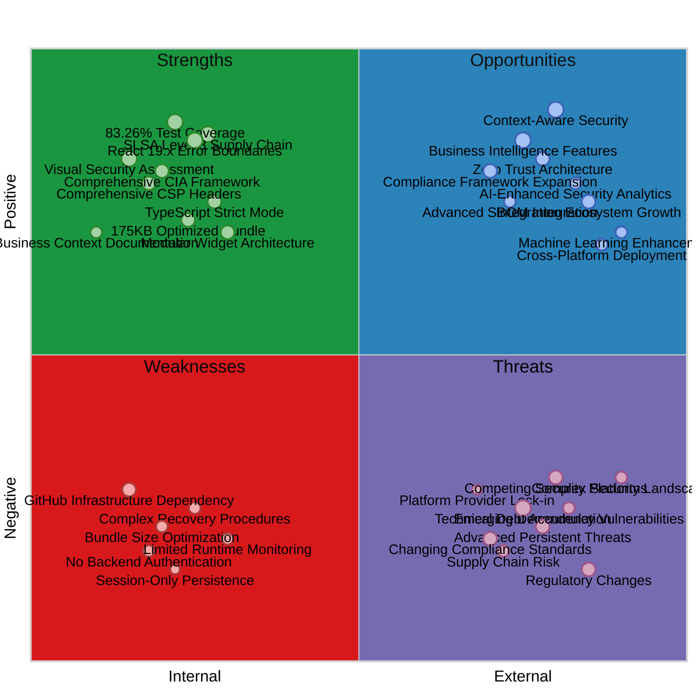
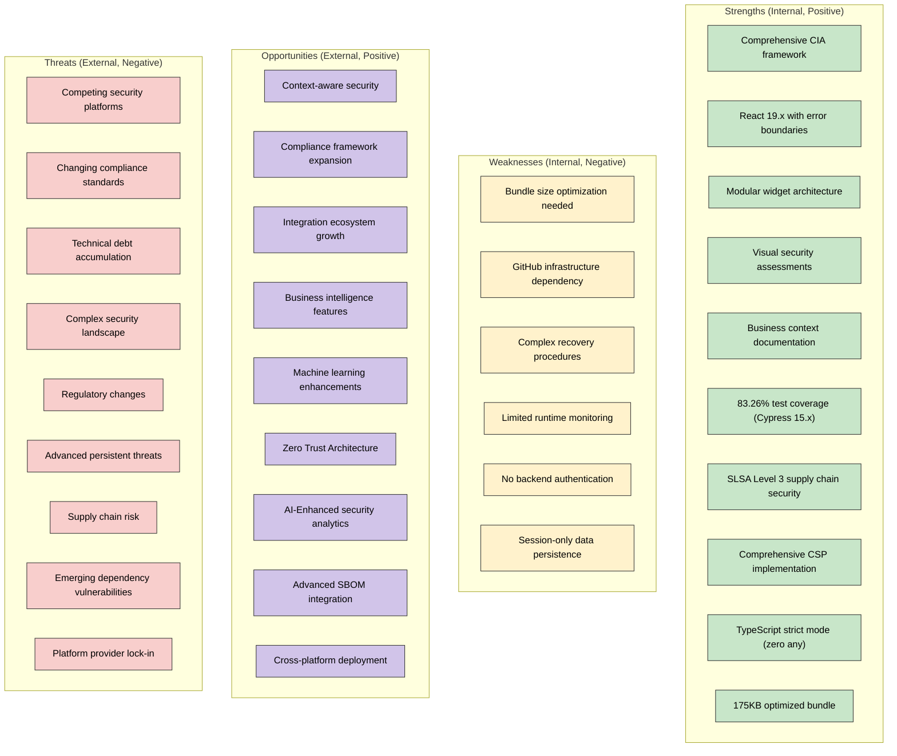
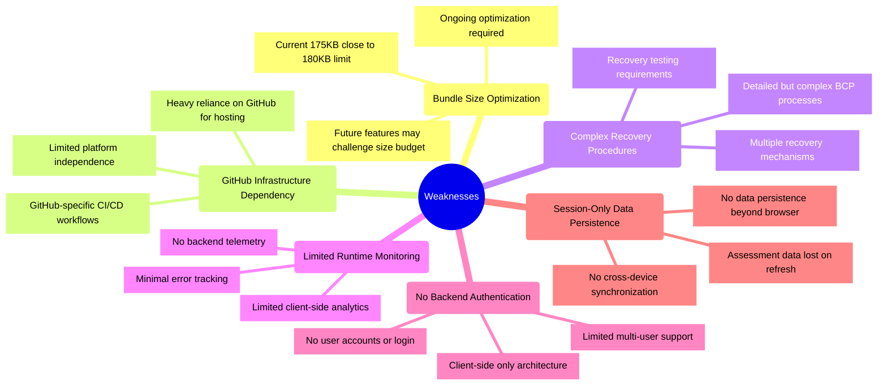
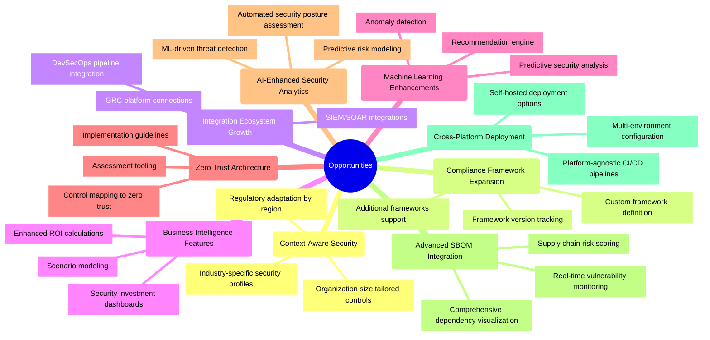
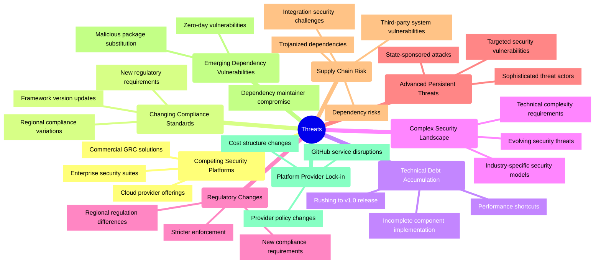
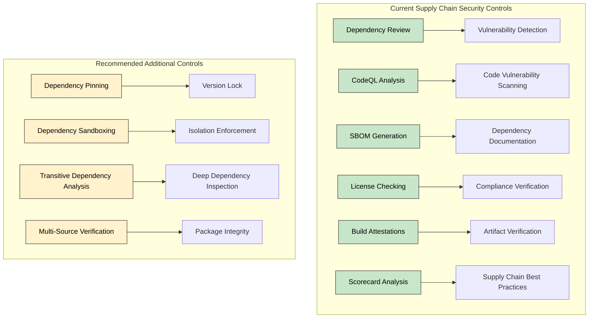

# 📊 CIA Compliance Manager SWOT Analysis (v1.0)

This document provides a strategic analysis of the CIA Compliance Manager's strengths, weaknesses, opportunities, and threats as of version 1.0 (November 2025). This analysis reflects the achievement of v1.0 milestones and informs future strategic direction.

## 📚 Related Architecture Documentation

<div class="documentation-map">

| Document                                            | Focus           | Description                               |
| --------------------------------------------------- | --------------- | ----------------------------------------- |
| **[Current Architecture](ARCHITECTURE.md)**         | 🏛️ Architecture | C4 model showing current system structure |
| **[Future Architecture](FUTURE_ARCHITECTURE.md)**   | 🏛️ Architecture | Vision for context-aware platform         |
| **[State Diagrams](STATEDIAGRAM.md)**               | 🔄 Behavior     | Current system state transitions          |
| **[Future State Diagrams](FUTURE_STATEDIAGRAM.md)** | 🔄 Behavior     | Enhanced adaptive state transitions       |
| **[Process Flowcharts](FLOWCHART.md)**              | 🔄 Process      | Current security workflows                |
| **[Future Flowcharts](FUTURE_FLOWCHART.md)**        | 🔄 Process      | Enhanced context-aware workflows          |
| **[Mindmaps](MINDMAP.md)**                          | 🧠 Concept      | Current system component relationships    |
| **[Future Mindmaps](FUTURE_MINDMAP.md)**            | 🧠 Concept      | Future capability evolution               |
| **[Future SWOT Analysis](FUTURE_SWOT.md)**          | 💼 Business     | Future strategic opportunities            |
| **[CI/CD Workflows](WORKFLOWS.md)**                 | 🔧 DevOps       | Current automation processes              |
| **[Future Workflows](FUTURE_WORKFLOWS.md)**         | 🔧 DevOps       | Enhanced CI/CD with ML                    |
| **[Future Data Model](FUTURE_DATA_MODEL.md)**       | 📊 Data         | Context-aware data architecture           |

</div>

## SWOT Overview

### Traditional SWOT Quadrant Chart

**Strategic Focus:** This quadrant chart provides a visual representation of the CIA Compliance Manager's strengths, weaknesses, opportunities, and threats arranged by their internal/external nature and positive/negative impact.



### Alternative Network Visualization

<!-- Quadrant charts are not well supported in GitHub Markdown, so providing an alternative mermaid diagram -->



## Strengths

```mermaid
mindmap
  root((Strengths))
    id1(Comprehensive CIA Security Framework)
      id1.1[Complete assessment model across security triad]
      id1.2[Granular security levels with clear metrics]
      id1.3[Business impact analysis integration]
    id2(React 19.x with Error Boundaries)
      id2.1[Component isolation and graceful degradation]
      id2.2[Concurrent rendering security benefits]
      id2.3[Automatic batching for state consistency]
    id3(Modular Widget Architecture)
      id3.1[Reusable UI components]
      id3.2[Consistent component patterns]
      id3.3[Clear separation of concerns]
    id4(Visual Security Assessment)
      id4.1[Intuitive security visualizations]
      id4.2[Interactive dashboard experience]
      id4.3[Adaptive visualization components]
    id5(Business Context Documentation)
      id5.1[Business perspective comments]
      id5.2[Clear value proposition articulation]
      id5.3[Domain terminology alignment]
    id6(83.26% Test Coverage with Cypress 15.x)
      id6.1[Component and E2E testing]
      id6.2[Visual regression testing]
      id6.3[Exceeds 80% target (+3.26%)]
    id7(SLSA Level 3 Supply Chain Security)
      id7.1[Build provenance attestation]
      id7.2[SBOM generation and verification]
      id7.3[SHA-pinned actions for immutability]
    id8(Comprehensive CSP Implementation)
      id8.1[10+ security directives]
      id8.2[Multi-layer XSS protection]
      id8.3[Frame-ancestors 'none' clickjacking defense]
    id9(TypeScript Strict Mode)
      id9.1[Zero any types throughout codebase]
      id9.2[Complete null safety with strict checks]
      id9.3[Compile-time vulnerability detection]
    id10(175KB Optimized Bundle)
      id10.1[Tree-shaking and dead code elimination]
      id10.2[Efficient code splitting]
      id10.3[Meets <180KB target (-5KB)]
```
      id7.2[Automated security scanning]
      id7.3[Deployment automation]
    id8(Supply Chain Security Controls)
      id8.1[Dependency vulnerability scanning]
      id8.2[SBOM generation and attestations] 
      id8.3[License compliance automation]
    id9(Business Continuity Planning)
      id9.1[Comprehensive disaster recovery]
      id9.2[GitHub-specific resilience strategies]
      id9.3[Recovery time and point objectives]
```

### Current Strengths Analysis

The CIA Compliance Manager v1.0 has achieved significant strengths that provide a robust foundation:

1. **Comprehensive CIA Security Framework**: The application fully implements the Confidentiality, Integrity, and Availability security triad with well-defined security levels and metrics for each component, providing a thorough approach to security assessment.

2. **React 19.x with Error Boundaries**: v1.0 leverages React 19.2.0's advanced features including error boundaries for component isolation, concurrent rendering for performance security, and automatic batching for consistent state management, preventing cascade failures.

3. **Modular Widget Architecture**: The application employs a consistent widget-based dashboard architecture with well-defined component hierarchies, clear separation of concerns, and reusable UI patterns that enhance maintainability.

4. **Visual Security Assessment**: The application provides intuitive visualizations of security levels and impacts through components like `SecurityVisualizationWidget` and `SecurityRiskScore`, making complex security concepts accessible.

5. **Business Context Documentation**: Components and services include "Business Perspective" documentation sections that explain their business value and purpose, helping engineers understand how technical implementations support business needs.

6. **83.26% Test Coverage with Cypress 15.x**: v1.0 achieves 83.26% line coverage (exceeding the 80% target by 3.26%) using Cypress 15.7.0 for comprehensive component, E2E, and visual regression testing.

7. **SLSA Level 3 Supply Chain Security**: Implements build provenance attestation, SBOM generation, hermetic builds, and SHA-pinned actions, providing cryptographic proof of build integrity and complete dependency transparency.

8. **Comprehensive CSP Implementation**: v1.0 includes 10+ Content Security Policy directives providing multi-layer XSS protection, frame-ancestors 'none' for clickjacking defense, and connect-src 'self' preventing data exfiltration.

9. **TypeScript Strict Mode**: Achieves zero `any` types throughout the codebase with complete null safety (strictNullChecks), enabling compile-time vulnerability detection and preventing type confusion attacks.

10. **175KB Optimized Bundle**: Through aggressive tree-shaking and efficient code splitting, v1.0 achieves a 175KB bundle size, meeting the <180KB target with 5KB to spare, reducing attack surface and improving performance.

## Weaknesses



### Current Weaknesses Analysis

While v1.0 has addressed many previous weaknesses, several areas remain for future improvement:

1. **Bundle Size Optimization**: At 175KB, the bundle is within the 180KB target with only 5KB margin. Future feature additions may challenge this limit, requiring ongoing optimization and careful feature evaluation.

2. **GitHub Infrastructure Dependency**: The system is heavily dependent on GitHub for hosting, CI/CD, and deployment, which may limit flexibility for organizations requiring self-hosted or alternative platform solutions.

3. **Complex Recovery Procedures**: While the business continuity planning is comprehensive, the recovery procedures are complex and may be challenging to implement in crisis situations, requiring significant testing and training.

4. **Limited Runtime Monitoring**: The client-side only architecture provides no backend telemetry, limited analytics capabilities, and minimal error tracking beyond what the browser provides.

5. **No Backend Authentication**: The client-side only design means no user accounts, login system, or session management, limiting multi-user scenarios and personalized assessments.

6. **Session-Only Data Persistence**: All assessment data is stored only in browser memory, lost on refresh, with no persistence mechanism or cross-device synchronization capability.

## Opportunities



### Future Opportunities Analysis

Looking beyond v1.0, several opportunities exist for growth and expansion:

1. **Context-Aware Security**: Enhancing the platform with industry-specific security profiles, regulatory adaptation by region, and organization size-tailored controls would provide significant value to diverse users.

2. **Compliance Framework Expansion**: Supporting additional compliance frameworks, tracking framework versions as they evolve, and enabling custom framework definitions would broaden the application's utility across industries.

3. **Integration Ecosystem Growth**: Building integration capabilities with SIEM/SOAR solutions, GRC platforms, and DevSecOps pipelines would improve workflow efficiency and adoption within enterprise environments.

4. **Business Intelligence Features**: Enhancing ROI calculations, developing security investment dashboards, and enabling scenario modeling would help justify security investments to business stakeholders.

5. **Machine Learning Enhancements**: Implementing recommendation engines, anomaly detection, and predictive security analysis would provide additional value through smart automation and insights.

6. **Zero Trust Architecture**: Providing implementation guidelines, control mapping to zero trust principles, and assessment tooling would align with modern security architecture trends.

7. **AI-Enhanced Security Analytics**: Developing ML-driven threat detection, predictive risk modeling, and automated security posture assessment would add significant value in increasingly complex threat environments.

8. **Advanced SBOM Integration**: Enhancing the Software Bill of Materials capabilities with real-time vulnerability monitoring, comprehensive dependency visualization, and supply chain risk scoring would provide deeper supply chain security insights.

9. **Cross-Platform Deployment**: Developing platform-agnostic CI/CD pipelines, self-hosted deployment options, and multi-environment configurations would increase flexibility and reduce platform lock-in risks.

## Threats



### Current Threats Analysis

Several external threats could impact the project's success:

1. **Competing Security Platforms**: Commercial GRC solutions, enterprise security suites, and cloud provider security offerings present alternatives that may have more features or integration capabilities.

2. **Changing Compliance Standards**: Keeping pace with evolving framework versions, new regulatory requirements, and regional compliance variations requires ongoing maintenance and updates.

3. **Technical Debt Accumulation**: Rushing to v1.0 without properly addressing current weaknesses could lead to mounting technical debt, making future enhancements more difficult and costly.

4. **Complex Security Landscape**: Evolving security threats, industry-specific security models, and increasing technical complexity make it challenging to provide comprehensive security assessment.

5. **Regulatory Changes**: Shifting compliance landscapes may require frequent updates to compliance mappings, potentially causing gaps in coverage if not addressed promptly.

6. **Advanced Persistent Threats**: The sophistication of state-sponsored attacks and targeted security vulnerabilities increases the complexity of security planning and implementation.

7. **Supply Chain Risk**: Third-party system vulnerabilities, dependency risks, integration security challenges, and trojanized dependencies pose significant risks despite current mitigations.

8. **Emerging Dependency Vulnerabilities**: Zero-day vulnerabilities, dependency maintainer compromises, and malicious package substitution present evolving threats to the supply chain that require continuous monitoring and mitigation.

9. **Platform Provider Lock-in**: Heavy reliance on GitHub infrastructure creates risks related to service disruptions, provider policy changes, and potential cost structure changes that could impact availability or operations.

## Path to v1.0 - Critical Focus Areas

Based on the SWOT analysis and code examination, the following areas require immediate attention before v1.0:

1. **Complete Existing Widget Implementation**:
   - Finish implementation of all widgets, especially Technical Details and Impact widgets
   - Ensure consistent behavior across all security levels
   - Add proper error states and loading indicators 

2. **Improve Error Handling and Edge Cases**:
   - Implement consistent error boundary usage
   - Add proper null/undefined checks
   - Create meaningful error states and recovery mechanisms

3. **Enhance Type Safety**:
   - Replace type casting with proper type guards
   - Ensure consistent interface implementation
   - Add missing type definitions

4. **Optimize Performance**:
   - Add proper memoization to calculation-heavy components
   - Optimize rendering performance 
   - Ensure consistent dependencies in hooks

5. **Standardize Data Access**:
   - Establish consistent patterns for data fetching and access
   - Create unified approach to service consumption
   - Implement proper data validation

6. **Strengthen Supply Chain Security**:
   - Implement dependency pinning strategy
   - Enhance dependency isolation mechanisms
   - Improve transitive dependency controls
   - Simplify recovery procedures for critical components

## Supply Chain Risk Mitigation Analysis

The project currently implements several controls to mitigate supply chain risks:



While the current supply chain security controls provide good protection, some specific enhancements could further reduce risks:

1. **Dependency Pinning Strategy**: Implement exact version pinning for all direct dependencies and consider using lockfiles for transitive dependencies to prevent dependency confusion attacks.

2. **Dependency Sandboxing**: Consider implementing dependency isolation techniques to limit the impact of compromised packages.

3. **Transitive Dependency Analysis**: Enhance the current dependency review to include deep analysis of transitive dependencies which often represent a larger attack surface.

4. **Multi-Source Verification**: Implement checksum verification from multiple sources to ensure package integrity and detect tampering.

5. **Simplified Recovery Procedures**: Streamline the current complex recovery procedures to enable faster response to supply chain incidents.

## Post-v1.0 Strategic Direction

After achieving v1.0 stability, these opportunities can be explored:

1. **Context-Aware Security**: Develop industry-specific security profiles and organization size adaptations.

2. **Integration Capabilities**: Build integration points with security and GRC platforms.

3. **Business Intelligence**: Enhance ROI and business impact calculations to improve decision support.

4. **Framework Expansion**: Add support for additional compliance frameworks and regional variations.

5. **Machine Learning Features**: Implement recommendation engines and anomaly detection to add intelligence.

6. **Zero Trust Architecture**: Provide implementation guidelines and assessment tools for zero trust security models.

7. **Platform Independence**: Reduce dependency on GitHub-specific infrastructure to increase deployment flexibility.

8. **Advanced Supply Chain Security**: Implement comprehensive SBOM analysis, dependency visualization, and risk scoring.

9. **Cross-Platform Capabilities**: Develop platform-agnostic deployment options to reduce infrastructure lock-in risks.

<div class="chart-legend">
The color scheme used in these diagrams follows the cool color palette established in other architectural documentation, with:

- **Strengths** (Green - #c8e6c9): Represents positive internal factors
- **Weaknesses** (Yellow - #fff2cc): Represents negative internal factors
- **Opportunities** (Purple - #d1c4e9): Represents positive external factors
- **Threats** (Red - #f8cecc): Represents negative external factors
- **Detail Categories** (Blue - #a0c8e0): Used for specific items within each category
</div>