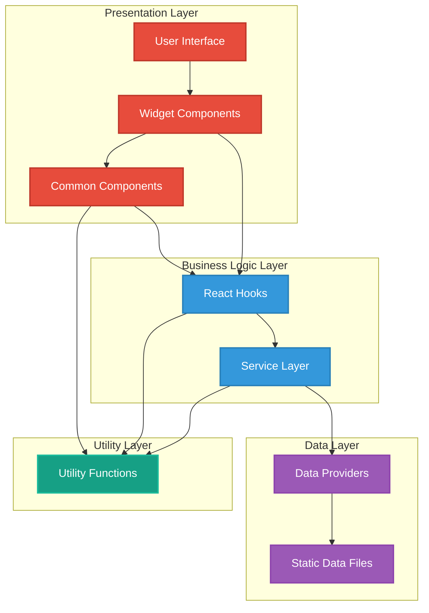
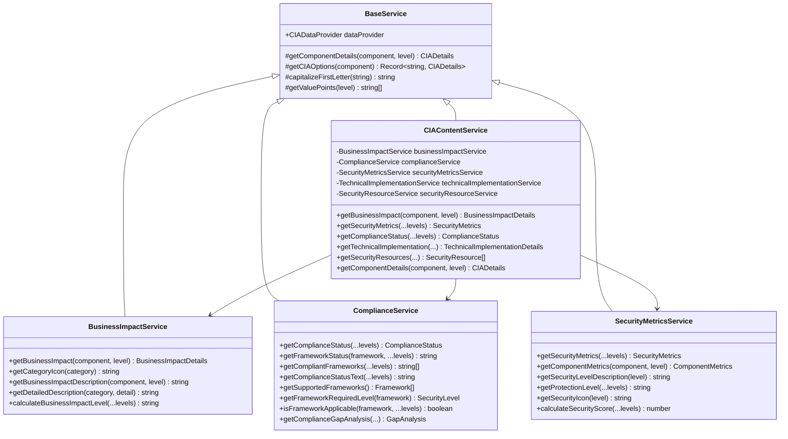
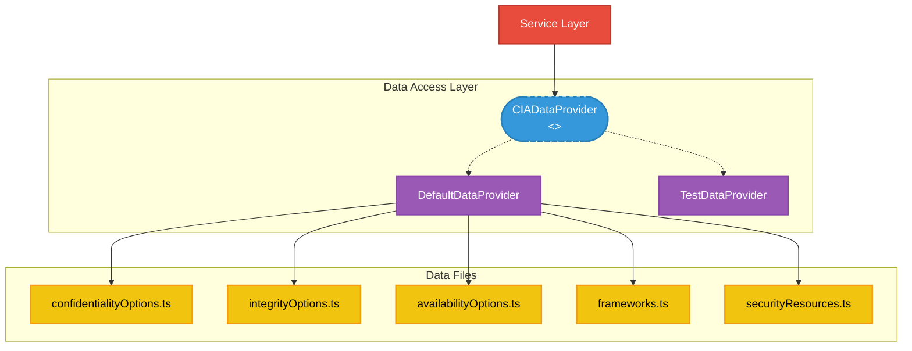
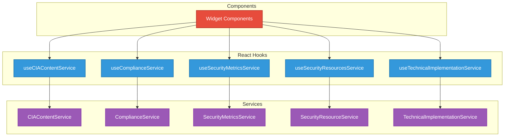
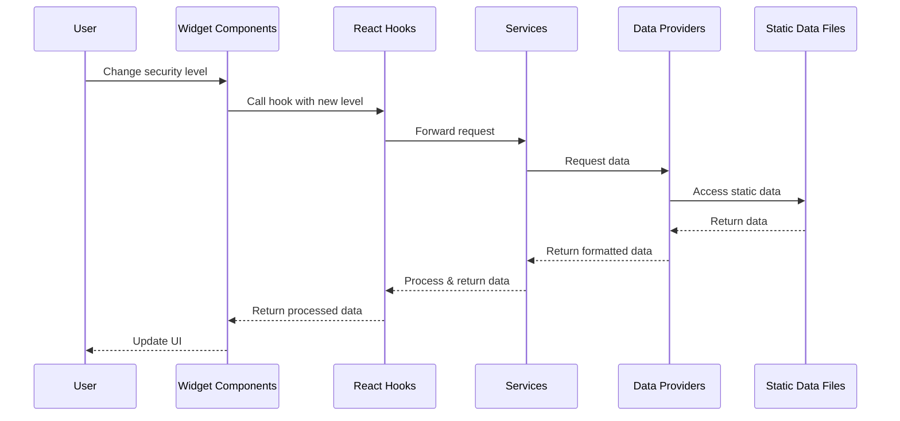
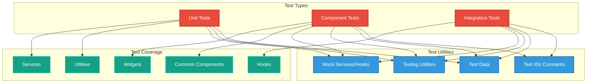

# 🏛️ CIA Compliance Manager System Architecture

This document provides multiple architectural perspectives of the CIA Compliance Manager system, illustrating how different layers interact to deliver security assessment, business impact analysis, and compliance mapping capabilities.

## 📚 Architecture Documentation Map

| Document                                            | Focus           | Description                               |
| --------------------------------------------------- | --------------- | ----------------------------------------- |
| **[System Architecture](SYSTEM_ARCHITECTURE.md)**   | 🏛️ System       | Layered architecture and component details |
| **[Architecture](ARCHITECTURE.md)**                 | 🏗️ C4 Model     | C4 model showing system structure          |
| **[Data Model](DATA_MODEL.md)**                     | 📊 Data         | Current data structures and relationships  |
| **[State Diagrams](STATEDIAGRAM.md)**               | 🔄 Behavior     | System state transitions                   |
| **[Process Flowcharts](FLOWCHART.md)**              | 🔄 Process      | Security assessment workflows              |
| **[Mindmaps](MINDMAP.md)**                          | 🧠 Concept      | System component relationships             |
| **[Widget Analysis](WIDGET_ANALYSIS.md)**           | 🧩 Components   | Detailed widget component analysis         |
| **[Style Guide](STYLE_GUIDE.md)**                   | 🎨 Style        | Documentation style guidelines             |
| **[SWOT Analysis](SWOT.md)**                        | 💼 Business     | Strategic business assessment              |
| **[BCP Plan](BCPPlan.md)**                          | 🔄 Recovery     | Business continuity planning               |
| **[Workflows](WORKFLOWS.md)**                       | 🚀 DevOps       | CI/CD and development workflows            |
| **[Contribution Guidelines](CONTRIBUTION_GUIDELINES.md)** | 📋 Guidelines | Documentation contribution process        |
| **[Future Architecture](FUTURE_ARCHITECTURE.md)**   | 🚀 Evolution    | Vision for platform evolution              |
| **[Future Data Model](FUTURE_DATA_MODEL.md)**       | 🚀 Evolution    | Future data architecture vision            |

## 🌐 System Overview

The CIA Compliance Manager is structured as a layered architecture with clear separation of concerns between services, components, data structures, and utilities. The diagram below illustrates the high-level system architecture:

## 🧩 Widget Architecture

The application uses a widget-based architecture organized into four main categories, each addressing specific aspects of security assessment and management:

```mermaid
flowchart TB
    subgraph Core
        SLW[Security Level<br>Widget]
    end

    subgraph Categories ["CIA Security Widget Categories"]
        subgraph Assessment ["📊 Assessment Center"]
            SSW[Security Summary<br>Widget]
            BIAW[Business Impact<br>Analysis Widget]
        end
        
        subgraph Business ["💰 Business Value"]
            CSW[Compliance Status<br>Widget]
            CEW[Cost Estimation<br>Widget]
            VCW[Value Creation<br>Widget]
        end
        
        subgraph Impact ["🔍 Impact Analysis"]
            subgraph CIA ["🔐 CIA Components"]
                CIW[Confidentiality<br>Impact Widget]
                IIW[Integrity<br>Impact Widget]
                AIW[Availability<br>Impact Widget]
            end
        end
        
        subgraph Implementation ["🛠️ Implementation"]
            SRW[Security Resources<br>Widget]
            SVW[Security Visualization<br>Widget]
            TDW[Technical Details<br>Widget]
        end
    end
    
    SLW --> SSW & BIAW
    SLW --> CSW & CEW & VCW
    SLW --> CIW & IIW & AIW
    SLW --> SRW & SVW & TDW
    
    %% Apply styles using class definitions
    classDef core fill:#e74c3c,stroke:#c0392b,stroke-width:2px,color:white
    classDef assessment fill:#3498db,stroke:#2980b9,stroke-width:2px,color:white
    classDef business fill:#f1c40f,stroke:#f39c12,stroke-width:2px,color:black
    classDef impact fill:#9b59b6,stroke:#8e44ad,stroke-width:2px,color:white
    classDef implementation fill:#16a085,stroke:#1abc9c,stroke-width:2px,color:white
    classDef confidentiality fill:#8e44ad,stroke:#6c3483,stroke-width:2px,color:white
    classDef integrity fill:#27ae60,stroke:#1e8449,stroke-width:2px,color:white
    classDef availability fill:#2980b9,stroke:#2471a3,stroke-width:2px,color:white
    
    %% Apply classes to nodes
    class SLW core
    class SSW,BIAW assessment
    class CSW,CEW,VCW business
    class CIW confidentiality
    class IIW integrity
    class AIW availability
    class SRW,SVW,TDW implementation
```

## 🔧 Service Architecture

The service layer encapsulates business logic and provides a clean API for widget components. Services retrieve data from static files through data providers:

## 📊 Data Architecture

The application currently uses static data files for all configuration and content. There is no database in the current implementation:

## 🔨 Utility Architecture

The application has a rich set of utility functions that provide common functionality across components:

```mermaid
classDiagram
    class Utils {
        colorUtils
        costCalculationUtils
        businessValueUtils
        formatUtils
        riskUtils
        securityLevelUtils
        typeGuards
    }
    
    class colorUtils {
        +getSecurityLevelBackgroundClass(color) string
        +getSecurityLevelTextClass(color) string
        +getColorForSecurityLevel(level) string
        +getBackgroundForSecurityLevel(level) string
    }
    
    class costCalculationUtils {
        +calculateTotalSecurityCost(...levels) CostDetails
        +calculateComponentCost(component, level) ComponentCost
        +estimateImplementationCost(...levels) number
    }
    
    class businessValueUtils {
        +calculateROIEstimate(...levels) ROIEstimate
        +generateValueMetrics(...levels) BusinessValueMetric[]
        +getComponentValueStatements(component, level) string[]
    }
    
    class formatUtils {
        +formatCurrency(value) string
        +formatPercentage(value) string
        +truncateText(text, length) string
    }
    
    class riskUtils {
        +calculateBusinessImpactLevel(...levels) string
        +getRiskLevelFromImpactLevel(level) string
        +getDefaultComponentImpact(component, level) BusinessImpact
        +getImplementationComplexity(...levels) string
    }
    
    class securityLevelUtils {
        +normalizeSecurityLevel(level) SecurityLevel
        +getSecurityLevelValue(level) number
        +getNextSecurityLevel(level) SecurityLevel
        +getPreviousSecurityLevel(level) SecurityLevel
    }
    
    class typeGuards {
        +isSecurityLevel(value) boolean
        +isCIAComponent(value) boolean
        +isArray(value) boolean
        +isObject(value) boolean
        +isString(value) boolean
        +isNullish(value) boolean
    }
    
    Utils *-- colorUtils
    Utils *-- costCalculationUtils
    Utils *-- businessValueUtils
    Utils *-- formatUtils
    Utils *-- riskUtils
    Utils *-- securityLevelUtils
    Utils *-- typeGuards
```

## 🧰 React Hook Architecture

Custom hooks provide a clean interface for components to access services and manage state:

## 🔄 Application Data Flow

The diagram below illustrates how data flows through the application:

## 🧪 Testing Architecture

The application uses Vitest for testing with a structured approach to component and service testing:

## Color Schema

The color schema used throughout these diagrams follows consistent patterns to enhance readability:

| Element Type | Color | Purpose |
|-------------|-------|---------|
| 🔒 Confidentiality | #8e44ad (Purple) | Confidentiality-related components |
| ✓ Integrity | #27ae60 (Green) | Integrity-related components |
| ⏱️ Availability | #2980b9 (Blue) | Availability-related components |
| 🏛️ Core Architecture | #34495e (Dark Blue) | Core architectural elements |
| 🧩 UI Components | #e74c3c (Red) | User interface elements |
| ⚙️ Services | #3498db (Light Blue) | Service layer components |
| 💼 Business Value | #f1c40f (Yellow) | Business impact, value creation |
| 🛠️ Implementation | #16a085 (Teal) | Technical implementation, utilities |
