# 🏛️ CIA Compliance Manager System Architecture

This document provides multiple architectural perspectives of the CIA Compliance Manager system, illustrating how different layers interact to deliver security assessment, business impact analysis, and compliance mapping capabilities.

## 📚 Related Architecture Documentation

| Document                                            | Focus           | Description                               |
| --------------------------------------------------- | --------------- | ----------------------------------------- |
| **[Current Architecture](ARCHITECTURE.md)**         | 🏛️ Architecture | C4 model showing current system structure |
| **[Future Architecture](FUTURE_ARCHITECTURE.md)**   | 🏛️ Architecture | Vision for context-aware platform         |
| **[Data Model](DATA_MODEL.md)**                     | 📊 Data         | Current data structures and relationships |
| **[Future Data Model](FUTURE_DATA_MODEL.md)**       | 📊 Data         | Context-aware data architecture           |
| **[State Diagrams](STATEDIAGRAM.md)**               | 🔄 Behavior     | System state transitions                  |
| **[Process Flowcharts](FLOWCHART.md)**              | 🔄 Process      | Security assessment workflows             |
| **[Mindmaps](MINDMAP.md)**                          | 🧠 Concept      | System component relationships            |

## 🌐 System Overview

The CIA Compliance Manager is structured as a layered architecture with clear separation of concerns between services, components, data structures, and utilities. The diagram below illustrates the high-level system architecture:

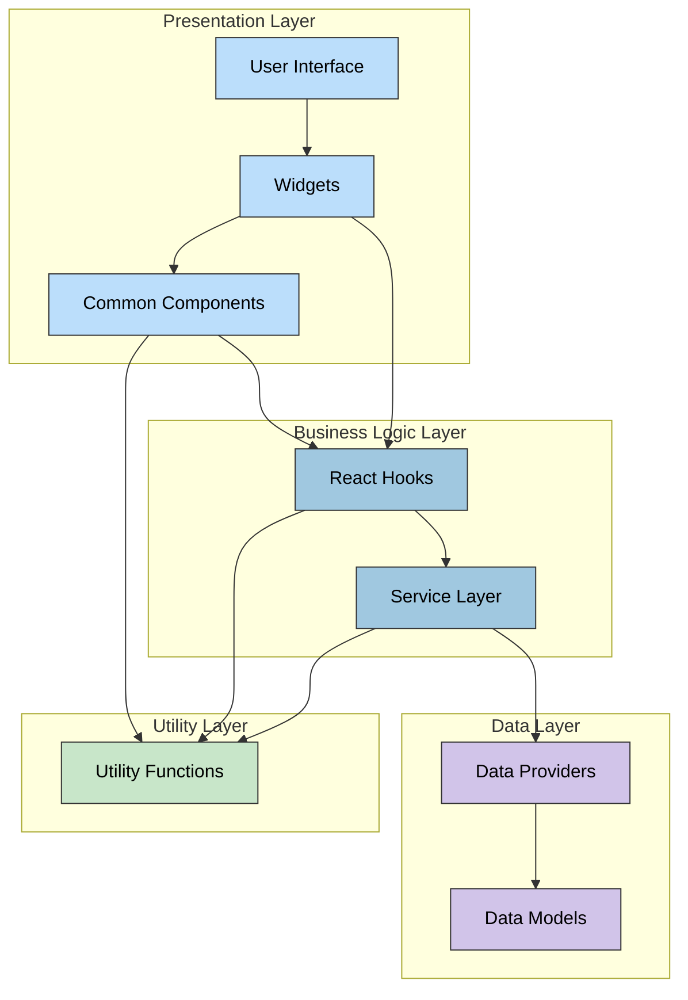

## 🔧 Service Architecture

**💼 Business Focus:** The service layer encapsulates core business logic and provides a clean API for user interface components.

**🔄 Data Flow Focus:** Services handle data transformation, processing, and interaction with data providers.

```mermaid
classDiagram
    class BaseService {
        +CIADataProvider dataProvider
        #getComponentDetails(component, level) CIADetails
        #getCIAOptions(component) Record~string, CIADetails~
        #capitalizeFirstLetter(string) string
        #getValuePoints(level) string[]
    }
    
    class BusinessImpactService {
        +getBusinessImpact(component, level) BusinessImpactDetails
        +getCategoryIcon(category) string
        +getBusinessImpactDescription(component, level) string
        +getDetailedDescription(category, detail) string
        +calculateBusinessImpactLevel(...levels) string
    }
    
    class ComplianceService {
        +getComplianceStatus(...levels) ComplianceStatus
        +getFrameworkStatus(framework, ...levels) string
        +getCompliantFrameworks(...levels) string[]
        +getComplianceStatusText(...levels) string
        +getSupportedFrameworks() Framework[]
        +getFrameworkRequiredLevel(framework) SecurityLevel
        +isFrameworkApplicable(framework, ...levels) boolean
    }
    
    class SecurityMetricsService {
        +getSecurityMetrics(...levels) SecurityMetrics
        +getComponentMetrics(component, level) ComponentMetrics
        +getImpactMetrics(component, level) ImpactMetrics
        +getSecurityLevelDescription(level) string
        +getProtectionLevel(...levels) string
        +getSecurityIcon(level) string
        +calculateSecurityScore(...levels) number
        +calculateRoi(...levels) ROIMetrics
    }
    
    class SecurityResourceService {
        +getValuePoints(level) string[]
        +getSecurityResources(component, level) SecurityResource[]
    }
    
    class TechnicalImplementationService {
        +getTechnicalImplementation(component, level) TechnicalImplementationDetails
        +getComponentImplementationDetails(component, level) ComponentImplementationDetails
        +getTechnicalDescription(component, level) string
        +getRecommendations(component, level) string[]
        +getImplementationConsiderations(...levels) string
        +getImplementationTime(...levels) string
    }
    
    class CIAContentService {
        -BusinessImpactService businessImpactService
        -ComplianceService complianceService
        -SecurityMetricsService securityMetricsService
        -TechnicalImplementationService technicalImplementationService
        -SecurityResourceService securityResourceService
        +getBusinessImpact(component, level) BusinessImpactDetails
        +getSecurityMetrics(...levels) SecurityMetrics
        +getComplianceStatus(...levels) ComplianceStatus
        +getTechnicalImplementation(...) TechnicalImplementationDetails
        +getSecurityResources(...) SecurityResource[]
    }
    
    BaseService <|-- BusinessImpactService
    BaseService <|-- ComplianceService
    BaseService <|-- SecurityMetricsService
    BaseService <|-- SecurityResourceService
    BaseService <|-- TechnicalImplementationService
    BaseService <|-- CIAContentService
    CIAContentService --> BusinessImpactService
    CIAContentService --> ComplianceService
    CIAContentService --> SecurityMetricsService
    CIAContentService --> SecurityResourceService
    CIAContentService --> TechnicalImplementationService
```

### 🔄 Service Dependencies

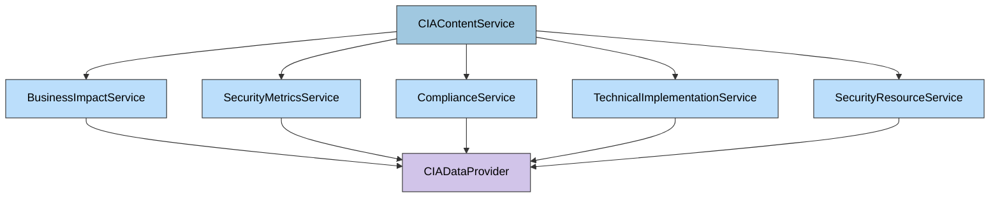

## 🧩 Component Architecture

**🎯 UI Focus:** Components form the building blocks of the user interface, providing reusable functionality.

**🔄 Composition Focus:** Shows how components are composed to create the complete user experience.

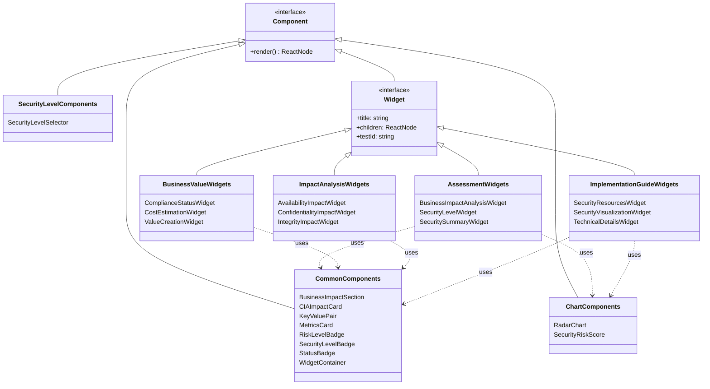

### 🖼️ Component Hierarchy

```mermaid
flowchart TD
    App[CIAClassificationApp] --> SLW[SecurityLevelWidget]
    App --> SSW[SecuritySummaryWidget]
    App --> BIAW[BusinessImpactAnalysisWidget]
    App --> CSW[ComplianceStatusWidget]
    App --> CEW[CostEstimationWidget]
    App --> VCW[ValueCreationWidget]
    App --> AIW[AvailabilityImpactWidget]
    App --> IIW[IntegrityImpactWidget]
    App --> CIW[ConfidentialityImpactWidget]
    App --> SRW[SecurityResourcesWidget]
    App --> SVW[SecurityVisualizationWidget]
    App --> TDW[TechnicalDetailsWidget]
    
    SLW --> SLS[SecurityLevelSelector]
    SLS --> SEL[Selection]
    
    SSW --> SRS[SecurityRiskScore]
    SSW --> RC[RadarChart]
    
    BIAW --> BIS[BusinessImpactSection]
    CSW --> SB[StatusBadge]
    SVW --> RC
    
    AIW --> KVP[KeyValuePair]
    IIW --> KVP
    CIW --> KVP
    
    SRW --> MC[MetricsCard]
    
    classDef app fill:#a0c8e0,stroke:#333,stroke-width:1px,color:black
    classDef widget fill:#bbdefb,stroke:#333,stroke-width:1px,color:black
    classDef component fill:#d1c4e9,stroke:#333,stroke-width:1px,color:black
    classDef common fill:#c8e6c9,stroke:#333,stroke-width:1px,color:black
    
    class App app
    class SLW,SSW,BIAW,CSW,CEW,VCW,AIW,IIW,CIW,SRW,SVW,TDW widget
    class SLS,RC,SRS component
    class SEL,BIS,SB,KVP,MC common
```

## 📊 Widget Architecture

**🧩 Modular Focus:** Widgets encapsulate domain-specific functionality in self-contained modules.

**💼 Domain Focus:** Each widget addresses a specific aspect of security assessment and management.

```mermaid
flowchart TD
    subgraph "Assessment Center"
        SLW[SecurityLevelWidget]
        SSW[SecuritySummaryWidget]
        BIAW[BusinessImpactAnalysisWidget]
    end
    
    subgraph "Business Value"
        CSW[ComplianceStatusWidget]
        CEW[CostEstimationWidget]
        VCW[ValueCreationWidget]
    end
    
    subgraph "Impact Analysis"
        AIW[AvailabilityImpactWidget]
        IIW[IntegrityImpactWidget]
        CIW[ConfidentialityImpactWidget]
    end
    
    subgraph "Implementation Guide"
        SRW[SecurityResourcesWidget]
        SVW[SecurityVisualizationWidget]
        TDW[TechnicalDetailsWidget]
    end
    
    SLW --> SSW
    SLW --> BIAW
    SLW --> CSW
    SLW --> CEW
    SLW --> VCW
    SLW --> AIW
    SLW --> IIW
    SLW --> CIW
    SLW --> SRW
    SLW --> SVW
    SLW --> TDW
    
    classDef assessment fill:#bbdefb,stroke:#333,stroke-width:1px,color:black
    classDef business fill:#c8e6c9,stroke:#333,stroke-width:1px,color:black
    classDef impact fill:#d1c4e9,stroke:#333,stroke-width:1px,color:black
    classDef implementation fill:#ffda9e,stroke:#333,stroke-width:1px,color:black
    
    class SLW,SSW,BIAW assessment
    class CSW,CEW,VCW business
    class AIW,IIW,CIW impact
    class SRW,SVW,TDW implementation
```

### 📊 Widget Data Flow

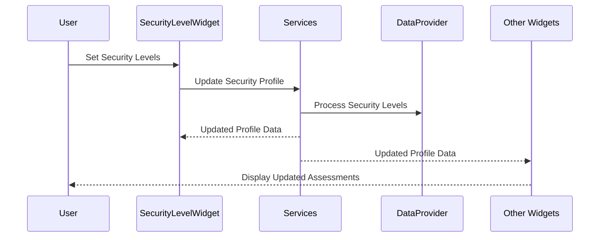

## 📂 Data Architecture

**📊 Data Model Focus:** Shows the organization and relationships of data structures.

**🧩 State Management Focus:** Illustrates how data flows and state is managed throughout the application.

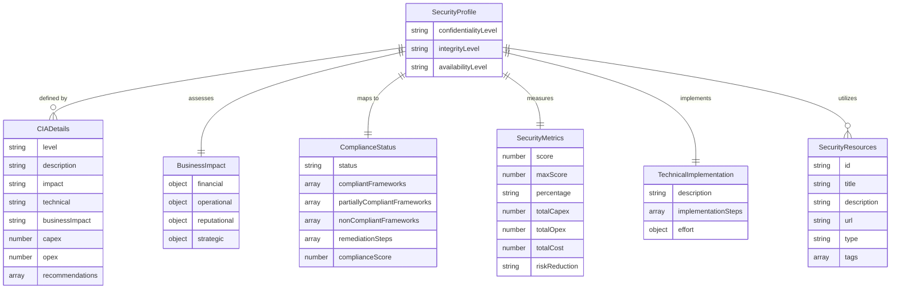

### 🗃️ Data Provider Architecture

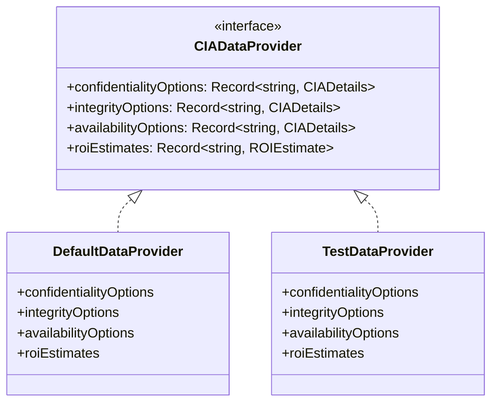

## 🔨 Utility Architecture

**🧰 Tools Focus:** Shows the organization and purpose of utility functions that support the application.

**🔧 Reuse Focus:** Illustrates how utilities provide common functionality across the system.

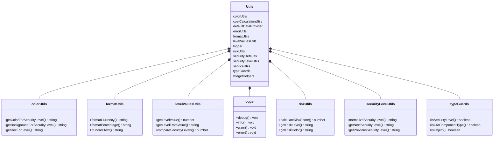

### 🔗 Utility Dependencies

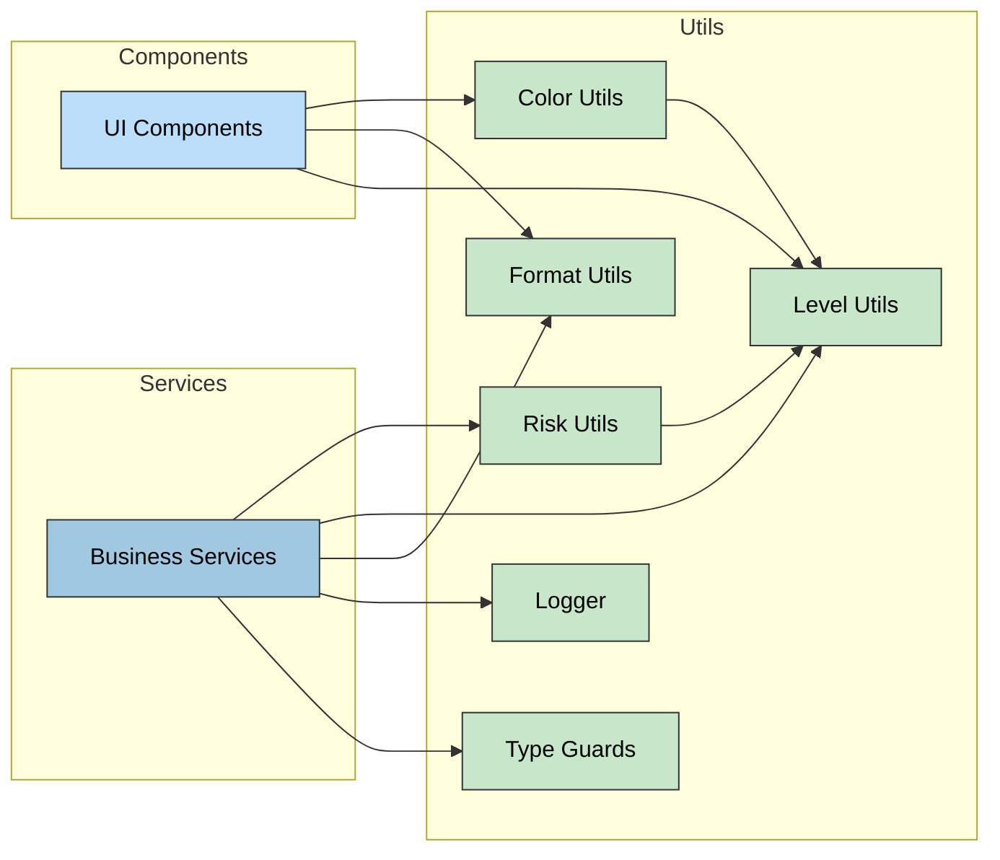

## 🔄 Workflow Architecture

**🔄 Process Focus:** Shows the key workflows and processes within the application.

**🚀 User Journey Focus:** Illustrates how users interact with the system to perform tasks.

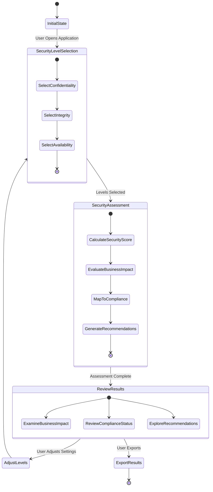

## 🔌 Integration Architecture

**🔗 Integration Focus:** Shows how the application interfaces with external systems.

**🏗️ Extension Focus:** Illustrates the extension points for adding new functionality.

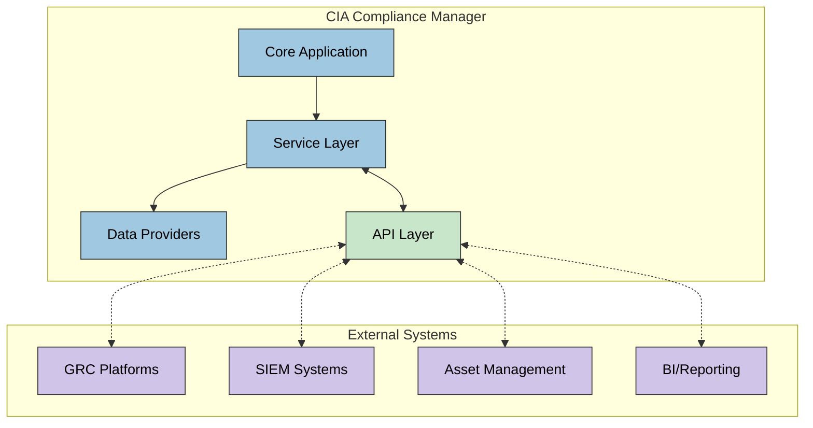

## 🔒 Security Architecture

**🛡️ Security Focus:** Shows the security controls and mechanisms within the application.

**🔐 Protection Focus:** Illustrates how the system safeguards data and functionality.

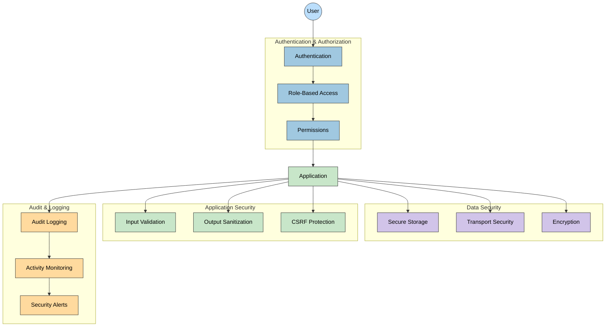

## 🔄 State Management Architecture

**🔄 State Flow Focus:** Shows how state is managed and propagated through the application.

**🧩 Hook Focus:** Illustrates the role of React hooks in state management.

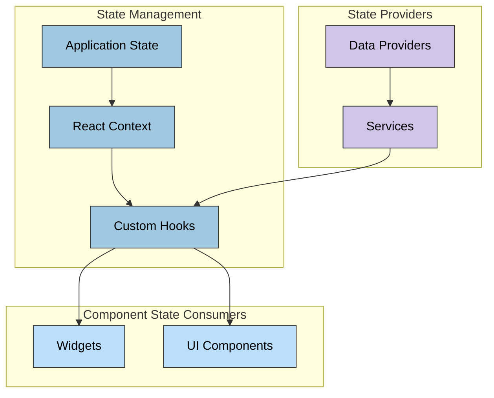

## 📦 Package Dependencies

**🔗 Dependency Focus:** Shows the key dependencies between packages in the codebase.

**📚 Module Focus:** Illustrates how modules relate to each other.

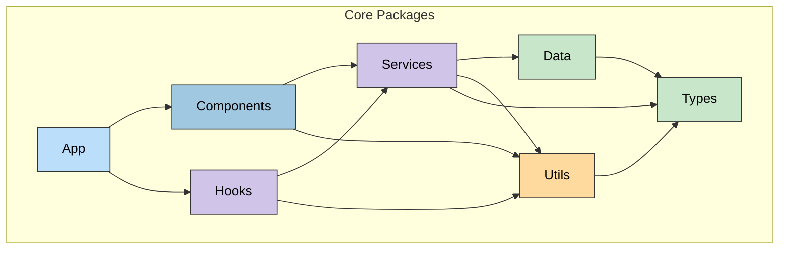

## 🧪 Testing Architecture

**🧪 Test Focus:** Shows the testing approach and organization across the codebase.

**🔍 Quality Focus:** Illustrates how different types of tests ensure system quality.

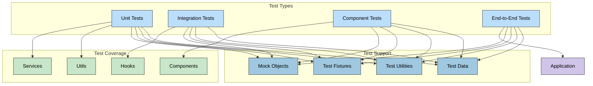

## Color Legend

The color scheme used throughout these diagrams follows a consistent pattern to enhance readability:

| Element Type           | Color                  | Description                                       |
| ------------------------ | ---------------------- | ------------------------------------------------- |
| Application Core         | #a0c8e0 (Medium Blue)  | Core application components and services          |
| User Interface           | #bbdefb (Light Blue)   | UI components, widgets, and presentation elements |
| Business Logic           | #d1c4e9 (Light Purple) | Business rules, services, and processing logic    |
| Data Elements            | #c8e6c9 (Light Green)  | Data structures, models, and storage              |
| Integration Elements     | #ffda9e (Light Orange) | External interfaces and integration points        |
| Support & Infrastructure | #ffccbc (Light Coral)  | Supporting functions, utilities, and infrastructure|

This consistent color scheme helps distinguish between different architectural aspects and creates visual continuity across all diagrams in the documentation.
