# 🏛️ CIA Compliance Manager System Architecture

This document provides multiple architectural perspectives of the CIA Compliance Manager system, illustrating how different layers interact to deliver security assessment, business impact analysis, and compliance mapping capabilities.

## 📚 Architecture Documentation Map

<div class="documentation-map">

| Document                                            | Focus           | Description                               |
| --------------------------------------------------- | --------------- | ----------------------------------------- |
| **[System Architecture](SYSTEM_ARCHITECTURE.md)**   | 🏛️ System       | Layered architecture and component details |
| **[Architecture](ARCHITECTURE.md)**                 | 🏗️ C4 Model     | C4 model showing system structure          |
| **[Data Model](DATA_MODEL.md)**                     | 📊 Data         | Current data structures and relationships  |
| **[State Diagrams](STATEDIAGRAM.md)**               | 🔄 Behavior     | System state transitions                   |
| **[Process Flowcharts](FLOWCHART.md)**              | 🔄 Process      | Security assessment workflows              |
| **[Mindmaps](MINDMAP.md)**                          | 🧠 Concept      | System component relationships             |
| **[Widget Analysis](WIDGET_ANALYSIS.md)**           | 🧩 Components   | Detailed widget component analysis         |
| **[Style Guide](STYLE_GUIDE.md)**                   | 🎨 Style        | Documentation style guidelines             |
| **[SWOT Analysis](SWOT.md)**                        | 💼 Business     | Strategic business assessment              |
| **[BCP Plan](BCPPlan.md)**                          | 🔄 Recovery     | Business continuity planning               |
| **[Workflows](WORKFLOWS.md)**                       | 🚀 DevOps       | CI/CD and development workflows            |
| **[Contribution Guidelines](CONTRIBUTION_GUIDELINES.md)** | 📋 Guidelines | Documentation contribution process        |
| **[Future Architecture](FUTURE_ARCHITECTURE.md)**   | 🚀 Evolution    | Vision for platform evolution              |
| **[Future Data Model](FUTURE_DATA_MODEL.md)**       | 🚀 Evolution    | Future data architecture vision            |

</div>

## 🌐 System Overview

The CIA Compliance Manager is structured as a layered architecture with clear separation of concerns between services, components, data structures, and utilities. The diagram below illustrates the high-level system architecture:


## 🧩 Widget Architecture

The application uses a widget-based architecture organized into four main categories, each addressing specific aspects of security assessment and management:

```mermaid
flowchart TB
    subgraph "Core"
        direction LR
        SLW[Security Level<br>Widget]
    end

    subgraph "Categories" ["CIA Security Widget Categories"]
        direction TB
        
        subgraph "Assessment Center" ["📊 Assessment Center"]
            style "Assessment Center" fill:#3498db,stroke:#2980b9,stroke-width:2px,color:white
            SSW[Security Summary<br>Widget]
            BIAW[Business Impact<br>Analysis Widget]
        end
        
        subgraph "Business Value" ["💰 Business Value"]
            style "Business Value" fill:#f1c40f,stroke:#f39c12,stroke-width:2px,color:black
            CSW[Compliance Status<br>Widget]
            CEW[Cost Estimation<br>Widget]
            VCW[Value Creation<br>Widget]
        end
        
        subgraph "Impact Analysis" ["🔍 Impact Analysis"]
            style "Impact Analysis" fill:#9b59b6,stroke:#8e44ad,stroke-width:2px,color:white
            
            subgraph "CIA" ["🔐 CIA Components"]
                direction LR
                CIW[Confidentiality<br>Impact Widget]
                IIW[Integrity<br>Impact Widget]
                AIW[Availability<br>Impact Widget]
                
                style CIW fill:#8e44ad,stroke:#6c3483,stroke-width:2px,color:white
                style IIW fill:#27ae60,stroke:#1e8449,stroke-width:2px,color:white
                style AIW fill:#2980b9,stroke:#2471a3,stroke-width:2px,color:white
            end
        end
        
        subgraph "Implementation Guide" ["🛠️ Implementation"]
            style "Implementation Guide" fill:#16a085,stroke:#1abc9c,stroke-width:2px,color:white
            SRW[Security Resources<br>Widget]
            SVW[Security Visualization<br>Widget]
            TDW[Technical Details<br>Widget]
        end
    end
    
    SLW --> SSW & BIAW
    SLW --> CSW & CEW & VCW
    SLW --> CIW & IIW & AIW
    SLW --> SRW & SVW & TDW
    
    style SLW fill:#e74c3c,stroke:#c0392b,stroke-width:2px,color:white
```

## 🔧 Service Architecture

The service layer encapsulates business logic and provides a clean API for widget components. Services retrieve data from static files through data providers:


## 📊 Data Architecture

The application currently uses static data files for all configuration and content. There is no database in the current implementation:

```mermaid
flowchart TD
    subgraph "Data Access Layer"
        CIADataProvider{{"CIADataProvider\n<<interface>>"}}
        DefaultDP[DefaultDataProvider]
        TestDP[TestDataProvider]
    end
    
    subgraph "Data Files"
        confidentialityOpts["confidentialityOptions.ts"]
        integrityOpts["integrityOptions.ts"]
        availabilityOpts["availabilityOptions.ts"]
        frameworkData["frameworks.ts"]
        resourcesData["securityResources.ts"]
    end
    
    CIADataProvider <|.. DefaultDP
    CIADataProvider <|.. TestDP
    
    DefaultDP --> confidentialityOpts
    DefaultDP --> integrityOpts
    DefaultDP --> availabilityOpts
    DefaultDP --> frameworkData
    DefaultDP --> resourcesData
    
    Services[Service Layer] --> CIADataProvider
    
    classDef interface fill:#3498db,stroke:#2980b9,stroke-width:2px,color:white,stroke-dasharray: 5 5
    classDef provider fill:#9b59b6,stroke:#8e44ad,stroke-width:2px,color:white
    classDef data fill:#f1c40f,stroke:#f39c12,stroke-width:2px,color:black
    classDef service fill:#e74c3c,stroke:#c0392b,stroke-width:2px,color:white
    
    class CIADataProvider interface
    class DefaultDP,TestDP provider
    class confidentialityOpts,integrityOpts,availabilityOpts,frameworkData,resourcesData data
    class Services service
```

## 🔨 Utility Architecture

The application has a rich set of utility functions that provide common functionality across components:

```mermaid
classDiagram
    class Utils {
        colorUtils
        costCalculationUtils
        businessValueUtils
        formatUtils
        riskUtils
        securityLevelUtils
        typeGuards
    }
    
    class colorUtils {
        +getSecurityLevelBackgroundClass(color) string
        +getSecurityLevelTextClass(color) string
        +getColorForSecurityLevel(level) string
        +getBackgroundForSecurityLevel(level) string
    }
    
    class costCalculationUtils {
        +calculateTotalSecurityCost(...levels) CostDetails
        +calculateComponentCost(component, level) ComponentCost
        +estimateImplementationCost(...levels) number
    }
    
    class businessValueUtils {
        +calculateROIEstimate(...levels) ROIEstimate
        +generateValueMetrics(...levels) BusinessValueMetric[]
        +getComponentValueStatements(component, level) string[]
    }
    
    class formatUtils {
        +formatCurrency(value) string
        +formatPercentage(value) string
        +truncateText(text, length) string
    }
    
    class riskUtils {
        +calculateBusinessImpactLevel(...levels) string
        +getRiskLevelFromImpactLevel(level) string
        +getDefaultComponentImpact(component, level) BusinessImpact
        +getImplementationComplexity(...levels) string
    }
    
    class securityLevelUtils {
        +normalizeSecurityLevel(level) SecurityLevel
        +getSecurityLevelValue(level) number
        +getNextSecurityLevel(level) SecurityLevel
        +getPreviousSecurityLevel(level) SecurityLevel
    }
    
    class typeGuards {
        +isSecurityLevel(value) boolean
        +isCIAComponent(value) boolean
        +isArray(value) boolean
        +isObject(value) boolean
        +isString(value) boolean
        +isNullish(value) boolean
    }
    
    Utils *-- colorUtils
    Utils *-- costCalculationUtils
    Utils *-- businessValueUtils
    Utils *-- formatUtils
    Utils *-- riskUtils
    Utils *-- securityLevelUtils
    Utils *-- typeGuards
```



## 🧰 React Hook Architecture

Custom hooks provide a clean interface for components to access services and manage state:


## 🔄 Application Data Flow

The diagram below illustrates how data flows through the application:


## 🧪 Testing Architecture

The application uses Vitest for testing with a structured approach to component and service testing:


## Color Schema

The color schema used throughout these diagrams follows consistent patterns to enhance readability:

| Element Type | Color | Purpose |
|-------------|-------|---------|
| 🔒 Confidentiality | #8e44ad (Purple) | Confidentiality-related components |
| ✓ Integrity | #27ae60 (Green) | Integrity-related components |
| ⏱️ Availability | #2980b9 (Blue) | Availability-related components |
| 🏛️ Core Architecture | #34495e (Dark Blue) | Core architectural elements |
| 🧩 UI Components | #e74c3c (Red) | User interface elements |
| ⚙️ Services | #3498db (Light Blue) | Service layer components |
| 💼 Business Value | #f1c40f (Yellow) | Business impact, value creation |
| 🛠️ Implementation | #16a085 (Teal) | Technical implementation, utilities |
