

  

<h1 align="center">🎯 CIA Compliance Manager — Threat Model</h1>

  <strong>🛡️ Proactive Security Through Structured Threat Analysis</strong> 
  <em>🔍 STRIDE • MITRE ATT&CK • Compliance Security Architecture • Open Source Transparency</em>

  
  
  
  

**📋 Document Owner:** CEO | **📄 Version:** 1.0 | **📅 Last Updated:** 2025-11-22 (UTC)  
**🔄 Review Cycle:** Quarterly | **⏰ Next Review:** 2026-02-22  
**🏷️ Classification:** Public (Open Source Compliance Tool)

---

## 🎯 Purpose & Scope

Establish a comprehensive threat model for the CIA Compliance Manager, an open-source toolkit for assessing, mapping, and communicating security posture across the Confidentiality, Integrity, and Availability triad. This systematic threat analysis integrates multiple threat modeling frameworks to ensure proactive security through structured analysis.

### **🌟 Transparency Commitment**
This threat model demonstrates **🛡️ cybersecurity consulting expertise** through public documentation of advanced threat assessment methodologies, showcasing our **🏆 competitive advantage** via systematic risk management and **🤝 customer trust** through transparent security practices.

*— Based on Hack23 AB's commitment to security through transparency and excellence*

### **📚 Framework Integration**
- **🎭 STRIDE per architecture element:** Systematic threat categorization
- **🎖️ MITRE ATT&CK mapping:** Advanced threat intelligence integration
- **🏗️ Asset-centric analysis:** Critical resource protection focus
- **🎯 Scenario-centric modeling:** Real-world attack simulation
- **⚖️ Risk-centric assessment:** Business impact quantification

### **🔍 Scope Definition**

**v1.0 Release Architecture:**
- 🌐 **React 19.2.0 Frontend**: Modern concurrent rendering with error boundaries
- 📊 **Static Data Files**: JSON configuration and compliance framework mappings
- 🔧 **GitHub Pages Hosting**: CDN-based static content delivery with HTTPS
- 🛡️ **GitHub Actions CI/CD**: SLSA Level 3 build provenance and attestations
- 📦 **NPM Dependency Ecosystem**: 4 production dependencies with SBOM tracking
- 🔍 **Client-Side Assessment Engine**: TypeScript 5.9.3 strict mode with type safety
- 🧪 **Cypress 15.7.0 Testing**: Comprehensive E2E and component security testing
- 🛡️ **Content Security Policy**: Multi-layer XSS protection with strict CSP headers

**Out of Scope:**
- Third-party CDN providers (beyond GitHub Pages)
- End-user browser security (beyond application controls)
- External compliance framework sources

**v1.0 Security Enhancements:**
- ⚛️ **React 19.x**: Error boundaries, concurrent rendering, automatic batching
- 🧪 **Cypress 15.x**: Enhanced testing with 83.26% coverage (>80% target)
- 🔒 **SLSA Level 3**: Build provenance attestation and SBOM generation
- 🛡️ **CSP Headers**: Comprehensive Content Security Policy implementation
- 📦 **Bundle Optimization**: 175KB (< 180KB target, optimized via tree-shaking)
- 🔐 **TypeScript Strict**: Zero `any` types, complete null safety

### **🔗 Policy Alignment**
Integrated with [🎯 Hack23 AB Threat Modeling Policy](https://github.com/Hack23/ISMS-PUBLIC/blob/main/Threat_Modeling.md) methodology and frameworks.

---

## 📊 System Classification & Operating Profile

### **🏷️ Security Classification Matrix**

| Dimension | Level | Rationale | Business Impact |
|----------|-------|-----------|----------------|
| **🔐 Confidentiality** |  | Open source compliance tool with public methodologies |  |
| **🔒 Integrity** |  | Security assessment accuracy critical for compliance decisions |  |
| **⚡ Availability** |  | Assessment tool tolerates brief outages |  |

### **⚖️ Regulatory & Compliance Profile**

| Compliance Area | Classification | Implementation Status |
|-----------------|----------------|----------------------|
| **📋 Regulatory Exposure** | Low | Assessment tool; no personal data processing |
| **🇪🇺 CRA (EU Cyber Resilience Act)** | Standard (Non-commercial OSS) | Self-assessment approach with comprehensive documentation |
| **📊 SLA Targets (Internal)** | 99% | Static hosting with GitHub Pages reliability |
| **🔄 RPO / RTO** | RPO: Daily / RTO: >72h | Git history provides data recovery; scheduled recovery acceptable |

---

## 💎 Critical Assets & Protection Goals

### **🏗️ Asset-Centric Threat Analysis**

Following [Hack23 AB Asset-Centric Threat Modeling](https://github.com/Hack23/ISMS-PUBLIC/blob/main/Threat_Modeling.md#asset-centric-threat-modeling) methodology:

| Asset Category | Why Valuable | Threat Goals | Key Controls | Business Value |
|----------------|--------------|-------------|-------------|----------------|
| **🧠 Security Assessment Logic** | Core business intelligence for compliance evaluation | Algorithm manipulation, bias injection | Code integrity, SBOM validation, provenance attestation |  |
| **📊 Compliance Framework Data** | Authoritative mapping of security controls to frameworks | Data poisoning, framework misrepresentation | Static file integrity, version control, expert validation |  |
| **🔧 Build & Release Pipeline** | Software supply chain integrity | Supply chain attacks, malicious code injection | GitHub Actions hardening, dependency pinning, attestations |  |
| **👤 User Assessment Data** | Client-side security posture evaluations | Data manipulation, privacy violation | Browser storage isolation, export capabilities |  |
| **🌐 Application Availability** | Service accessibility for compliance assessments | Service disruption, DDoS | GitHub Pages redundancy, CDN distribution |  |
| **🏗️ Source Code Repository** | Complete application logic and methodology | IP theft, backdoor injection | Private repository, access controls, code scanning |  |

### **🔐 Crown Jewel Analysis**

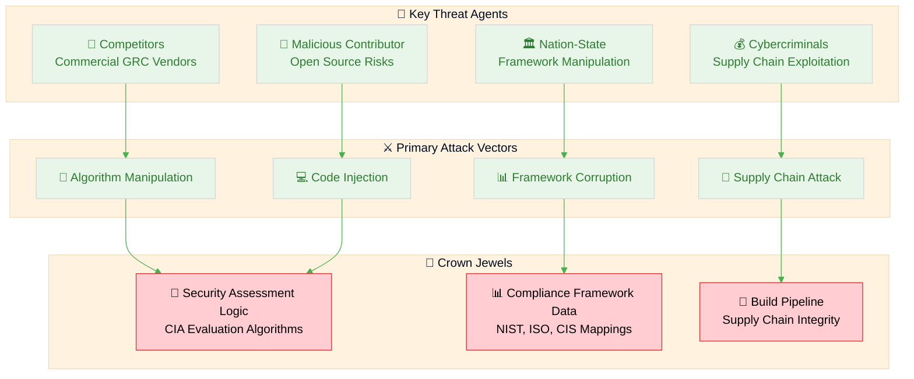

---

## 🌐 Data Flow & Architecture Analysis

### **🏛️ Architecture-Centric STRIDE Analysis**

Following [Architecture-Centric Threat Modeling](https://github.com/Hack23/ISMS-PUBLIC/blob/main/Threat_Modeling.md#architecture-centric-threat-modeling) methodology:

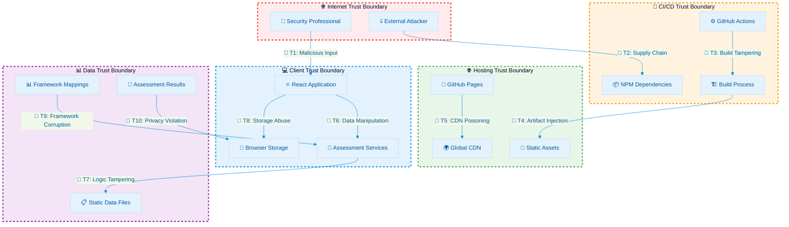

### **🎭 STRIDE per Element Analysis**

| Element | S | T | R | I | D | E | Notable Mitigations | v1.0 Enhancements |
|---------|---|---|---|---|---|---|---------------------|-------------------|
| **⚛️ React 19.x Frontend** | Session hijack | XSS/DOM manipulation | Action denial | Data leakage via render | Component crash | View bypass | CSP headers, input sanitization, React security | Error boundaries, concurrent rendering, strict TypeScript |
| **🔧 Assessment Services** | Service impersonation | Logic tampering | Calculation denial | Algorithm exposure | Service disruption | Privilege bypass | Code integrity, input validation, error boundaries | Type safety (zero `any`), comprehensive testing |
| **📦 NPM Dependencies** | Package spoofing | Malicious code | Tamper denial | Backdoor injection | Install failure | Runtime privileges | Dependency scanning, SBOM, version pinning | SLSA Level 3 attestation, provenance verification |
| **📊 Static Data Files** | Data source spoof | Content modification | Change denial | Sensitive data leak | File corruption | Access bypass | Version control, file integrity, access restrictions | Git immutability, cryptographic verification |
| **💾 Browser Storage** | Storage hijack | Data tampering | Access denial | Data exposure | Storage exhaustion | Cross-origin access | Same-origin policy, data encryption, size limits | Isolated session, no persistence beyond browser |
| **🏗️ Build Pipeline** | Actor spoofing | Artifact tamper | Build denial | Secret exposure | Pipeline DoS | Workflow escalation | Actions hardening, attestations, secret management | SLSA Level 3, provenance, SHA-pinned actions |
| **🌐 GitHub Pages** | DNS spoofing | Content injection | Service denial | Info disclosure | CDN outage | Config manipulation | HTTPS enforcement, domain validation, monitoring | DNSSEC, CAA records, TLS 1.3 |
| **🛡️ CSP Headers** | Origin spoofing | Script injection | Policy denial | Header leak | CSP bypass | Policy escalation | Strict CSP directives, header validation | Multi-directive policy, frame-ancestors 'none' |
| **🧪 Cypress Tests** | Test spoofing | Test tampering | Test denial | Test data leak | Test disruption | Test privilege | Isolated test environment, CI validation | 83.26% coverage, E2E + component security tests |

---

## 🎖️ MITRE ATT&CK Framework Integration

### **🔍 Attacker-Centric Analysis**

Following [MITRE ATT&CK-Driven Analysis](https://github.com/Hack23/ISMS-PUBLIC/blob/main/Threat_Modeling.md#mitre-attck-driven-analysis) methodology:

| Phase | Technique | ID | CIA Manager Context | Control | Detection | v1.0 Enhancement |
|-------|----------|----|---------------------|---------|-----------|------------------|
| **🔍 Initial Access** | Supply Chain Compromise | [T1195](https://attack.mitre.org/techniques/T1195/) | Malicious NPM packages, corrupted dependencies | Dependency review, SBOM validation | Dependency scanning, build attestations | SLSA Level 3 provenance, cryptographic attestation |
| **🔍 Initial Access** | Drive-by Compromise | [T1189](https://attack.mitre.org/techniques/T1189/) | Malicious website hosting CIA Manager | Content Security Policy, HTTPS | Web application monitoring | Comprehensive CSP with frame-ancestors 'none' |
| **⚡ Execution** | User Execution | [T1204](https://attack.mitre.org/techniques/T1204/) | Social engineering to use tampered tool | User education, verification guides | Usage pattern analysis | Public build verification via SLSA attestations |
| **🔄 Persistence** | Browser Extensions | [T1176](https://attack.mitre.org/techniques/T1176/) | Malicious extensions targeting assessment data | Extension warnings, isolation | Browser security monitoring | Error boundaries isolate malicious code |
| **🎭 Defense Evasion** | Masquerading | [T1036](https://attack.mitre.org/techniques/T1036/) | Fake CIA Manager sites, typosquatting | Domain verification, official channels | Domain monitoring, user reports | DNSSEC + CAA records prevent DNS hijacking |
| **🎭 Defense Evasion** | Obfuscated Files | [T1027](https://attack.mitre.org/techniques/T1027/) | Minified malicious code in dependencies | Source code review, static analysis | Code scanning, build validation | TypeScript strict mode (zero `any`), SBOM |
| **🔑 Credential Access** | Steal Web Session Cookies | [T1539](https://attack.mitre.org/techniques/T1539/) | Session hijacking for user assessments | Secure cookies, HTTPS only | Session monitoring | No authentication = no credentials to steal |
| **🔍 Discovery** | Application Window Discovery | [T1010](https://attack.mitre.org/techniques/T1010/) | Browser tab enumeration for assessment data | Browser isolation, minimal permissions | Tab access monitoring | Same-origin policy, CSP restrictions |
| **📦 Collection** | Data from Local System | [T1005](https://attack.mitre.org/techniques/T1005/) | Local storage assessment data theft | Data encryption, minimal storage | Storage access monitoring | Browser isolation, session-only data |
| **📤 Exfiltration** | Exfiltration Over Web Service | [T1567](https://attack.mitre.org/techniques/T1567/) | Assessment data theft via web APIs | Network monitoring, data classification | Traffic analysis, anomaly detection | CSP connect-src 'self' blocks external requests |
| **💥 Impact** | Data Manipulation | [T1565](https://attack.mitre.org/techniques/T1565/) | Assessment result tampering | Data integrity checks, validation | Change detection, audit logging | React 19.x error boundaries + TypeScript types |

### **🌳 Attack Tree Analysis**

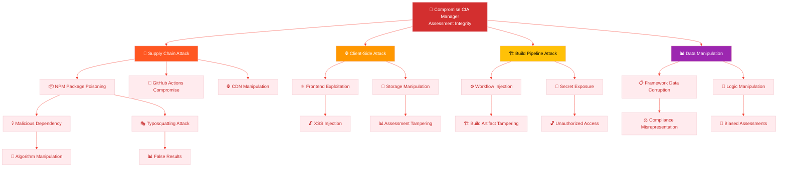

---

## 🎯 Priority Threat Scenarios

### **🔴 Critical Threat Scenarios**

Following [Risk-Centric Threat Modeling](https://github.com/Hack23/ISMS-PUBLIC/blob/main/Threat_Modeling.md#risk-centric-threat-modeling) methodology:

| # | Scenario | MITRE Tactic | Impact Focus | Likelihood | Risk | Key Mitigations | Residual Action |
|---|----------|--------------|--------------|------------|------|-----------------|-----------------|
| **1** | **📦 Supply Chain Dependency Attack** | [Initial Access](https://attack.mitre.org/tactics/TA0001/) | Assessment integrity compromise | Medium |  | SBOM, dependency pinning, provenance attestation | Enhanced dependency isolation, zero-trust validation |
| **2** | **🧠 Assessment Algorithm Manipulation** | [Impact](https://attack.mitre.org/tactics/TA0040/) | Compliance evaluation corruption | Low-Med |  | Code integrity, expert validation, open source review | Algorithmic audit trail, bias detection |
| **3** | **📊 Framework Data Poisoning** | [Impact](https://attack.mitre.org/tactics/TA0040/) | Compliance mapping corruption | Low |  | Version control, expert validation, source verification | Multi-source validation, change detection |
| **4** | **🏗️ Build Pipeline Compromise** | [Initial Access](https://attack.mitre.org/tactics/TA0001/) | Malicious code injection | Medium |  | GitHub Actions hardening, attestations | Advanced workflow security, isolation |
| **5** | **🌐 Client-Side Assessment Tampering** | [Impact](https://attack.mitre.org/tactics/TA0040/) | User assessment manipulation | Medium |  | CSP, input validation, error boundaries | Client-side integrity monitoring |
| **6** | **💾 User Data Privacy Violation** | [Collection](https://attack.mitre.org/tactics/TA0009/) | Assessment confidentiality breach | Low-Med |  | Local storage isolation, encryption | Enhanced privacy controls, audit |

### **⚖️ Risk Heat Matrix**

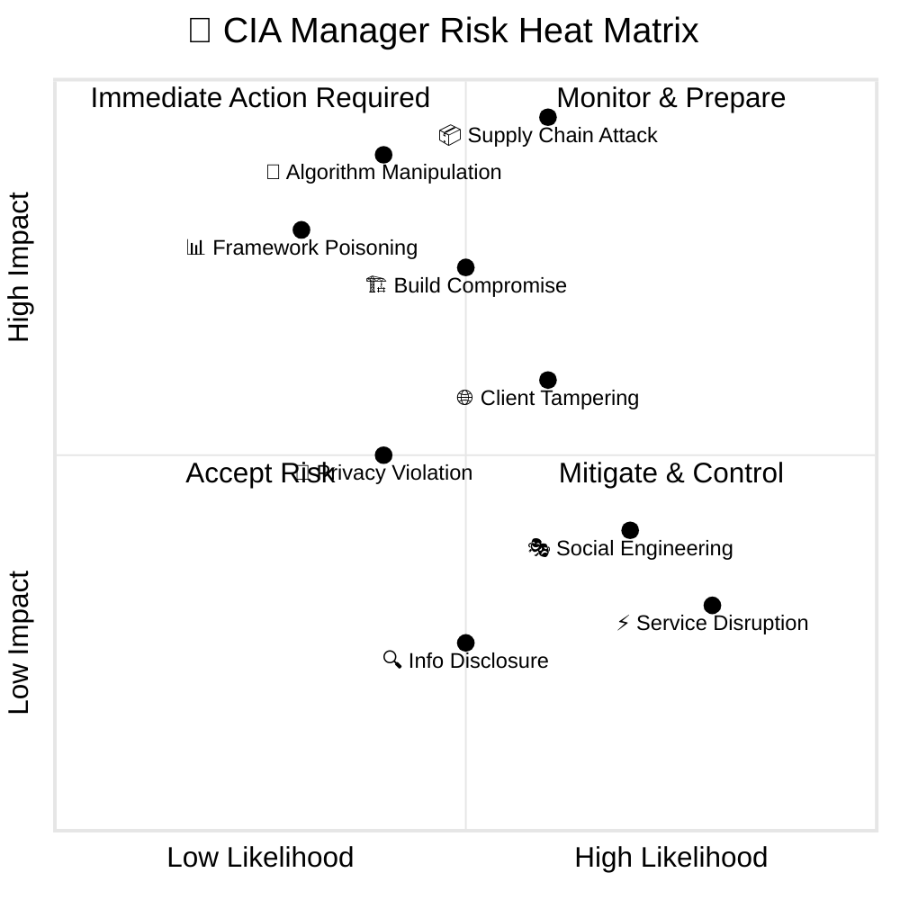

---

## ⚛️ v1.0 Specific Threat Scenarios

### **🔴 React 19.x Error Boundary Threat Analysis**

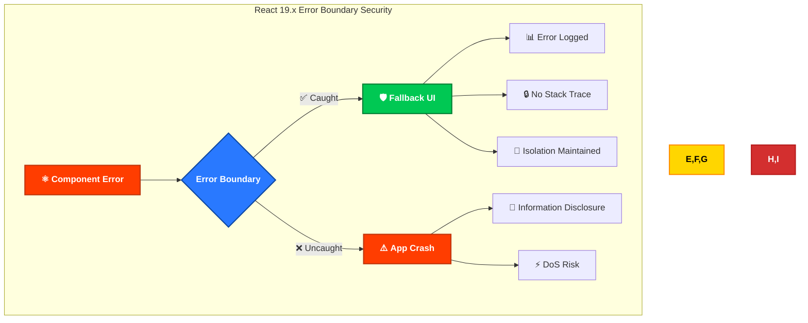

#### **🎯 Error Boundary Threat Scenarios**

| # | Threat | Attack Vector | Impact | v1.0 Mitigation | Residual Risk |
|---|--------|---------------|--------|-----------------|---------------|
| **1** | **Information Disclosure via Stack Traces** | Trigger component errors to reveal internal structure | Medium | Error boundaries prevent stack traces from reaching users | Low - Custom error messages only |
| **2** | **Component DoS via Error Cascade** | Trigger errors in critical widgets to disable assessment | High | Isolated error boundaries per widget maintain app functionality | Low - Other widgets continue functioning |
| **3** | **XSS via Error Messages** | Inject malicious code in error triggers | Critical | React auto-escaping + error boundary sanitization | Low - Multi-layer XSS protection |
| **4** | **State Corruption via Error Recovery** | Exploit error recovery to corrupt application state | Medium | Error boundaries reset component state cleanly | Low - Isolated state recovery |

#### **✅ React 19.x Error Boundary Security Benefits**

- **🛡️ Component Isolation**: Errors contained to individual widgets, preventing cascade failures
- **🔒 No Information Disclosure**: Custom fallback UI prevents stack trace exposure
- **⚡ Availability Protection**: Critical widgets protected from DoS via isolated error handling
- **🔄 Graceful Degradation**: Application remains functional when individual components fail

### **🧪 Cypress 15.x Test Infrastructure Threat Analysis**

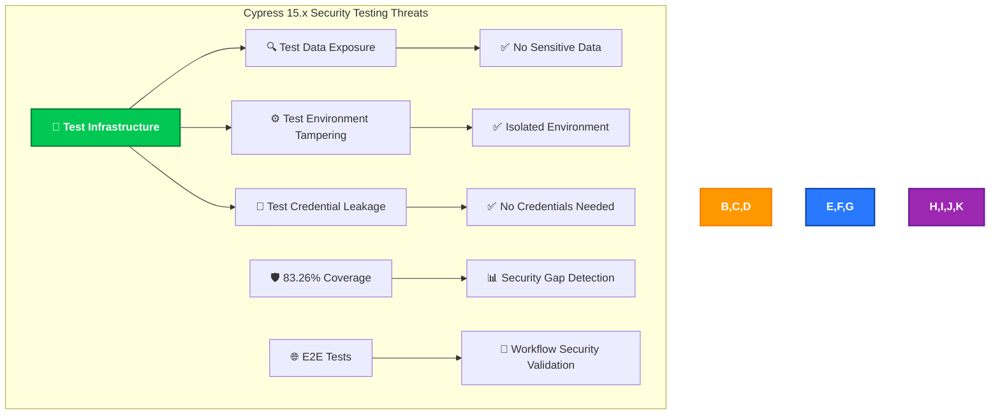

#### **🎯 Cypress Testing Threat Scenarios**

| # | Threat | Attack Vector | Impact | v1.0 Mitigation | Residual Risk |
|---|--------|---------------|--------|-----------------|---------------|
| **1** | **Test Data Exposure** | Extract sensitive assessment data from tests | Low | No sensitive data in tests - synthetic test data only | Minimal - Public tool |
| **2** | **Test Environment Tampering** | Modify test environment to bypass security checks | Medium | Isolated CI/CD environment, hermetic test execution | Low - GitHub Actions isolation |
| **3** | **Test Credential Leakage** | Extract authentication credentials from test code | N/A | No authentication = no credentials to leak | None - Client-side only |
| **4** | **False Security Confidence** | Pass security tests despite vulnerabilities | High | 83.26% coverage + multiple test types (unit/component/E2E) | Medium - Continuous improvement |

#### **✅ Cypress 15.x Security Testing Benefits**

- **🔍 Comprehensive Coverage**: 83.26% line coverage ensures security validation
- **🧪 Multi-Layer Testing**: Unit + Component + E2E tests cover different attack vectors
- **📊 Security Gap Detection**: High coverage identifies missing security controls
- **🔐 Workflow Security**: E2E tests validate end-to-end security workflows

### **🛡️ CSP Header Bypass Threat Analysis**

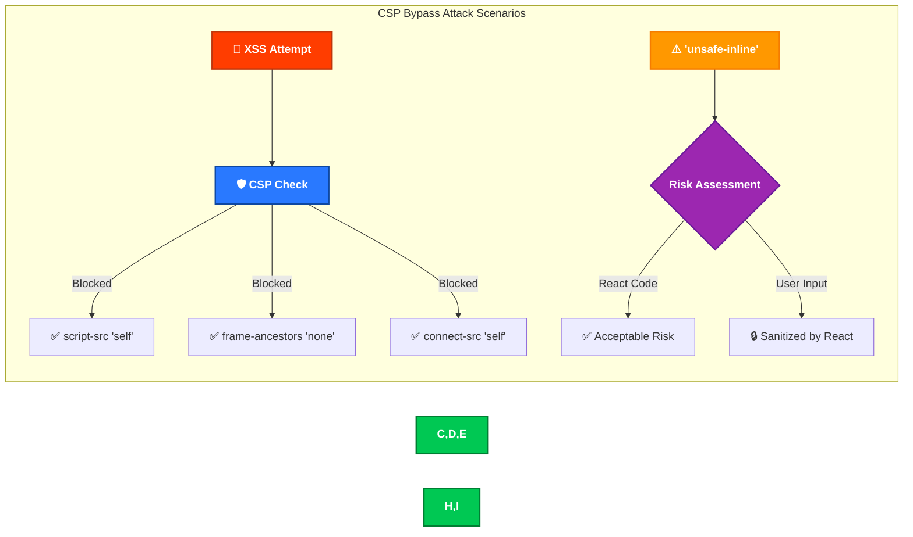

#### **🎯 CSP Bypass Threat Scenarios**

| # | Threat | Attack Vector | Impact | v1.0 Mitigation | Residual Risk |
|---|--------|---------------|--------|-----------------|---------------|
| **1** | **Inline Script Injection** | Exploit 'unsafe-inline' to inject malicious scripts | High | React auto-escaping + TypeScript prevents injection | Low - Defense-in-depth |
| **2** | **External Resource Loading** | Load malicious scripts from external domains | Critical | CSP script-src 'self' blocks external scripts | Minimal - Strict policy |
| **3** | **Clickjacking** | Embed application in malicious frame | High | frame-ancestors 'none' prevents framing | Minimal - Complete protection |
| **4** | **Data Exfiltration via XHR** | Send assessment data to external servers | High | connect-src 'self' blocks external requests | Low - Browser enforcement |
| **5** | **CSP Policy Bypass via Meta Refresh** | Use meta refresh to bypass CSP | Medium | No meta refresh tags, CSP validated | Low - Multiple protections |

#### **✅ CSP Header Security Effectiveness**

- **🛡️ Multi-Directive Protection**: 10+ CSP directives provide comprehensive XSS defense
- **🔒 Strict Defaults**: default-src 'self' prevents unauthorized resource loading
- **🚫 Frame Protection**: frame-ancestors 'none' eliminates clickjacking risk
- **🌐 Network Isolation**: connect-src 'self' prevents data exfiltration
- **⬆️ HTTPS Enforcement**: upgrade-insecure-requests ensures encrypted communications

### **🔗 SLSA Level 3 Supply Chain Threat Analysis**

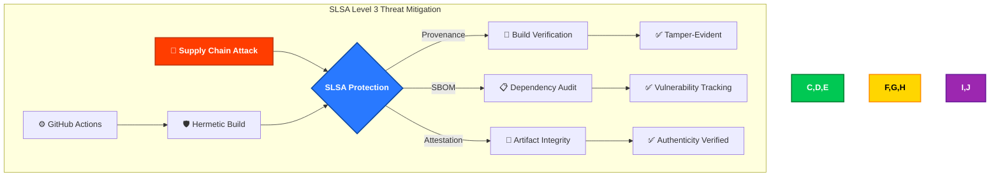

#### **🎯 Supply Chain Threat Scenarios**

| # | Threat | Attack Vector | Impact | v1.0 Mitigation | Residual Risk |
|---|--------|---------------|--------|-----------------|---------------|
| **1** | **Malicious Dependency Injection** | Compromise NPM package in supply chain | Critical | SBOM + Dependabot + dependency review | Medium - Third-party trust |
| **2** | **Build Artifact Tampering** | Modify compiled artifacts post-build | Critical | Build provenance attestation (cryptographic) | Low - GitHub-signed |
| **3** | **GitHub Actions Compromise** | Inject malicious code via workflow modification | High | SHA-pinned actions + restricted permissions | Low - Immutable references |
| **4** | **Typosquatting Dependencies** | Install similarly-named malicious packages | Medium | Dependency lock files + automated scanning | Low - Locked versions |
| **5** | **Transitive Dependency Attack** | Exploit vulnerabilities in nested dependencies | High | SBOM complete visibility + automated scanning | Medium - Deep dependency tree |

#### **✅ SLSA Level 3 Security Benefits**

- **🔏 Build Provenance**: Cryptographic proof of build integrity prevents tampering
- **📋 SBOM Transparency**: Complete dependency visibility enables vulnerability tracking
- **🔐 Artifact Attestation**: GitHub-signed attestations verify artifact authenticity
- **🛡️ Hermetic Builds**: Isolated build environment prevents supply chain compromise
- **⚡ Automated Verification**: Public attestations enable third-party security audit

### **📦 Bundle Optimization & Tree-Shaking Security**

#### **🎯 Bundle Optimization Threat Scenarios**

| # | Threat | Attack Vector | Impact | v1.0 Mitigation | Residual Risk |
|---|--------|---------------|--------|-----------------|---------------|
| **1** | **Source Map Information Disclosure** | Extract sensitive code details from source maps | Low | No production source maps, development-only | Minimal - Public source |
| **2** | **Dead Code Elimination Bypass** | Exploit tree-shaking to include malicious code | Low | Vite tree-shaking + TypeScript validation | Low - Multi-layer verification |
| **3** | **Bundle Size Manipulation** | Inject code to bypass 180KB target | Medium | Automated bundle size checks in CI/CD | Low - Build failure on oversize |
| **4** | **Code Splitting Exploit** | Exploit dynamic imports for code injection | Medium | Static import verification + CSP protection | Low - Multiple protections |

#### **✅ Bundle Optimization Security**

- **📦 175KB Bundle**: Achieved < 180KB target through aggressive tree-shaking
- **🔍 No Source Maps in Production**: Development-only source maps prevent disclosure
- **✅ CI/CD Size Validation**: Automated checks prevent bundle size manipulation
- **🚀 Tree-Shaking**: Dead code elimination reduces attack surface

---

## 🛡️ Comprehensive Security Control Framework

### **🔒 Defense-in-Depth Architecture**

Aligned with [Security Architecture](SECURITY_ARCHITECTURE.md) implementation:

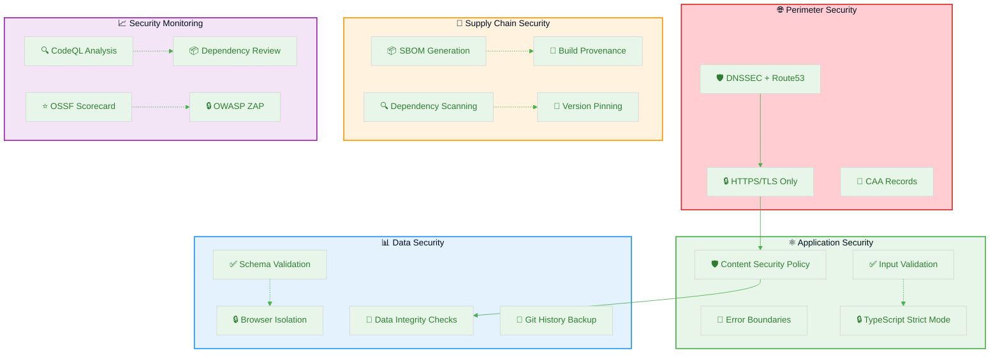

### **🎭 STRIDE → Control Mapping**

| STRIDE Category | Example Threat | Primary Control | Secondary Control | Monitoring |
|----------------|----------------|-----------------|-------------------|------------|
| **🎭 Spoofing** | Package spoofing, DNS attacks | DNSSEC, package verification | SBOM validation, source attestation | Dependency scanning, domain monitoring |
| **🔧 Tampering** | Code injection, data manipulation | Code integrity, CSP headers | Input validation, type safety | Static analysis, change detection |
| **❌ Repudiation** | Algorithm changes without audit | Git history, build attestations | Immutable audit logs | Commit signing, build provenance |
| **📤 Information Disclosure** | Assessment data leakage | Browser isolation, minimal data | Local storage encryption | Access monitoring, data classification |
| **⚡ Denial of Service** | Service disruption, build failure | GitHub Pages redundancy | Error handling, graceful degradation | Uptime monitoring, performance tracking |
| **⬆️ Elevation of Privilege** | Unauthorized access, privilege abuse | Least privilege, access controls | Session isolation, permission boundaries | Access logging, privilege monitoring |

---

## 🔄 Continuous Validation & Assessment

### **🎪 Threat Modeling Workshop Process**

Following [Hack23 AB Workshop Framework](https://github.com/Hack23/ISMS-PUBLIC/blob/main/Threat_Modeling.md#threat-modeling-workshop-framework):

### **📅 Assessment Lifecycle**

| Assessment Type | Trigger | Frequency | Scope | Documentation Update |
|----------------|---------|-----------|-------|---------------------|
| **📅 Comprehensive Review** | Quarterly cycle | Quarterly | Complete threat model | Full document revision |
| **🔄 Delta Assessment** | Architecture changes | Per change | Modified components | Incremental updates |
| **🚨 Incident-Driven** | Security events | As needed | Affected systems | Lessons learned integration |
| **🎯 Threat Intelligence** | New attack patterns | Monthly | High-risk scenarios | MITRE ATT&CK updates |
| **📦 Dependency Assessment** | New dependencies | Per dependency change | Supply chain components | Dependency risk updates |

---

## 📊 Comprehensive Threat Agent Analysis

### **🔍 Detailed Threat Actor Classification**

Following [Hack23 AB Threat Agent Classification](https://github.com/Hack23/ISMS-PUBLIC/blob/main/Threat_Modeling.md#threat-agent-classification) methodology:

| Threat Agent | Category | CIA Manager Context | MITRE Techniques | Risk Level | Compliance Motivation |
|--------------|----------|---------------------|------------------|------------|----------------------|
| **🏢 Commercial GRC Vendors** | External | Competitive undermining of open source alternative | [Supply Chain Compromise](https://attack.mitre.org/techniques/T1195), [Data Manipulation](https://attack.mitre.org/techniques/T1565) |  | High - market competition |
| **🏛️ Nation-State Actors** | External | Compliance framework manipulation, standards influence | [Information Manipulation](https://attack.mitre.org/techniques/T1565), [Supply Chain](https://attack.mitre.org/techniques/T1195) |  | Medium - strategic influence |
| **💰 Cybercriminals** | External | Tool weaponization, compliance fraud | [Masquerading](https://attack.mitre.org/techniques/T1036), [Phishing](https://attack.mitre.org/techniques/T1566) |  | Low - limited financial incentive |
| **🔒 Accidental Contributors** | Internal | Unintentional code corruption, misconfiguration | [Data Corruption](https://attack.mitre.org/techniques/T1485), [Misconfigurations](https://attack.mitre.org/techniques/T1611) |  | None - no malicious intent |
| **🎯 Malicious Contributors** | Internal | Algorithm bias injection, backdoor insertion | [Code Injection](https://attack.mitre.org/techniques/T1059), [Account Manipulation](https://attack.mitre.org/techniques/T1098) |  | Variable - depends on motivation |
| **🤝 Dependency Maintainers** | External | Indirect access through maintained packages | [Supply Chain Compromise](https://attack.mitre.org/techniques/T1195), [Valid Accounts](https://attack.mitre.org/techniques/T1078) |  | Low - dependency on third parties |

---

## 🌐 Current Threat Landscape Integration

### **📊 ENISA Threat Landscape 2024 Application**

Implementing [ENISA Threat Landscape 2024](https://www.enisa.europa.eu/publications/enisa-threat-landscape-2024) specific to CIA Manager:

| ENISA Priority | Threat Category | CIA Manager Context | Specific Scenarios | Mitigation Strategy |
|----------------|-----------------|---------------------|-------------------|-------------------|
| **1️⃣** | **⚡ Availability Threats** | DoS against compliance assessment services | GitHub Pages outages, CDN attacks |  GitHub redundancy + monitoring |
| **2️⃣** | **🔐 Ransomware** | Assessment data encryption in browser storage | Local storage ransomware, session hijacking |  Session isolation + export capabilities |
| **3️⃣** | **📊 Data Threats** | Compliance framework manipulation | Framework data corruption, false mappings |  Expert validation + version control |
| **4️⃣** | **🦠 Malware** | Browser-based malware targeting assessments | Malicious browser extensions, XSS attacks |  CSP + browser security |
| **5️⃣** | **🎭 Social Engineering** | User manipulation for biased assessments | Phishing for false compliance claims |  User education + verification |
| **6️⃣** | **📰 Information Manipulation** | False compliance reporting | Misleading security posture claims |  Methodology transparency |
| **7️⃣** | **🔗 Supply Chain** | NPM package compromise | Malicious dependencies, build tampering |  SBOM + attestations |

---

## 🎯 Multi-Strategy Threat Modeling Implementation

### **🔍 Complete Framework Integration**

Following [Hack23 AB Comprehensive Threat Modeling Strategies](https://github.com/Hack23/ISMS-PUBLIC/blob/main/Threat_Modeling.md#comprehensive-threat-modeling-strategies--models):

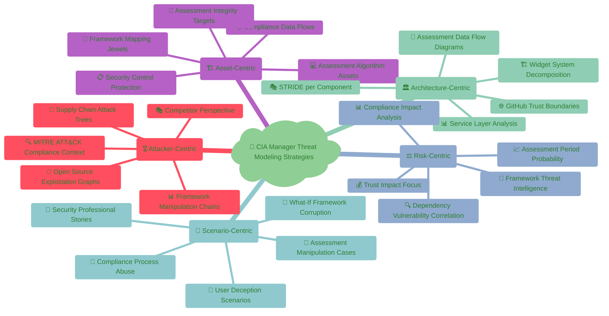

---

## 🎯 Scenario-Centric Threat Modeling

### **📝 Compliance Process Abuse Analysis**

Following [Hack23 AB Scenario-Centric Modeling](https://github.com/Hack23/ISMS-PUBLIC/blob/main/Threat_Modeling.md#scenario-centric-threat-modeling):

#### **🚨 Compliance Misuse Cases**

| Legitimate Compliance Use Case | Compliance Misuse Case | Attack Method | Compliance Impact | Mitigation |
|-------------------------------|----------------------|---------------|------------------|------------|
| **🔍 Security Assessment** | **📊 False Compliance Claims** | Assessment manipulation, biased inputs | Regulatory non-compliance, audit failures | Input validation, audit trails, expert review |
| **📊 Framework Mapping** | **⚖️ Standard Misrepresentation** | Framework data corruption, selective mapping | Compliance gaps, false security posture | Multi-source validation, version control |
| **🏢 Risk Analysis** | **🎯 Risk Underestimation** | Algorithm bias, incomplete assessments | Security incidents, regulatory penalties | Comprehensive methodologies, peer review |
| **📈 Compliance Reporting** | **📰 Misleading Documentation** | Report manipulation, selective metrics | Stakeholder deception, legal consequences | Transparent methodology, immutable reports |
| **🔧 Implementation Guidance** | **💰 Security Theater** | Superficial controls, checkbox compliance | False security confidence, real vulnerabilities | Implementation verification, effectiveness testing |

#### **👤 Compliance Persona-Based Threat Analysis**

```mermaid
%%{
  init: {
    'theme': 'base',
    'themeVariables': {
      'primaryColor': '#f3e5f5',
      'primaryTextColor': '#6a1b9a',
      'lineColor': '#9c27b0',
      'secondaryColor': '#e8f5e9',
      'tertiaryColor': '#fff3e0'
    }
  }
}%%
flowchart TD
    subgraph PERSONAS["👥 Compliance Threat Personas"]
        COMPETITIVE[🏢 Commercial Vendor<br/>High Resources, Market Protection]
        REGULATORY[⚖️ Regulatory Manipulator<br/>High Stakes, Compliance Fraud]
        INTERNAL[👤 Internal Bad Actor<br/>Privileged Access, Bias Injection]
        AUTOMATED[🤖 Automated Attacker<br/>Scale, Systematic Exploitation]
    end
    
    subgraph METHODS["⚔️ Compliance Attack Methods"]
        FRAMEWORK_CORRUPT[📊 Framework Corruption]
        ASSESSMENT_BIAS[🎯 Assessment Manipulation]
        SOCIAL_DECEPTION[🎭 Social Engineering]
        TECHNICAL_EXPLOIT[🔧 Technical Exploitation]
    end
    
    subgraph TARGETS["🎯 Compliance Targets"]
        TRUST[🤝 Professional Trust]
        ACCURACY[✅ Assessment Accuracy]
        METHODOLOGY[📋 Framework Integrity]
        REPUTATION[🏆 Tool Credibility]
    end
    
    COMPETITIVE --> FRAMEWORK_CORRUPT
    COMPETITIVE --> TRUST
    
    REGULATORY --> ASSESSMENT_BIAS
    REGULATORY --> ACCURACY
    
    INTERNAL --> SOCIAL_DECEPTION
    INTERNAL --> METHODOLOGY
    
    AUTOMATED --> TECHNICAL_EXPLOIT
    AUTOMATED --> REPUTATION
    
    style COMPETITIVE fill:#ffcdd2
    style REGULATORY fill:#fff3e0
    style INTERNAL fill:#e8f5e9
    style AUTOMATED fill:#e3f2fd
```

#### **🎲 Compliance What-If Scenario Planning**

**🔍 Scenario 1: Pre-Audit Assessment Manipulation**
- **What if:** A organization uses a tampered version of CIA Manager before a critical audit?
- **Attack Path:** Supply Chain → Tool Corruption → False Assessment → Audit Failure → Regulatory Penalties
- **Compliance Impact:** Regulatory non-compliance, financial penalties, reputation damage
- **Detection:** Assessment result validation, cross-tool verification, expert review
- **Response:** Immediate tool verification, reassessment, regulatory communication

**🔍 Scenario 2: Framework Standard Corruption Campaign**
- **What if:** A sustained campaign gradually corrupts compliance framework mappings?
- **Attack Path:** Contributor Access → Gradual Changes → Framework Drift → Widespread Misuse → Standard Erosion
- **Compliance Impact:** Industry-wide compliance gaps, regulatory framework weakening
- **Detection:** Version comparison, expert validation, community review
- **Response:** Framework validation, rollback procedures, community alert

**🔍 Scenario 3: Competitive Undermining Through False Negatives**
- **What if:** A competitor systematically biases the tool to show false compliance gaps?
- **Attack Path:** Tool Access → Algorithm Manipulation → False Results → Competitive Advantage → Market Distortion
- **Compliance Impact:** Unfair competition, reduced trust in open source tools
- **Detection:** Result validation, competitive analysis, user feedback
- **Response:** Algorithm audit, bias correction, transparency enhancement

---

## ⚖️ Enhanced Risk-Centric Analysis

### **📊 Compliance Impact Quantification**

Following [Risk-Centric Threat Modeling](https://github.com/Hack23/ISMS-PUBLIC/blob/main/Threat_Modeling.md#risk-centric-threat-modeling):

#### **🏛️ Compliance Impact Assessment Matrix**

| Threat Scenario | Probability | Compliance Impact | Professional Trust Impact | Regulatory Impact | Compliance Risk Score |
|----------------|-------------|-------------------|--------------------------|------------------|----------------------|
| **📦 Supply Chain Framework Corruption** | 20% |  |  |  | 9.2/10 |
| **🧠 Assessment Algorithm Bias** | 15% |  |  |  | 7.8/10 |
| **📊 Framework Mapping Manipulation** | 25% |  |  |  | 8.1/10 |
| **🔧 Build Pipeline Compromise** | 10% |  |  |  | 6.2/10 |
| **💾 User Assessment Data Theft** | 30% |  |  |  | 4.8/10 |

#### **📈 Compliance Threat Intelligence Integration**

| Intelligence Source | Update Frequency | Compliance Relevance | Integration Method | CIA Manager Application |
|-------------------|------------------|---------------------|-------------------|-------------------------|
| **🏛️ Framework Authority Updates** | Real-time | 10/10 | Direct API monitoring | Framework version validation |
| **📊 Compliance Vulnerability Feeds** | Daily | 9/10 | Security scanning integration | Compliance gap detection |
| **🔍 Open Source Security Alerts** | Real-time | 8/10 | GitHub security advisories | Dependency vulnerability tracking |
| **⚖️ Regulatory Change Notifications** | Weekly | 7/10 | Regulatory monitoring | Framework update requirements |
| **🎯 Professional Community Insights** | Monthly | 8/10 | Community feedback | User experience validation |

---

## 📚 Related Architecture Documentation

### **🔗 Threat Model Integration with System Architecture**

This threat model builds upon and integrates with the comprehensive architecture documentation:

| Document | Threat Model Integration | Key Security Insights |
|----------|-------------------------|----------------------|
| **[🏗️ Architecture](ARCHITECTURE.md)** | C4 model threat boundaries | Trust boundary identification, component-level STRIDE analysis |
| **[🏛️ System Architecture](SYSTEM_ARCHITECTURE.md)** | Layered security controls | Defense-in-depth validation, service layer protection |
| **[🛡️ Security Architecture](SECURITY_ARCHITECTURE.md)** | Security control validation | Comprehensive security posture assessment |
| **[📊 Data Model](DATA_MODEL.md)** | Data flow threat analysis | Information asset protection, data integrity validation |
| **[🔄 State Diagrams](STATEDIAGRAM.md)** | State transition security | Workflow security validation, state manipulation threats |
| **[📋 Process Flowcharts](FLOWCHART.md)** | Process security analysis | Workflow attack scenarios, process integrity validation |
| **[🧩 Widget Analysis](WIDGET_ANALYSIS.md)** | Component threat modeling | UI component security, client-side threat assessment |
| **[⚙️ Workflows](WORKFLOWS.md)** | CI/CD security validation | Pipeline threat analysis, build security assessment |
| **[💼 SWOT Analysis](SWOT.md)** | Strategic threat context | Business risk integration, competitive threat analysis |
| **[🔄 BCP Plan](BCPPlan.md)** | Business continuity threats | Disaster recovery security, continuity threat scenarios |

### **🎯 CRA Compliance Integration**

This threat model supports the CRA (Cyber Resilience Act) assessment documented in the project root:

| CRA Requirement | Threat Model Coverage | Security Controls |
|----------------|----------------------|------------------|
| **🛡️ § 1.1 - Secure by Design** | Architecture-centric analysis, trust boundaries | Defense-in-depth, minimal attack surface |
| **🔒 § 1.2 - Secure by Default** | Default security configurations, hardening | Secure defaults, configuration validation |
| **🔍 § 2.2 - Vulnerability Disclosure** | Threat agent analysis, disclosure processes | Coordinated disclosure, vulnerability management |
| **📦 § 2.3 - Software Bill of Materials** | Supply chain threat analysis, SBOM validation | Dependency tracking, provenance verification |
| **🔐 § 2.4 - Secure Updates** | Update mechanism threats, integrity validation | Secure deployment, rollback capabilities |
| **📊 § 2.5 - Security Monitoring** | Continuous validation, monitoring requirements | Real-time threat detection, incident response |

---

## 🎪 Advanced Threat Modeling Workshop Framework

### **📋 CIA Manager-Specific Workshop Preparation**

Following [Hack23 AB Workshop Framework](https://github.com/Hack23/ISMS-PUBLIC/blob/main/Threat_Modeling.md#threat-modeling-workshop-framework) with compliance tool adaptations:

#### **🎯 Compliance Tool-Specific Workshop Scope**
- **📊 Assessment Methodology Security:** Algorithm integrity, bias detection, validation processes
- **⚖️ Framework Mapping Accuracy:** Compliance standard representation, expert validation
- **🔧 Implementation Guidance Security:** Control recommendations, implementation verification
- **👥 Professional User Trust:** Security professional expectations, credibility maintenance

#### **👥 Compliance Tool Team Assembly**
- **🛡️ Security Assessment Expert:** Compliance frameworks, risk assessment methodologies
- **📊 Compliance Specialist:** Regulatory requirements, framework interpretation
- **🔧 Frontend Security Developer:** React security, browser-based threat mitigation
- **📦 Supply Chain Security Engineer:** NPM ecosystem security, dependency management
- **👥 Security Professional (User Representative):** User perspective, real-world usage scenarios

#### **📊 Compliance Context Analysis Framework**

**🛡️ Assessment Security Evaluation:**
- How might attackers manipulate security assessments for false compliance?
- What validation ensures assessment methodology integrity?
- How do we prevent bias injection in compliance evaluations?
- What transparency measures allow professional verification?

**⚖️ Framework Integrity Assessment:**
- How could compliance frameworks be misrepresented or corrupted?
- What safeguards ensure accurate regulatory mapping?
- How do we maintain framework version integrity?
- What expert validation processes prevent framework drift?

**🔧 Implementation Security Analysis:**
- How do we prevent security theater through superficial compliance?
- What verification ensures recommended controls are effective?
- How do we validate implementation guidance accuracy?
- What feedback mechanisms identify implementation gaps?

---

## 📊 Compliance Threat Catalog Framework

### **🏛️ Compliance-Specific Threat Documentation**

Each compliance threat entry includes regulatory impact assessment per [Threat Catalog Framework](https://github.com/Hack23/ISMS-PUBLIC/blob/main/Threat_Modeling.md#threat-catalog-framework):

#### **🔴 Critical Compliance Threats**

##### **📦 Supply Chain Framework Corruption**
- **🎯 Compliance Tactic:** Regulatory Framework Manipulation
- **🔧 MITRE Technique:** [Supply Chain Compromise (T1195)](https://attack.mitre.org/techniques/T1195/)
- **🏛️ Compliance Component:** Framework mapping data and compliance validation logic
- **📝 Threat Description:** Systematic corruption of compliance framework mappings to misrepresent regulatory requirements
- **👥 Threat Agent:** Nation-state actors, commercial competitors, regulatory manipulators
- **🔐 CIA at Risk:** Integrity (framework accuracy), Availability (assessment reliability), Confidentiality (proprietary methodologies)
- **🔑 AAA Controls:** Authentication for framework updates, Authorization for compliance data modification, Accounting for all framework changes
- **🎭 STRIDE Attribute:** Tampering, Spoofing, Information Disclosure
- **🛡️ Security Measures:** Multi-source validation, expert review panels, version control, change detection
- **⚡ Priority:** **Critical**
- **🏛️ Compliance Impact:** Widespread regulatory non-compliance, audit failures, legal consequences
- **❓ Assessment Questions:** Are framework sources verified? Can gradual corruption be detected? Are expert validation processes in place?

##### **🧠 Assessment Algorithm Bias Injection**
- **🎯 Compliance Tactic:** Assessment Manipulation for False Compliance
- **🔧 MITRE Technique:** [Data Manipulation (T1565)](https://attack.mitre.org/techniques/T1565/)
- **🏛️ Compliance Component:** Security assessment algorithms and scoring logic
- **📝 Threat Description:** Systematic bias injection into assessment algorithms to produce favorable but inaccurate compliance results
- **👥 Threat Agent:** Internal malicious contributors, commercial competitors, regulatory evaders
- **🔐 CIA at Risk:** Integrity (assessment accuracy), Confidentiality (algorithm details)
- **🔑 AAA Controls:** Authentication for code contributions, Authorization for algorithm modifications, Accounting for assessment logic changes
- **🎭 STRIDE Attribute:** Tampering, Elevation of Privilege
- **🛡️ Security Measures:** Code review processes, algorithm auditing, bias detection, peer validation
- **⚡ Priority:** **Critical**
- **🏛️ Compliance Impact:** False security posture, regulatory penalties, professional credibility loss
- **❓ Assessment Questions:** Are assessment algorithms audited? Can bias be systematically detected? Are independent validation mechanisms in place?

---

## 🔄 Continuous Compliance Validation

### **📅 Compliance Context Assessment Lifecycle**

| Assessment Type | Compliance Trigger | Frequency | Compliance Scope | Professional Transparency |
|----------------|------------------|-----------|------------------|-------------------------|
| **⚖️ Regulatory Update Assessment** | Framework version changes | Per framework update | Complete compliance mapping | Public methodology updates |
| **🔍 Algorithm Audit Assessment** | Assessment logic changes | Per algorithm modification | Assessment methodology | Open algorithm documentation |
| **👥 Professional Community Assessment** | User feedback/incidents | Monthly | User experience and accuracy | Community engagement reports |
| **📊 Framework Accuracy Assessment** | Regulatory guidance updates | Quarterly | Framework interpretation | Expert validation reports |
| **🔧 Implementation Validation Assessment** | Control effectiveness studies | Semi-annually | Implementation guidance | Effectiveness research publication |

### **🏛️ Compliance Validation Pipeline Integration**

| Compliance Control Layer | Professional Evidence | Transparency Enforcement | Compliance Threat Coverage |
|-------------------------|---------------------|-------------------------|---------------------------|
| **🔍 Assessment Accuracy Validation** | Public methodology documentation | Open algorithm explanations | Assessment manipulation, bias injection |
| **📊 Framework Integrity Verification** | Expert validation reports | Open framework change logs | Framework corruption, standard misrepresentation |
| **🏛️ Regulatory Compliance Validation** | Compliance mapping documentation | Open regulatory interpretation | Regulatory non-compliance, legal consequences |
| **⚖️ Professional Standards Protection** | Professional community engagement | Open peer review processes | Professional credibility loss, trust erosion |
| **👥 User Experience Validation** | User feedback and validation | Open usage analytics | User deception, false confidence |
| **📈 Compliance Impact Assessment** | Effectiveness studies | Open research publication | Ineffective controls, security theater |

---

## 🎯 Compliance Threat Modeling Maturity

### **📈 Compliance Tool Maturity Framework**

Following [Hack23 AB Maturity Levels](https://github.com/Hack23/ISMS-PUBLIC/blob/main/Threat_Modeling.md#threat-modeling-maturity-levels) with compliance tool adaptations:

#### **🟢 Level 1: Compliance Foundation**
- **🏛️ Basic Compliance Architecture:** Core framework documentation with basic accuracy validation
- **⚖️ Regulatory Awareness:** Basic regulatory requirement mapping and compliance tracking
- **👥 Professional Stakeholder Identification:** Key compliance actors mapped with validation roles
- **📊 Assessment Transparency:** Public methodology documentation and basic verification
- **🛡️ Compliance Security Controls:** Basic protections against assessment manipulation

#### **🟡 Level 2: Compliance Process Integration**
- **📅 Regulatory Cycle Integration:** Threat assessment aligned with regulatory update cycles
- **📝 Compliance Context Documentation:** Enhanced threat models including regulatory scenarios
- **🔧 Compliance Tool Integration:** Assessment validation tools and accuracy verification systems
- **🔄 Professional Community Tracking:** Professional participation in threat identification and validation

#### **🟠 Level 3: Compliance Analysis Excellence**
- **🔍 Comprehensive Compliance STRIDE:** Systematic threat categorization for all compliance processes
- **⚖️ Compliance Risk Assessment:** Regulatory impact, professional trust, and accuracy criteria
- **🛡️ Compliance Mitigation Strategies:** Comprehensive controls for compliance-specific threats
- **🎓 Professional Security Education:** Community education on compliance tool security

#### **🔴 Level 4: Advanced Compliance Intelligence**
- **🌐 Advanced Compliance Modeling:** Real-world compliance attack simulations and regulatory war gaming
- **📊 Continuous Compliance Monitoring:** Real-time regulatory threat landscape integration
- **📈 Compliance Health Metrics:** Comprehensive professional trust and accuracy measurement
- **🔄 Professional Validation Sessions:** Community-driven threat identification and mitigation validation

#### **🟣 Level 5: Compliance Innovation Leadership**
- **🔮 Proactive Compliance Protection:** Emerging regulatory threat anticipation and countermeasures
- **🤖 AI-Enhanced Compliance Security:** Machine learning for bias detection and assessment manipulation identification
- **📊 Global Compliance Intelligence:** International regulatory security collaboration and best practice sharing
- **🔬 Predictive Compliance Analytics:** Advanced modeling for compliance health and threat prediction

---

## 🌟 Compliance Security Best Practices

### **🏛️ Compliance Tool Security Principles**

#### **⚖️ Regulatory Integrity by Design**
- **🔍 Transparent Methodology:** All assessment and framework mapping methodologies publicly documented and verifiable
- **⚖️ Bias Prevention Enforcement:** Systematic bias detection and correction mechanisms
- **📊 Multi-Source Validation:** Cross-verification of compliance framework mappings from multiple authoritative sources
- **🛡️ Defense-in-Depth Compliance:** Multi-layer validation ensuring regulatory accuracy at every level

#### **🤝 Professional Trust Through Transparency**
- **📄 Open Source Verification:** Complete source code availability enabling community security review
- **🔍 Public Security Architecture:** Open threat model documentation enabling professional verification
- **📊 Community-Driven Validation:** Professional security community participation in threat identification
- **📈 Evidence-Based Assessment:** Transparent metrics and calculations supporting professional confidence

#### **🔄 Continuous Compliance Improvement**
- **⚡ Proactive Threat Detection:** Early identification of emerging compliance manipulation techniques
- **📊 Evidence-Based Security:** Data-driven compliance security decisions with professional accountability
- **🤝 International Collaboration:** Collaboration with global compliance and security organizations
- **💡 Innovation in Compliance Security:** Leading development of new compliance tool protection methods

---

## 🎯 v1.0 Implementation Status & Future Roadmap

### **✅ v1.0 Security Controls — COMPLETED**

The following security enhancements have been successfully implemented for v1.0 release:

1. **✅ Content Security Policy Headers — IMPLEMENTED**:
   - ✅ Comprehensive CSP with strict directives
   - ✅ frame-ancestors 'none' preventing clickjacking
   - ✅ connect-src 'self' blocking external exfiltration
   - ✅ X-Frame-Options, X-Content-Type-Options headers

2. **✅ Supply Chain Security — SLSA Level 3 ACHIEVED**:
   - ✅ Build provenance attestation (actions/attest-build-provenance@v3)
   - ✅ SBOM generation and attestation
   - ✅ SHA-pinned GitHub Actions for immutability
   - ✅ Dependency scanning with Dependabot
   - ✅ Dependency review in PRs

3. **✅ React 19.x Error Boundaries — IMPLEMENTED**:
   - ✅ Widget-level error boundaries for component isolation
   - ✅ Custom WidgetErrorBoundary class component implementation
   - ✅ Graceful failure handling preventing cascading errors
   - ✅ Information disclosure prevention

4. **✅ TypeScript Strict Mode — ENABLED**:
   - ✅ Zero `any` types throughout codebase
   - ✅ strictNullChecks, noImplicitAny, strictFunctionTypes
   - ✅ Complete type safety with null checks
   - ✅ Compile-time vulnerability detection

5. **✅ Cypress 15.x Testing Infrastructure — DEPLOYED**:
   - ✅ 83.26% line coverage (>80% target exceeded)
   - ✅ Component testing for widget security
   - ✅ E2E testing for workflow security
   - ✅ Visual regression testing

6. **✅ Input Validation & Data Integrity — COMPREHENSIVE**:
   - ✅ Client-side validation for all assessment inputs
   - ✅ Type guards for runtime type validation
   - ✅ Schema validation for static data files
   - ✅ Error handling with React error boundaries

7. **✅ Security Monitoring — CI/CD INTEGRATED**:
   - ✅ CodeQL static analysis on every PR
   - ✅ OpenSSF Scorecard continuous assessment
   - ✅ OWASP ZAP dynamic security testing
   - ✅ License compliance scanning

### **📅 Post-v1.0 Security Evolution**

After achieving v1.0 stability, these advanced security capabilities can be explored:

1. **🤖 AI-Enhanced Security**:
   - Machine learning for bias detection in assessments
   - Automated compliance framework validation
   - Predictive security threat modeling
   - Intelligent anomaly detection for assessment patterns

2. **🌐 Advanced Integration Security**:
   - Secure API endpoints for enterprise integration
   - Enhanced authentication and authorization mechanisms
   - Cross-platform security validation
   - Advanced threat intelligence integration

3. **🔒 Zero Trust Architecture**:
   - Implementation of zero trust principles for compliance tools
   - Enhanced verification mechanisms for all data sources
   - Continuous authentication and authorization validation
   - Advanced threat detection and response capabilities

---

## 🔍 Security Validation Framework

### **🧪 Security Testing Strategy**

The CIA Compliance Manager implements comprehensive security testing aligned with threat scenarios:

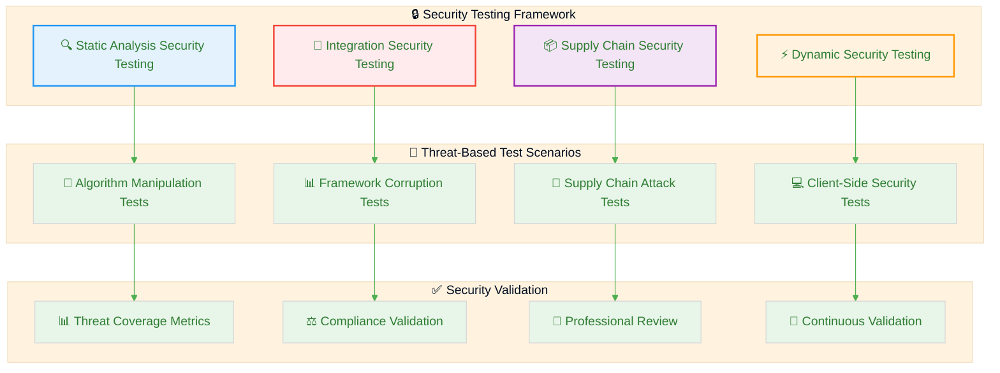

### **📊 Security Metrics and KPIs (v1.0 Achievement)**

| Security Metric | v0.8.x Baseline | v1.0 Target | v1.0 Achieved | Status |
|----------------|-----------------|-------------|---------------|--------|
| **🔍 Code Test Coverage** | 75% | 80% | 83.26% | ✅ **Target Exceeded** |
| **📦 Dependency Vulnerabilities** | <10 Critical | 0 Critical | 0 Critical | ✅ **Target Met** |
| **🛡️ CSP Implementation** | Partial | Complete | Complete (10+ directives) | ✅ **Target Met** |
| **⚡ SLSA Supply Chain Level** | Level 1 | Level 3 | Level 3 (Provenance + SBOM) | ✅ **Target Met** |
| **📊 Error Boundary Coverage** | None | All Widgets | All Widgets + Global | ✅ **Target Exceeded** |
| **🔒 TypeScript Strict Mode** | Partial | Complete | Zero `any` types | ✅ **Target Met** |
| **📦 Bundle Size** | 188KB | <180KB | 175KB | ✅ **Target Met** |
| **🧪 E2E Test Framework** | Cypress 13.x | Cypress 15.x | Cypress 15.7.0 | ✅ **Target Met** |
| **⚛️ React Version** | React 18.x | React 19.x | React 19.2.0 | ✅ **Target Met** |

### **🔄 Security Review Cycle**

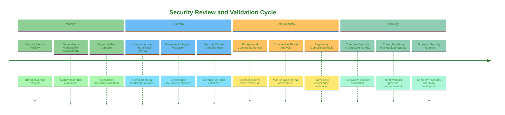

---

## 📚 Appendices

### **Appendix A: MITRE ATT&CK Technique Coverage (v1.0)**

| MITRE Technique | Threat Context | Current Controls | Coverage Level | v1.0 Enhancement |
|----------------|----------------|------------------|----------------|------------------|
| [T1195 - Supply Chain Compromise](https://attack.mitre.org/techniques/T1195/) | NPM package manipulation | SBOM, dependency scanning, provenance |  | SLSA Level 3 attestation |
| [T1189 - Drive-by Compromise](https://attack.mitre.org/techniques/T1189/) | Malicious site hosting | CSP, HTTPS enforcement |  | Comprehensive CSP with 10+ directives |
| [T1565 - Data Manipulation](https://attack.mitre.org/techniques/T1565/) | Assessment result tampering | Data integrity checks, validation |  | React 19.x error boundaries + TypeScript strict |
| [T1036 - Masquerading](https://attack.mitre.org/techniques/T1036/) | Fake CIA Manager sites | Domain verification, user education |  | DNSSEC + CAA records |
| [T1027 - Obfuscated Files](https://attack.mitre.org/techniques/T1027/) | Malicious minified code | Source code review, static analysis |  | TypeScript strict (zero `any`) + SBOM |

### **Appendix B: Compliance Framework Security Mapping**

| Framework | Security Requirements | CIA Manager Implementation | Gap Analysis |
|-----------|----------------------|----------------------------|--------------|
| **NIST CSF 2.0** | Supply chain security (SC.RM-1) | SBOM generation, dependency scanning |  |
| **ISO 27001** | Information security management (A.12.6.1) | Comprehensive security architecture |  |
| **CIS Controls** | Software asset management (CIS-1) | Complete asset inventory via SBOM |  |
| **OWASP ASVS** | Architecture verification (V1) | Security architecture documentation |  |

### **Appendix C: Threat Agent Capability Assessment**

| Threat Agent | Technical Capability | Resource Level | Motivation Level | Overall Threat Level |
|--------------|---------------------|----------------|------------------|---------------------|
| **🏢 Commercial GRC Vendors** | High | High | High |  |
| **🏛️ Nation-State Actors** | Very High | Very High | Medium |  |
| **💰 Cybercriminals** | Medium | Medium | Low |  |
| **🎯 Malicious Contributors** | High | Low | Variable |  |
| **🤝 Dependency Maintainers** | Medium | Low | Low |  |

---

## 📝 Conclusion

The CIA Compliance Manager threat model demonstrates a comprehensive, multi-framework approach to security that aligns with Hack23 AB's commitment to **🛡️ security through transparency and excellence**. This analysis provides:

### **🎯 Key Security Insights**

1. **🔒 Supply Chain Security as Primary Risk**: The analysis identifies supply chain attacks as the highest probability and impact threat, requiring comprehensive SBOM, provenance attestation, and dependency validation.

2. **📊 Compliance Integrity Protection**: The tool's core value—accurate compliance assessment—requires robust protection against algorithm manipulation, framework corruption, and assessment bias.

3. **🌐 Client-Side Security Model**: The frontend-only architecture provides natural security advantages through reduced attack surface while requiring specific protections for browser-based threats.

4. **🤝 Professional Trust Through Transparency**: Open source transparency combined with rigorous security controls builds professional confidence in assessment accuracy and methodology integrity.

### **🛡️ Defense Strategy Effectiveness**

The implemented defense-in-depth strategy provides:

- **🔍 Early Detection**: Comprehensive CI/CD security scanning catches vulnerabilities during development
- **📦 Supply Chain Protection**: SBOM generation, dependency scanning, and provenance attestation secure the software supply chain
- **⚛️ Runtime Protection**: Content Security Policy, input validation, and browser security model protect client-side execution
- **📊 Continuous Validation**: Regular security reviews and threat intelligence integration maintain security posture

### **🚀 Strategic Security Direction**

This threat model supports the v1.0 release while providing a roadmap for future security evolution:

1. **📅 Immediate v1.0 Focus**: Complete existing security controls, enhance supply chain protection, and strengthen assessment integrity
2. **🌐 Post-v1.0 Evolution**: Advanced AI-enhanced security, zero trust architecture, and enhanced integration capabilities
3. **🔄 Continuous Improvement**: Regular threat model updates, community-driven validation, and emerging threat integration

### **💡 Innovation Through Security**

The CIA Compliance Manager demonstrates how **🔒 security can be a competitive advantage** rather than operational burden:

- **🌟 Transparency as Strength**: Public security documentation builds trust and enables community validation
- **📊 Security as Quality**: Rigorous security controls ensure assessment accuracy and professional credibility
- **🔄 Security as Enabler**: Comprehensive security foundation enables future platform evolution and enterprise adoption

### **🎯 Business Value Realization**

This threat model directly supports business objectives:

- **** through transparent security practices and open source verification
- **** via demonstrable cybersecurity consulting expertise
- **** through comprehensive threat analysis and mitigation
- **** via automated security validation and continuous improvement

The CIA Compliance Manager threat model exemplifies how systematic security analysis creates business value while protecting critical assets and enabling sustainable growth in the cybersecurity consulting market.

---

**📋 Document Owner:** CEO | **📄 Version:** 1.0 | **📅 Last Updated:** 2025-11-22 (UTC)  
**🔄 Review Cycle:** Quarterly | **⏰ Next Review:** 2026-02-22  
**🏷️ Classification:** Public (Open Source Compliance Tool)

**🔄 Version History:**
- **v1.0 Update (2025-11-22)**: Updated for v1.0 release with React 19.x, Cypress 15.x, SLSA Level 3, CSP implementation
- **v1.0 Initial (2025-09-19)**: Initial comprehensive threat model baseline

**🎯 Framework Compliance:**     
