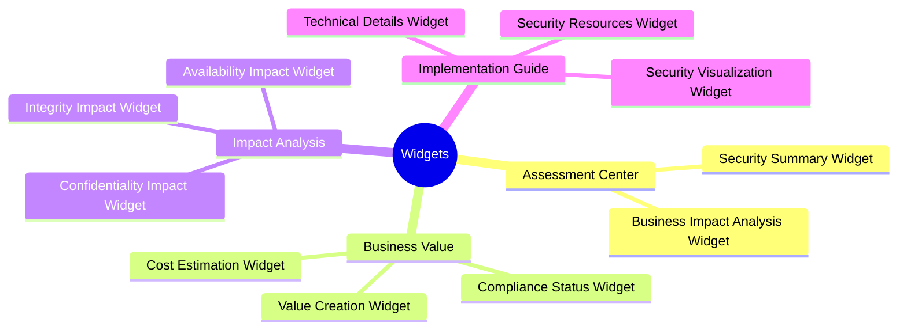
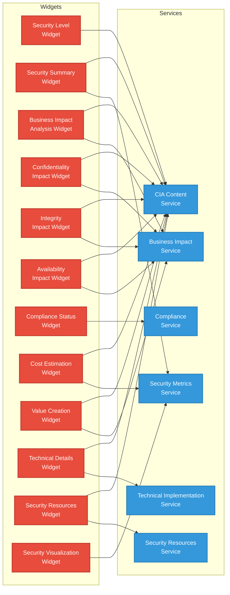
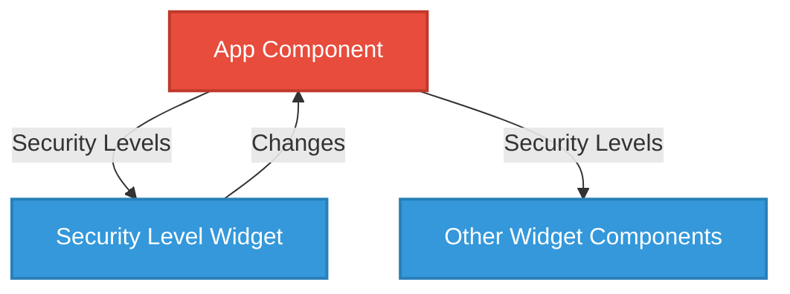
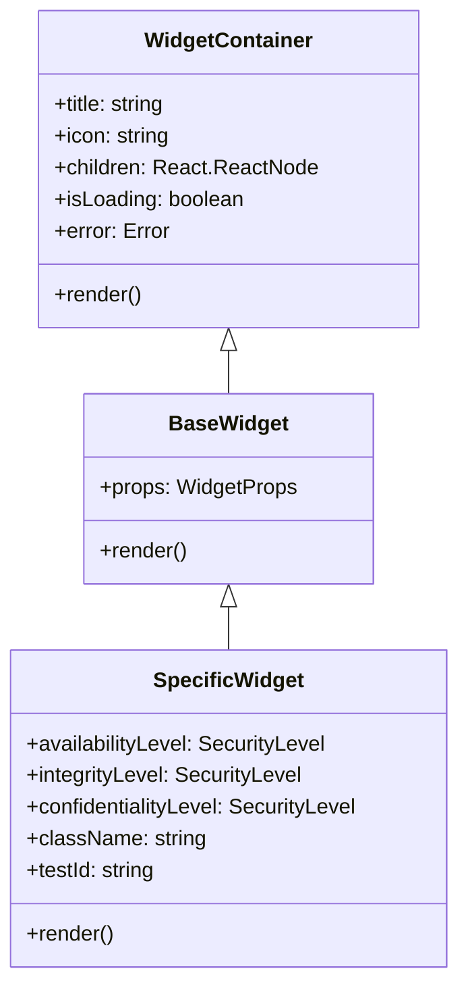
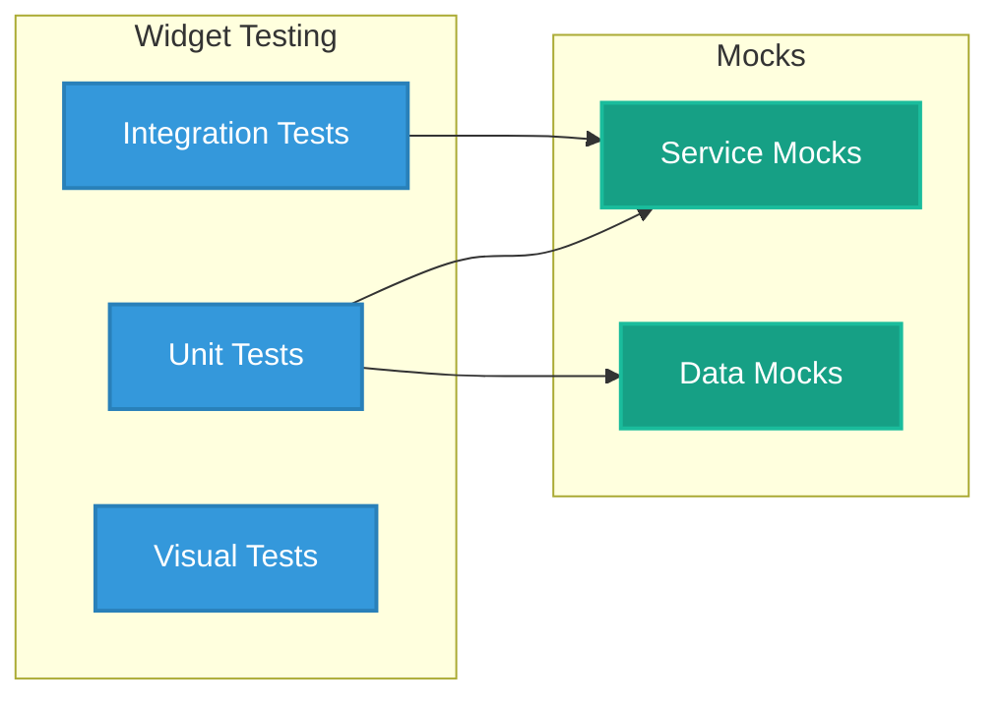

# 🧩 Widget Analysis for CIA Compliance Manager

This document provides a detailed analysis of the widget components in the CIA Compliance Manager, their responsibilities, dependencies, and relationships.

## 📚 Related Documentation

| Document                                          | Focus           | Description                               |
| ------------------------------------------------- | --------------- | ----------------------------------------- |
| **[System Architecture](SYSTEM_ARCHITECTURE.md)** | 🏛️ System       | Layered architecture and component details |
| **[Architecture](ARCHITECTURE.md)**               | 🏗️ C4 Model     | C4 model showing system structure          |
| **[Data Model](DATA_MODEL.md)**                   | 📊 Data         | Current data structures and relationships  |

## 🔍 Widget Categories

The CIA Compliance Manager organizes widgets into four functional categories, each serving specific business and security purposes:

## 🧩 Widget Dependency Flow

The widgets are organized in a hierarchical relationship, with the Security Level Widget at the core controlling the security levels that affect all other widgets:

```mermaid
flowchart TD
    SLW((Security Level<br>Widget)) --> SSW[Security Summary<br>Widget]
    SLW --> BIAW[Business Impact<br>Analysis Widget]
    SLW --> CIW[Confidentiality<br>Impact Widget]
    SLW --> IIW[Integrity<br>Impact Widget]
    SLW --> AIW[Availability<br>Impact Widget]
    SLW --> CSW[Compliance Status<br>Widget]
    SLW --> CEW[Cost Estimation<br>Widget]
    SLW --> VCW[Value Creation<br>Widget]
    SLW --> TDW[Technical Details<br>Widget]
    SLW --> SRW[Security Resources<br>Widget]
    SLW --> SVW[Security Visualization<br>Widget]
    
    classDef core fill:#e74c3c,stroke:#c0392b,stroke-width:2px,color:white
    classDef assessment fill:#3498db,stroke:#2980b9,stroke-width:2px,color:white
    classDef business fill:#f1c40f,stroke:#f39c12,stroke-width:2px,color:black
    classDef confidentiality fill:#8e44ad,stroke:#6c3483,stroke-width:2px,color:white
    classDef integrity fill:#27ae60,stroke:#1e8449,stroke-width:2px,color:white
    classDef availability fill:#2980b9,stroke:#2471a3,stroke-width:2px,color:white
    classDef implementation fill:#16a085,stroke:#1abc9c,stroke-width:2px,color:white
    
    class SLW core
    class SSW,BIAW assessment
    class CSW,CEW,VCW business
    class CIW confidentiality
    class IIW integrity
    class AIW availability
    class TDW,SRW,SVW implementation
```

## 📊 Widget Service Dependencies

Each widget depends on specific services to provide its functionality:

## 🧪 Widget Detailed Analysis

### Core Widget

#### Security Level Widget

- **Purpose**: Controls security levels across the CIA triad
- **Key Features**: 
  - Independent selectors for Confidentiality, Integrity, and Availability
  - Detailed descriptions for each security level
  - Real-time state propagation to other widgets
- **Dependencies**: CIA Content Service
- **Business Perspective**: Central control point for configuring the organization's security posture

### Assessment Center

#### Security Summary Widget

- **Purpose**: Provides an overview of the security posture across all components
- **Key Features**:
  - Overall security score
  - Component-specific security levels
  - Tabbed interface for business and technical views
- **Dependencies**: CIA Content Service, Security Metrics Service
- **Business Perspective**: Executive dashboard for security posture assessment

#### Business Impact Analysis Widget

- **Purpose**: Analyzes business impacts of selected security levels
- **Key Features**:
  - Impact analysis by business dimension
  - Component-specific business impact details
  - Implementation considerations and benefits
- **Dependencies**: CIA Content Service, Business Impact Service
- **Business Perspective**: Helps stakeholders understand business implications of security decisions

### Impact Analysis

#### Confidentiality Impact Widget

- **Purpose**: Analyzes confidentiality-specific impacts
- **Key Features**:
  - Data classification and privacy impact
  - Component-specific business impacts
- **Dependencies**: CIA Content Service, Business Impact Service
- **Business Perspective**: Understanding data protection requirements and impacts

#### Integrity Impact Widget

- **Purpose**: Analyzes integrity-specific impacts
- **Key Features**:
  - Data validation metrics
  - Data error rate information
- **Dependencies**: CIA Content Service, Business Impact Service
- **Business Perspective**: Understanding data accuracy and validation requirements

#### Availability Impact Widget

- **Purpose**: Analyzes availability-specific impacts
- **Key Features**:
  - SLA metrics (uptime, RTO, RPO)
  - Business operational impacts
- **Dependencies**: CIA Content Service, Business Impact Service
- **Business Perspective**: Understanding uptime requirements and recovery capabilities

### Business Value

#### Compliance Status Widget

- **Purpose**: Analyzes compliance with regulatory frameworks
- **Key Features**:
  - Compliance status by framework
  - Gap analysis
  - Recommendations for addressing gaps
- **Dependencies**: Compliance Service
- **Business Perspective**: Understanding regulatory compliance posture and gaps

#### Cost Estimation Widget

- **Purpose**: Estimates costs for implementing selected security levels
- **Key Features**:
  - Implementation and operational costs
  - Component-specific cost breakdown
  - Resource requirements
- **Dependencies**: CIA Content Service, Security Metrics Service
- **Business Perspective**: Budget planning for security investments

#### Value Creation Widget

- **Purpose**: Articulates business value of security investments
- **Key Features**:
  - ROI estimates
  - Business value metrics
  - Component-specific value statements
- **Dependencies**: CIA Content Service, Business Impact Service
- **Business Perspective**: Building business cases for security investments

### Implementation Guide

#### Technical Details Widget

- **Purpose**: Provides technical implementation guidance
- **Key Features**:
  - Component-specific technical requirements
  - Implementation complexity assessments
  - Technical expertise requirements
- **Dependencies**: CIA Content Service, Technical Implementation Service
- **Business Perspective**: Bridging security requirements and technical implementation

#### Security Resources Widget

- **Purpose**: Provides reference materials and implementation guides
- **Key Features**:
  - Curated security resources
  - Component-specific implementation guides
  - Searchable resource database
- **Dependencies**: CIA Content Service, Security Resources Service
- **Business Perspective**: Knowledge base for implementing security controls

#### Security Visualization Widget

- **Purpose**: Visualizes security metrics and relationships
- **Key Features**:
  - Security posture radar chart
  - Risk level visualization
  - Component metrics visualization
- **Dependencies**: Security Metrics Service
- **Business Perspective**: Visual communication of security posture

## 🔄 State Management

The application uses React's state management with a hierarchical approach:

## 🧵 Widget Component Structure

Each widget follows a consistent component pattern:

## 🧪 Widget Testing Approach

The widget testing strategy employs several techniques:

1. **Unit Testing**: Tests individual widget rendering and behavior
2. **Service Mocking**: Provides mock implementations of services
3. **Props Testing**: Validates widget behavior with different prop combinations
4. **Accessibility Testing**: Ensures widgets meet accessibility requirements
5. **Visual Regression**: Prevents unintended visual changes

This document provides a comprehensive analysis of the CIA Compliance Manager's widget architecture, highlighting the current implementation details and relationships between components.
