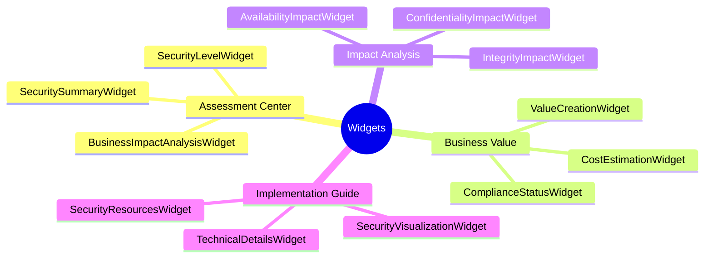
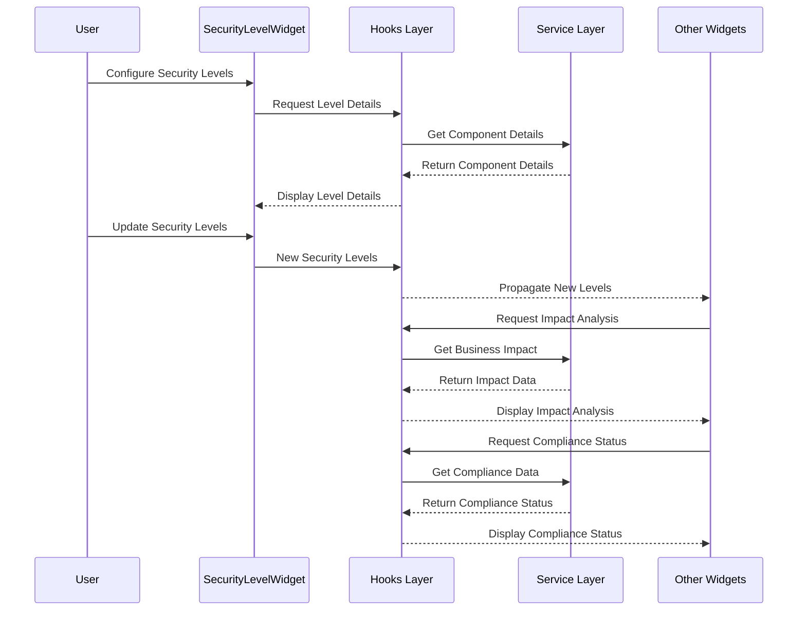

# Widget Analysis for CIA Compliance Manager v1.0

This document provides a detailed analysis of the widget components in the CIA Compliance Manager, their responsibilities, dependencies, and relationships.

## Widget Categories

The CIA Compliance Manager organizes widgets into four functional categories:



## Common Widget Patterns

Each widget follows these consistent patterns:

1. **Container Structure**
   - All widgets use a common `WidgetContainer` component as their wrapper
   - Standard layout with title, icon, content, loading state, and error handling
   
2. **Service Access**
   - Services are accessed through dedicated hooks:
     - `useCIAContentService`
     - `useComplianceService`
     - `useSecurityMetricsService`
   - Error and loading states are handled consistently
   
3. **State Management**
   - Heavy use of `useMemo` for derived calculations
   - `useCallback` for event handlers
   - Local state with `useState` for UI interactions

4. **Type Safety**
   - TypeScript interfaces for props
   - Type guards for runtime type checking
   - Avoidance of `any` types

5. **Error Handling**
   - Consistent try-catch blocks for service interactions
   - Fallback UI states for error conditions
   - Proper null/undefined checking

## Detailed Widget Analysis

### Assessment Center Widgets

#### SecurityLevelWidget

**Purpose:** Primary configuration widget for the CIA triad security levels.

**Dependencies:**
- `useCIAContentService` - For loading security level details
- Constants: `SECURITY_LEVELS`, `WIDGET_ICONS`, `WIDGET_TITLES`, `CIA_COMPONENT_ICONS`

**Components:**
- WidgetContainer
- SecurityLevelBadge

**Key Behaviors:**
- Allows selection of security levels for all three CIA components
- Displays detailed information about each security level
- Provides real-time feedback on selections
- Contains the core configuration that drives the entire application

#### SecuritySummaryWidget

**Purpose:** Provides an overview of the selected security posture and its implications.

**Dependencies:**
- `useCIAContentService` - For security level descriptions and metrics
- Risk calculation utilities 

**Components:**
- WidgetContainer
- SecurityRiskScore
- RadarChart

**Key Behaviors:**
- Displays overall security score
- Shows radar chart visualization of security levels
- Provides tab-based view of different security aspects

#### BusinessImpactAnalysisWidget

**Purpose:** Analyzes business impact of selected security levels.

**Dependencies:**
- `useCIAContentService` - For business impact information
- Risk calculation utilities

**Components:**
- WidgetContainer
- KeyValuePair
- RiskLevelBadge
- SecurityLevelBadge

**Key Behaviors:**
- Displays impact by component (availability, integrity, confidentiality)
- Shows business considerations and benefits
- Provides executive summary for quick analysis

### Business Value Widgets

#### ComplianceStatusWidget

**Purpose:** Shows compliance status with regulatory frameworks based on security selections.

**Dependencies:**
- `useComplianceService` - For compliance status data
- Constants: `WIDGET_ICONS`, `WIDGET_TITLES`, `COMPLIANCE_TEST_IDS`, `SECURITY_ICONS`

**Components:**
- WidgetContainer
- StatusBadge

**Key Behaviors:**
- Displays overall compliance score
- Lists compliant, partially compliant, and non-compliant frameworks
- Provides gap analysis for selected frameworks
- Offers compliance tips based on current status

#### CostEstimationWidget

**Purpose:** Estimates costs for implementing and maintaining security controls.

**Dependencies:**
- `useCIAContentService` - For implementation details
- `calculateTotalSecurityCost` - Cost calculation utility
- `formatCurrency` - Formatting utility

**Components:**
- WidgetContainer
- SecurityLevelBadge

**Key Behaviors:**
- Shows implementation and operational costs
- Breaks down costs by CIA component
- Displays implementation complexity and FTE requirements
- Visualizes CAPEX vs OPEX ratios

#### ValueCreationWidget

**Purpose:** Articulates the business value created by security investments.

**Dependencies:**
- `useCIAContentService` - For value data
- `calculateROIEstimate` - ROI calculation utility
- `calculateBusinessImpactLevel` - Risk utility

**Components:**
- WidgetContainer
- SecurityLevelIndicator

**Key Behaviors:**
- Shows estimated return on investment
- Displays business value metrics
- Lists component-specific value statements
- Provides business case building blocks

### Impact Analysis Widgets

#### AvailabilityImpactWidget

**Purpose:** Analyzes the impact of availability controls on business operations.

**Dependencies:**
- `useCIAContentService` - For availability impact data
- `getSecurityLevelBackgroundClass` - Color utility
- `getDefaultComponentImpact` - Default data fallback

**Components:**
- WidgetContainer
- SecurityLevelBadge
- BusinessImpactSection

**Key Behaviors:**
- Displays availability level badge
- Shows business impact analysis
- Lists SLA metrics (uptime, RTO, RPO, etc.)

#### IntegrityImpactWidget

**Purpose:** Analyzes the impact of integrity controls on data reliability.

**Dependencies:**
- `useCIAContentService` - For integrity impact data
- `getSecurityLevelBackgroundClass` - Color utility
- `normalizeSecurityLevel` - Level normalization

**Components:**
- WidgetContainer
- SecurityLevelBadge
- BusinessImpactSection

**Key Behaviors:**
- Displays integrity level badge
- Shows business impact of data integrity
- Lists integrity metrics (validation level, error rate)
- Shows recommendations when extended details enabled

#### ConfidentialityImpactWidget

**Purpose:** Analyzes the impact of confidentiality controls on data protection.

**Dependencies:**
- `useCIAContentService` - For confidentiality impact data
- `getSecurityLevelBackgroundClass` - Color utility
- `getDefaultComponentImpact` - Default data fallback

**Components:**
- WidgetContainer
- SecurityLevelBadge
- BusinessImpactSection

**Key Behaviors:**
- Displays confidentiality level badge
- Shows business impact of data protection
- Displays data classification and privacy impact information

### Implementation Guide Widgets

#### SecurityResourcesWidget

**Purpose:** Provides resources and implementation guides for security controls.

**Dependencies:**
- `useCIAContentService` - For security resources and implementation guides
- Type guards for data validation

**Components:**
- WidgetContainer
- ResourceCard (implied)

**Key Behaviors:**
- Lists relevant security resources based on security levels
- Provides filtering by category and search
- Shows implementation tips for each CIA component
- Displays implementation guide details and expertise requirements

#### SecurityVisualizationWidget

**Purpose:** Visualizes security metrics to support decision-making.

**Dependencies:**
- `useSecurityMetricsService` - For security metrics data
- `normalizeSecurityLevel`, `getSecurityLevelValue` - Level utilities
- `calculateBusinessImpactLevel`, `getRiskLevelFromImpactLevel` - Risk utilities

**Components:**
- WidgetContainer
- (Likely includes charts/visualization components not shown in the code snippet)

**Key Behaviors:**
- Calculates security score based on selected levels
- Determines risk level based on business impact
- Provides security recommendations
- Displays visual representations of security posture

#### TechnicalDetailsWidget

**Purpose:** Provides detailed technical implementation requirements.

**Dependencies:**
- (Only partial code provided, but likely uses `useCIAContentService` and technical implementation utilities)

**Key Behaviors:**
- Provides technical teams with implementation details
- Bridges gap between security requirements and technical implementation
- Offers concrete guidance on controls, configurations, and technologies

## Widget Interactions and Data Flow



## Common State Management Patterns

Most widgets follow these state management patterns:

1. **Service Data Fetching**
```typescript
// Common pattern for accessing service data
const { ciaContentService, error, isLoading } = useCIAContentService();

// Using the service with proper error handling
const details = useMemo(() => {
  try {
    if (isNullish(ciaContentService)) {
      return null;
    }
    
    const componentDetails = ciaContentService.getComponentDetails(
      component,
      level
    );
    
    return isNullish(componentDetails) ? null : componentDetails;
  } catch (err) {
    console.error("Error fetching details:", err);
    return null;
  }
}, [ciaContentService, component, level]);
```

2. **Computed Properties with Fallbacks**
```typescript
// Pattern for computed properties with fallbacks
const businessImpact = useMemo(() => {
  try {
    if (isNullish(ciaContentService)) {
      return getDefaultComponentImpact(component, level);
    }
    
    const impact = ciaContentService.getBusinessImpact(component, level);
    return impact || getDefaultComponentImpact(component, level);
  } catch (err) {
    console.error("Error getting business impact:", err);
    return getDefaultComponentImpact(component, level);
  }
}, [ciaContentService, component, level]);
```

3. **User Interaction Handlers**
```typescript
// Pattern for user interaction handlers
const handleCategorySelect = useCallback((category: string | null) => {
  setSelectedCategory(category);
  setCurrentPage(1); // Reset to first page when changing filters
}, []);
```

## Widget-to-Widget Communication

Widgets communicate primarily through these mechanisms:

1. **Prop Passing**: Parent components pass security levels and callbacks to widgets
2. **Custom Hooks**: Hooks manage state that's shared between widgets
3. **Service Layer**: Services provide a consistent data model across widgets

## Error Handling and Loading States

Widgets implement consistent error handling and loading states:

1. **Loading State Display**:
   - WidgetContainer accepts `isLoading` prop
   - Loading indicators shown during data fetching

2. **Error Handling**:
   - WidgetContainer accepts `error` prop
   - Try-catch blocks for service interactions
   - Default/fallback data when services fail

3. **Nullish Checking**:
   - Consistent use of `isNullish` type guard
   - Fallbacks for missing or incomplete data

## Widget Testing Approaches

The SecuritySummaryWidget.test.tsx file demonstrates these testing approaches:

1. **Mocking Services**:
   ```typescript
   vi.mock("../../../hooks/useCIAContentService", () => ({
     useCIAContentService: () => ({
       ciaContentService: {
         getSecurityLevelDescription: vi.fn().mockImplementation(/*...*/),
         // Other mocked methods
       },
       error: null,
       isLoading: false,
     }),
   }));
   ```

2. **Component Rendering Tests**:
   ```typescript
   it("renders without crashing", () => {
     const { container } = render(
       <SecuritySummaryWidget
         availabilityLevel="Moderate"
         integrityLevel="Moderate"
         confidentialityLevel="Moderate"
         testId="custom-test-id"
         className="custom-class"
       />
     );
     expect(
       screen.getByTestId("widget-container-custom-test-id")
     ).toBeInTheDocument();
   });
   ```

3. **Feature Testing**:
   ```typescript
   it("displays individual component levels", () => {
     render(
       <SecuritySummaryWidget
         availabilityLevel="Moderate"
         integrityLevel="Moderate"
         confidentialityLevel="Moderate"
       />
     );
     expect(
       screen.getByTestId(SECURITY_SUMMARY_TEST_IDS.CONFIDENTIALITY_CARD)
     ).toBeInTheDocument();
     // Additional assertions
   });
   ```

## Conclusion

The widget architecture follows consistent patterns for:

1. **Component Structure**: Clear separation of presentation and data access
2. **Type Safety**: Strong TypeScript typing throughout
3. **Error Handling**: Comprehensive error handling and fallbacks
4. **Reusability**: Common components and utilities
5. **Testability**: Well-structured code that supports unit testing

This analysis provides a foundation for understanding the current widget architecture and can guide future development and refactoring efforts.
