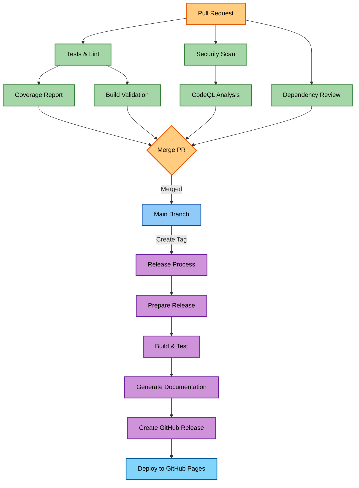
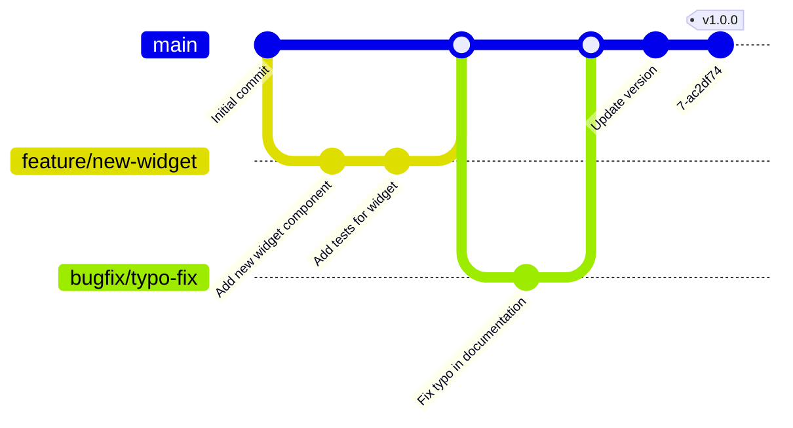
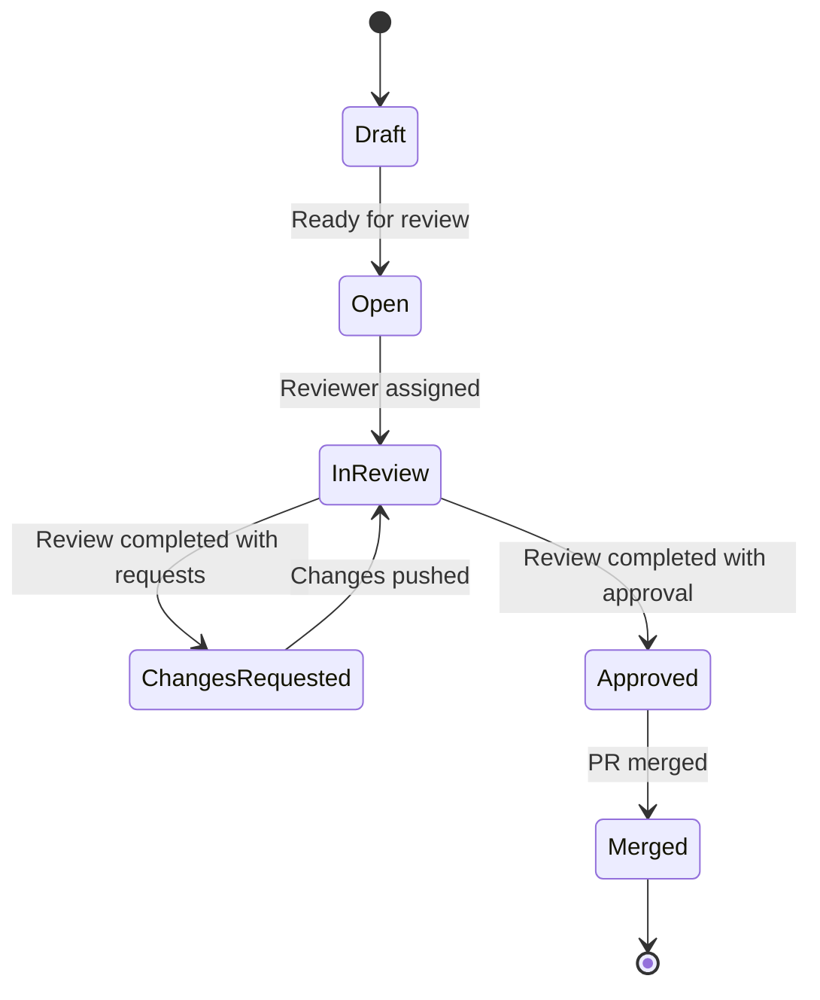
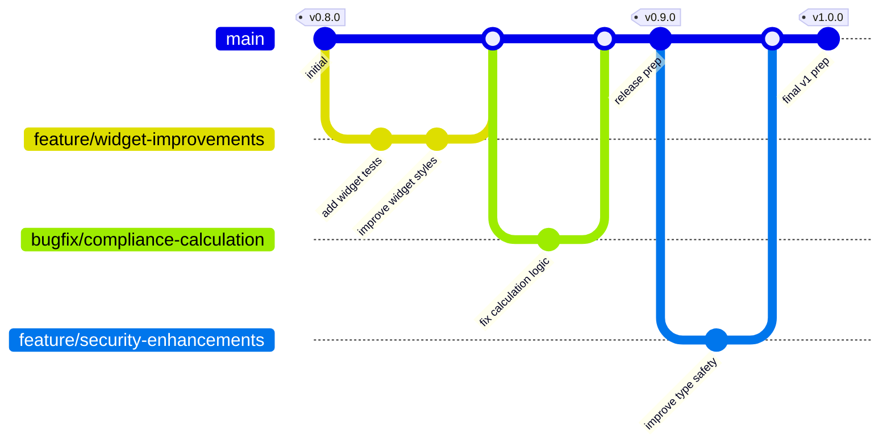
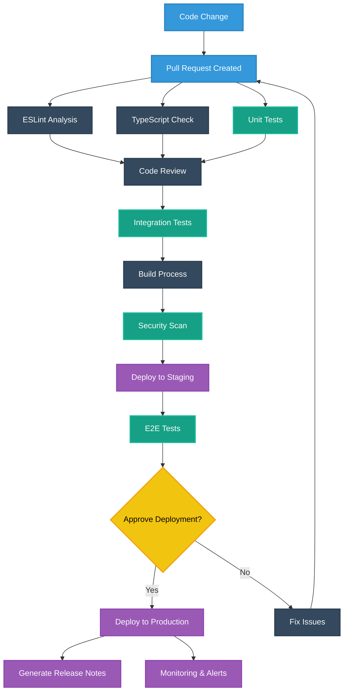
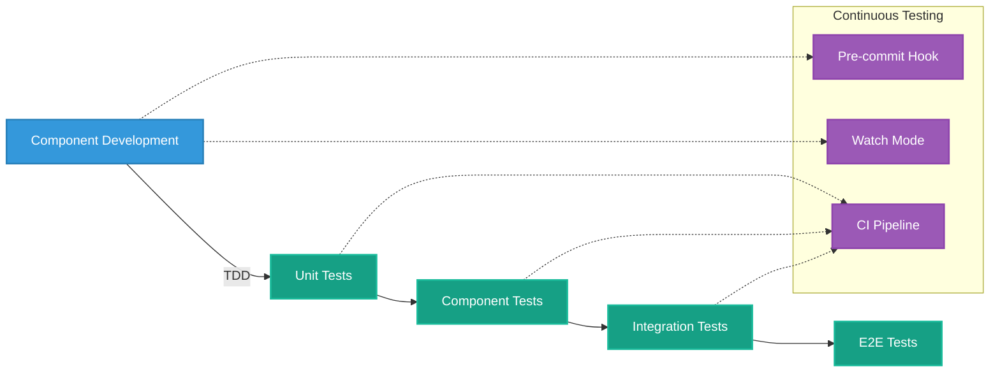
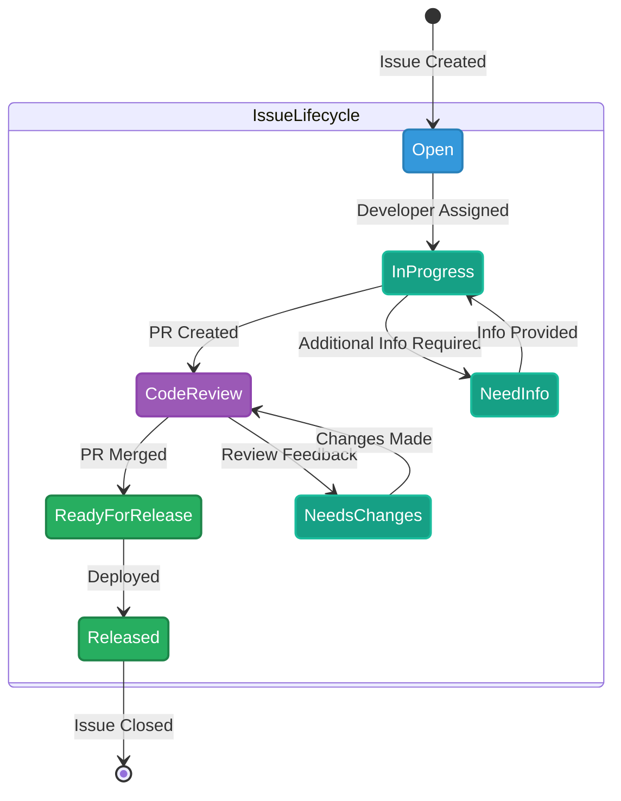
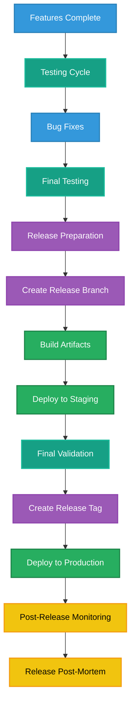

# 🚀 CIA Compliance Manager CI/CD and Development Workflows

This document describes the current automation processes and development workflows used in the CIA Compliance Manager project.

## 📦 CI/CD Pipeline

The CIA Compliance Manager uses GitHub Actions for continuous integration and continuous deployment. The workflow is designed to ensure code quality, test coverage, and automated deployment.



## 🏗️ GitHub Actions Workflows

The following GitHub Actions workflows are used in the CI/CD pipeline:

### Pull Request Workflow

```yaml
name: PR Checks
on:
  pull_request:
    branches: [ main ]
    
jobs:
  lint-and-test:
    runs-on: ubuntu-latest
    steps:
      - uses: actions/checkout@v4
      - uses: actions/setup-node@v3
        with:
          node-version: '18'
          cache: 'npm'
      - run: npm ci
      - run: npm run lint
      - run: npm run test:coverage
      - name: Upload coverage report
        uses: actions/upload-artifact@v4
        with:
          name: coverage-report
          path: coverage/
  
  security-scan:
    runs-on: ubuntu-latest
    steps:
      - uses: actions/checkout@v4
      - name: Run CodeQL Analysis
        uses: github/codeql-action/analyze@v2
        
  dependency-review:
    runs-on: ubuntu-latest
    steps:
      - uses: actions/checkout@v4
      - name: Dependency Review
        uses: actions/dependency-review-action@v3
```

### Release Workflow

```yaml
name: Release
on:
  push:
    tags:
      - 'v*.*.*'
    
jobs:
  build-and-release:
    runs-on: ubuntu-latest
    steps:
      - uses: actions/checkout@v4
      - uses: actions/setup-node@v3
        with:
          node-version: '18'
          cache: 'npm'
      - run: npm ci
      - run: npm run test
      - run: npm run build
      - name: Generate documentation
        run: npm run docs:build
      - name: Create GitHub Release
        uses: actions/create-release@v1
        env:
          GITHUB_TOKEN: ${{ secrets.GITHUB_TOKEN }}
        with:
          tag_name: ${{ github.ref }}
          release_name: Release ${{ github.ref }}
          draft: false
          prerelease: false
      - name: Deploy to GitHub Pages
        uses: JamesIves/github-pages-deploy-action@v4
        with:
          folder: dist
```

## 🔄 Development Workflow

The development workflow follows these steps:

1. **Feature Branch Creation**: Developers create a new branch from `main` for each feature or bug fix.
2. **Local Development**:
   - Code changes are made locally
   - Tests are written for new features
   - Code is tested using `npm run test`
   - Linting is performed using `npm run lint`
3. **Pull Request Creation**:
   - Developer creates a pull request to merge their branch into `main`
   - PR template is filled out with relevant information
   - PR is linked to any relevant issues
4. **Automated Checks**:
   - GitHub Actions runs automated checks on the PR
   - Tests, lint, security scans, and dependency review are performed
5. **Code Review**:
   - Team members review the code changes
   - Comments and suggestions are addressed
   - Changes are pushed to the PR branch
6. **Merge**:
   - PR is merged to `main` once approved and passing all checks
   - Branch is deleted after successful merge
7. **Release**:
   - When ready for release, a tag is created following semantic versioning
   - GitHub Actions creates a GitHub Release and deploys to GitHub Pages



## 📋 Pull Request Workflow

The pull request process follows these steps:



## 🔍 Code Review Guidelines

When reviewing code, team members should follow these guidelines:

1. **Security**: Verify that code follows security best practices
2. **Code Quality**: Check for clean, readable, and maintainable code
3. **Tests**: Ensure proper test coverage for new code
4. **Types**: Verify TypeScript types are properly used
5. **Reusability**: Check that existing utilities and components are reused appropriately
6. **Documentation**: Verify that code is properly documented
7. **Performance**: Consider performance implications of changes

## 📊 Quality Gates

The following quality gates are enforced in the CI/CD pipeline:

| Gate | Requirement | Description |
|------|------------|-------------|
| 🧪 Tests | All tests pass | All unit and integration tests must pass |
| 📏 Lint | No lint errors | Code must conform to ESLint rules |
| 📊 Coverage | Minimum 80% | Code coverage must be at least 80% |
| 🔒 Security | No high or critical vulnerabilities | CodeQL must not find high or critical vulnerabilities |
| 📦 Dependencies | No vulnerable dependencies | Dependency review must not find vulnerable dependencies |

## 🚀 Deployment Process

The deployment process is automated and triggered by creating a new tag:

1. **Tag Creation**: A new tag is created following semantic versioning
2. **Build**: The application is built and tested
3. **Documentation**: Documentation is generated
4. **GitHub Release**: A new release is created on GitHub
5. **GitHub Pages**: The application is deployed to GitHub Pages

## 🔄 Versioning Strategy

The project uses semantic versioning:

- **Major version** (X.y.z): Breaking changes
- **Minor version** (x.Y.z): New features without breaking changes
- **Patch version** (x.y.Z): Bug fixes and minor improvements

## 🗓️ Release Schedule

- **Patch Releases**: As needed for bug fixes
- **Minor Releases**: Every 2-4 weeks with new features
- **Major Releases**: Planned, with migration guides and documentation

# 🔄 CIA Compliance Manager Workflows

## 📚 Related Documentation

<div class="documentation-map">

| Document                                          | Focus           | Description                               |
| ------------------------------------------------- | --------------- | ----------------------------------------- |
| **[System Architecture](SYSTEM_ARCHITECTURE.md)** | 🏛️ System       | Layered architecture and component details |
| **[Process Flowcharts](FLOWCHART.md)**            | 🔄 Process      | Security assessment workflows             |
| **[State Diagrams](STATEDIAGRAM.md)**             | 🔄 Behavior     | System state transitions                   |

</div>

## Development Workflows

The CIA Compliance Manager project follows established development workflows to ensure code quality, maintainability, and collaborative development.

### 🌿 Git Workflow

The project uses a GitHub Flow model with the following characteristics:



#### Key Workflow Elements:

1. **Feature Branches**: Created from `main` for new features
2. **Bugfix Branches**: Created from `main` for bug fixes
3. **Pull Requests**: Required for all changes to `main`
4. **Code Reviews**: Required for all PRs
5. **CI Checks**: Must pass before merging

### 🔄 CI/CD Pipeline

The CI/CD pipeline automates testing, building, and deployment processes:



### 🔬 Testing Workflow



## Issue Management Process



## Release Process



## Working with GitHub Actions

The project leverages GitHub Actions for automated workflows:

### Currently Configured Actions

1. **CI Pipeline**: `test-and-report.yml`
   - Run tests
   - Generate coverage reports
   - Lint code

2. **Security Scanning**: 
   - `codeql.yml` - Code quality and security scanning
   - `dependency-review.yml` - Check dependencies for vulnerabilities
   - `scorecards.yml` - OSSF security scorecard
   - `zap-scan.yml` - OWASP ZAP security scan

3. **Performance Testing**: `lighthouse-performance.yml`

4. **Issue Management**: `labeler.yml`

5. **Release Automation**: `release.yml`

These workflows help maintain code quality, security, and streamline the development process for the CIA Compliance Manager.
