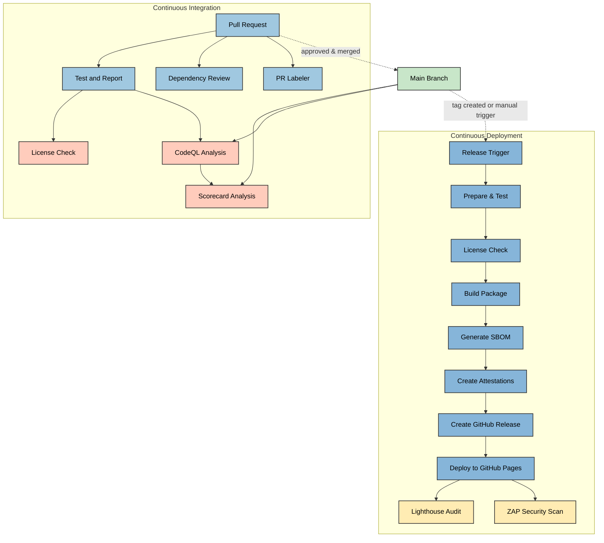
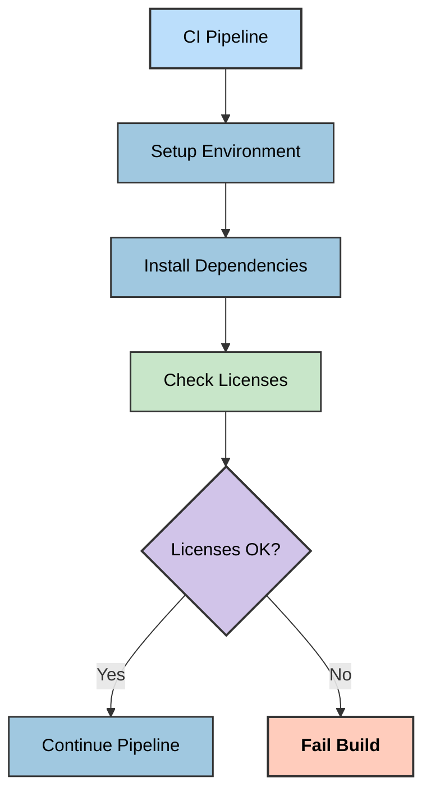
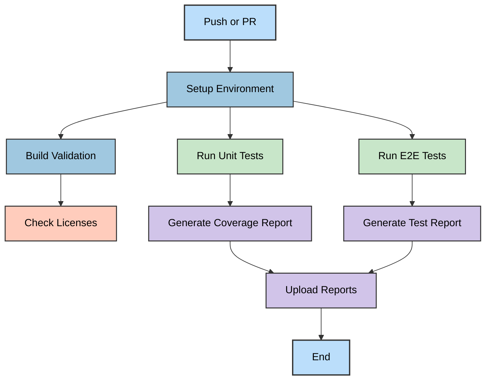
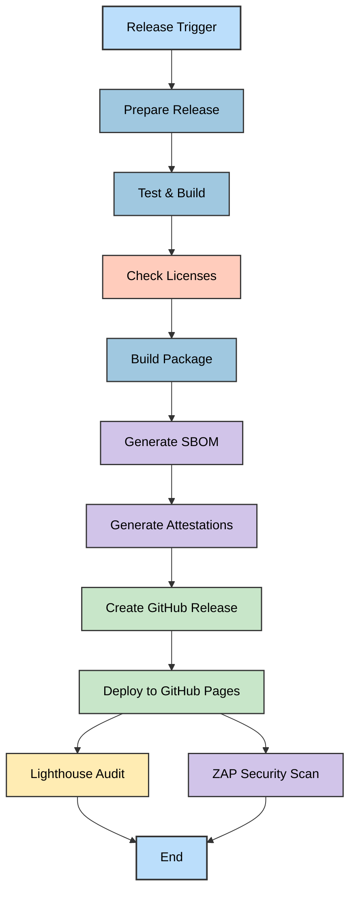
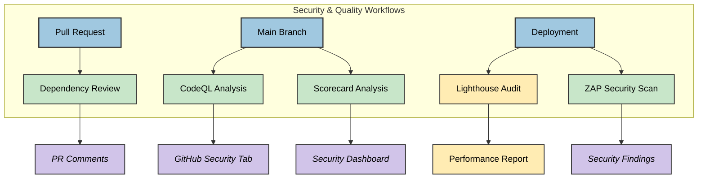
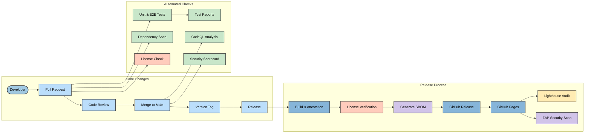

# 🔁 CIA Compliance Manager CI/CD Workflows

This document details the continuous integration and deployment workflows used in the CIA Compliance Manager project. The workflows automate testing, security scanning, and release procedures to ensure code quality and security compliance.

## 📚 Related Architecture Documentation

<div class="documentation-map">

| Document                                            | Focus           | Description                               |
| --------------------------------------------------- | --------------- | ----------------------------------------- |
| **[Current Architecture](ARCHITECTURE.md)**         | 🏛️ Architecture | C4 model showing current system structure |
| **[Future Architecture](FUTURE_ARCHITECTURE.md)**   | 🏛️ Architecture | Vision for context-aware platform         |
| **[State Diagrams](STATEDIAGRAM.md)**               | 🔄 Behavior     | Current system state transitions          |
| **[Future State Diagrams](FUTURE_STATEDIAGRAM.md)** | 🔄 Behavior     | Enhanced adaptive state transitions       |
| **[Process Flowcharts](FLOWCHART.md)**              | 🔄 Process      | Current security workflows                |
| **[Future Flowcharts](FUTURE_FLOWCHART.md)**        | 🔄 Process      | Enhanced context-aware workflows          |
| **[Mindmaps](MINDMAP.md)**                          | 🧠 Concept      | Current system component relationships    |
| **[Future Mindmaps](FUTURE_MINDMAP.md)**            | 🧠 Concept      | Future capability evolution               |
| **[SWOT Analysis](SWOT.md)**                        | 💼 Business     | Current strategic assessment              |
| **[Future SWOT Analysis](FUTURE_SWOT.md)**          | 💼 Business     | Future strategic opportunities            |
| **[Future Workflows](FUTURE_WORKFLOWS.md)**         | 🔧 DevOps       | Enhanced CI/CD with ML                    |
| **[Future Data Model](FUTURE_DATA_MODEL.md)**       | 📊 Data         | Context-aware data architecture           |

</div>

## 🔄 Workflow Overview

The project uses GitHub Actions for automation with the following workflows:

1. **🚀 Build, Attest and Release**: Builds, attests, and releases new versions with security scanning
2. **🧪 Test and Report**: Runs unit and E2E tests with coverage reporting
3. **🔍 CodeQL Analysis**: Security scanning for code vulnerabilities
4. **📦 Dependency Review**: Scanning of dependency changes for vulnerabilities
5. **⭐ Scorecard Analysis**: OSSF security scorecard for supply chain security
6. **📜 License Checking**: Verification of dependency licenses for compliance
7. **🏷️ PR Labeler**: Automated labeling of pull requests
8. **🔆 Lighthouse**: Performance, accessibility, and best practices auditing
9. **🔒 ZAP Scan**: Dynamic security scanning of deployed application

## Workflow Relationships



## 📜 License Checking Workflow

The project includes license checking as part of the CI/CD process to ensure all dependencies comply with the project's license requirements:



License checks are run both during PR verification and before releases to ensure compliance.

## 🧪 Test and Report Workflow

This workflow runs on pull requests and pushes to the main branch to ensure code quality.



## 🚀 Release Workflow

This workflow handles the release process for new versions, triggered by version tags or manual workflow dispatch.



## 🔍 Security and Quality Scanning Workflows

Multiple security and quality scanning workflows validate different aspects of the codebase and deployed application.



### 🔍 CodeQL Analysis Workflow

Analyzes code for security vulnerabilities using GitHub's CodeQL engine. Runs on:

- Push to main branch
- Pull requests to main branch
- Weekly schedule (Mondays)

### 📦 Dependency Review

Scans dependency manifest changes in pull requests to identify vulnerable packages.

### ⭐ Scorecard Analysis

Evaluates the project against OSSF security best practices:

- Branch protection rules
- Dependency management
- Code signing
- Other supply chain security practices

### 🔆 Lighthouse Audit

Runs performance and best practices audits on the deployed application:

- Performance metrics
- Accessibility compliance
- SEO optimization
- PWA compatibility
- Best practices adherence

The workflow uses a budget.json file to define performance budgets and thresholds, uploading results as artifacts and to temporary public storage for viewing.

### 🔒 ZAP Security Scan

Performs dynamic application security testing (DAST) on the deployed application:

- Identifies common web vulnerabilities
- API security scanning
- Checks for OWASP Top 10 vulnerabilities
- Generates comprehensive security reports

ZAP scans are performed using the OWASP ZAP Docker container against the deployed GitHub Pages site to identify runtime security issues that static analysis might miss.

## CI/CD Integration

Performance tests and license checks are integrated with CI/CD pipelines to catch performance regressions and licensing issues:

```yaml
# Excerpt from CI configuration
stages:
  - test
  - performance
  - compliance
  - security

performance-tests:
  stage: performance
  script:
    - npm run cypress:run:perf
  artifacts:
    paths:
      - cypress/reports/performance/

license-check:
  stage: compliance
  script:
    - npm run test:licenses
  artifacts:
    paths:
      - license-report/

lighthouse-audit:
  stage: performance
  script:
    - npm run lighthouse
  artifacts:
    paths:
      - lighthouse-reports/

zap-scan:
  stage: security
  script:
    - npm run zap-scan
  artifacts:
    paths:
      - zap-reports/
```

## Mermaid Diagram Support

GitHub natively supports Mermaid diagrams in Markdown files. The diagrams in this documentation leverage this support to visually represent workflows using the Mermaid syntax. This enables:

- Real-time rendering of workflow diagrams
- Automatic updates when the workflow code changes
- Interactive visualization of complex processes

For more information about Mermaid syntax and capabilities, see the [Mermaid documentation](https://mermaid.js.org/).

## Continuous Integration Diagram

The complete CI/CD pipeline integrates all workflows:



## Future CI/CD Improvements

The following enhancements are planned for future CI/CD pipeline improvements:

1. **Automated Versioning**: Semantic versioning based on commit messages
2. **Performance Testing**: Expanding performance benchmarks with more metrics
3. **Security Scanning Enhancement**: Additional security scanners and threat modeling
4. **Containerization**: Docker image building and container scanning
5. **Environment-Specific Deployments**: Staging and production deployment pipelines
6. **Automated Accessibility Testing**: Extended accessibility compliance validation
7. **Continuous Performance Monitoring**: Trend analysis for performance metrics
8. **Vulnerability Management**: Automated vulnerability tracking and remediation workflows
9. **Compliance Reporting**: Automated compliance status reporting and auditing

For details on the future architecture direction, see [FUTURE_ARCHITECTURE.md](FUTURE_ARCHITECTURE.md).
