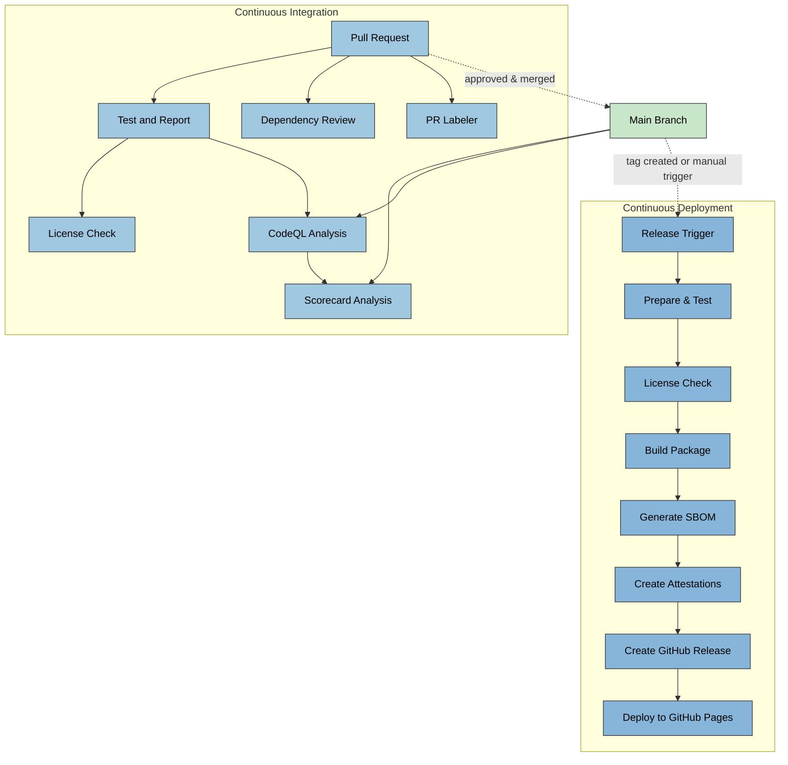
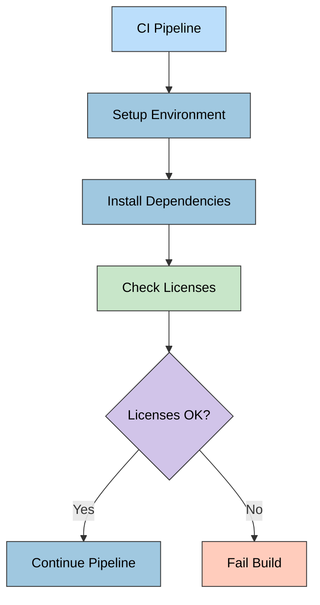
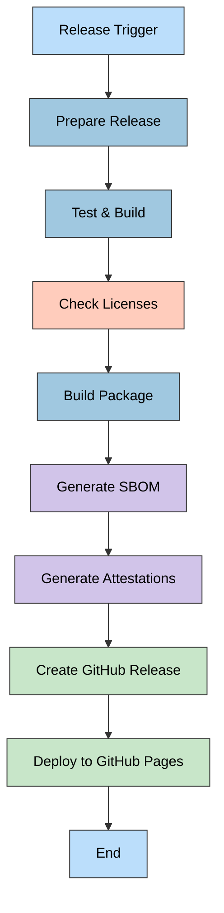
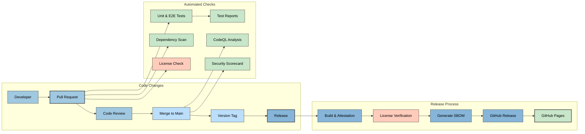

# 🔁 CIA Compliance Manager CI/CD Workflows

This document details the continuous integration and deployment workflows used in the CIA Compliance Manager project. The workflows automate testing, security scanning, and release procedures to ensure code quality, security, and reliable deployment.

## 📚 Related Architecture Documentation

<div class="documentation-map">

| Document                                            | Focus           | Description                               |
| --------------------------------------------------- | --------------- | ----------------------------------------- |
| **[Current Architecture](ARCHITECTURE.md)**         | 🏛️ Architecture | C4 model showing current system structure |
| **[Future Architecture](FUTURE_ARCHITECTURE.md)**   | 🏛️ Architecture | Vision for context-aware platform         |
| **[State Diagrams](STATEDIAGRAM.md)**               | 🔄 Behavior     | Current system state transitions          |
| **[Future State Diagrams](FUTURE_STATEDIAGRAM.md)** | 🔄 Behavior     | Enhanced adaptive state transitions       |
| **[Process Flowcharts](FLOWCHART.md)**              | 🔄 Process      | Current security workflows                |
| **[Future Flowcharts](FUTURE_FLOWCHART.md)**        | 🔄 Process      | Enhanced context-aware workflows          |
| **[Mindmaps](MINDMAP.md)**                          | 🧠 Concept      | Current system component relationships    |
| **[Future Mindmaps](FUTURE_MINDMAP.md)**            | 🧠 Concept      | Future capability evolution               |
| **[SWOT Analysis](SWOT.md)**                        | 💼 Business     | Current strategic assessment              |
| **[Future SWOT Analysis](FUTURE_SWOT.md)**          | 💼 Business     | Future strategic opportunities            |
| **[Future Workflows](FUTURE_WORKFLOWS.md)**         | 🔧 DevOps       | Enhanced CI/CD with ML                    |
| **[Future Data Model](FUTURE_DATA_MODEL.md)**       | 📊 Data         | Context-aware data architecture           |

</div>

## 🔄 Workflow Overview

The project uses GitHub Actions for automation with the following workflows:

1. **🧪 Test and Report**: Run unit and E2E tests with coverage reporting
2. **🔍 CodeQL Analysis**: Security scanning for code vulnerabilities
3. **📦 Dependency Review**: Scanning of dependency changes for vulnerabilities
4. **⭐ Scorecard Analysis**: OSSF security scorecard for supply chain security
5. **📜 License Checking**: Verification of dependency licenses for compliance
6. **🚀 Release Process**: Build, attest, and deploy new versions
7. **🏷️ PR Labeler**: Automated labeling of pull requests

## Workflow Relationships



## 📜 License Checking Workflow

The project includes license checking as part of the CI/CD process to ensure all dependencies comply with the project's license requirements:



License checks are run both during PR verification and before releases to ensure compliance.

## 🧪 Test and Report Workflow

This workflow runs on pull requests and pushes to the main branch to ensure code quality.


## 🚀 Release Workflow

This workflow handles the release process for new versions, triggered by version tags or manual workflow dispatch.



## 🔍 Security Scanning Workflows

Multiple security scanning workflows validate different aspects of the codebase.


### 🔍 CodeQL Analysis Workflow

Analyzes code for security vulnerabilities using GitHub's CodeQL engine. Runs on:

- Push to main branch
- Pull requests to main branch
- Weekly schedule (Mondays)

### 📦 Dependency Review

Scans dependency manifest changes in pull requests to identify vulnerable packages.

### ⭐ Scorecard Analysis

Evaluates the project against OSSF security best practices:

- Branch protection rules
- Dependency management
- Code signing
- Other supply chain security practices

## CI/CD Integration

Performance tests and license checks are integrated with CI/CD pipelines to catch performance regressions and licensing issues:

```yaml
# Excerpt from CI configuration
stages:
  - test
  - performance
  - compliance

performance-tests:
  stage: performance
  script:
    - npm run cypress:run:perf
  artifacts:
    paths:
      - cypress/reports/performance/

license-check:
  stage: compliance
  script:
    - npm run test:licenses
  artifacts:
    paths:
      - license-report/
```

## Mermaid Diagram Support

GitHub natively supports Mermaid diagrams in Markdown files. The diagrams in this documentation leverage this support to visually represent workflows using the Mermaid syntax. This enables:

- Real-time rendering of workflow diagrams
- Automatic updates when the workflow code changes
- Interactive visualization of complex processes

For more information about Mermaid syntax and capabilities, see the [Mermaid documentation](https://mermaid.js.org/).

## Continuous Integration Diagram

The complete CI/CD pipeline integrates all workflows:



## Future CI/CD Improvements

The following enhancements are planned for future CI/CD pipeline improvements:

1. **Automated Versioning**: Semantic versioning based on commit messages
2. **Performance Testing**: Integrating performance benchmarks into CI pipeline
3. **Security Scanning Enhancement**: Additional security scanners
4. **Containerization**: Docker image building and container scanning
5. **Environment-Specific Deployments**: Staging and production deployment pipelines

For details on the future architecture direction, see [FUTURE_ARCHITECTURE.md](FUTURE_ARCHITECTURE.md).
