<p align="center">
  
</p>

<h1 align="center">🔄 CIA Compliance Manager — CI/CD Workflows</h1>

<p align="center">
  <strong>🛡️ Automated Security Excellence Through Continuous Integration</strong><br>
  <em>🎯 Transparent Pipeline Operations Demonstrating ISMS Policy Compliance</em>
</p>

<p align="center">
  <a href="#"></a>
  <a href="#"></a>
  <a href="#"></a>
  <a href="#"></a>
</p>

**📋 Document Owner:** Security Architect | **📄 Version:** 1.1 | **📅 Last Updated:** 2026-01-11 (UTC)  
**🔄 Review Cycle:** Quarterly | **⏰ Next Review:** 2026-04-11

---

## 🎯 Purpose & Scope

This document provides comprehensive documentation of the CI/CD workflows implemented in the CIA Compliance Manager project, demonstrating alignment with **Hack23 ISMS Secure Development Policy §10.1 "CI/CD Workflow & Automation Excellence"**. It serves as evidence of automated security operations, pipeline transparency, and continuous security validation.

**Compliance Objectives:**
- **ISO 27001 (A.12.1)**: Change management documentation and controls
- **NIST CSF (DE.CM)**: Continuous monitoring and detection evidence
- **CIS Controls (17.1)**: Implement and manage automated secure application deployments
- **Transparency**: Public demonstration of security automation and quality gates

This document details the continuous integration and deployment workflows used in the CIA Compliance Manager project. The workflows automate testing, security scanning, and release procedures to ensure code quality and security compliance.

## 📚 Related Documents

- [🏛️ Current Architecture](ARCHITECTURE.md) - C4 model showing current system structure
- [🏛️ Future Architecture](FUTURE_ARCHITECTURE.md) - Vision for context-aware platform
- [🛡️ Security Architecture](SECURITY_ARCHITECTURE.md) - Comprehensive security design and controls
- [🎯 Threat Model](THREAT_MODEL.md) - Risk analysis informing security gates
- [🔄 State Diagrams](STATEDIAGRAM.md) - Current system state transitions
- [🔄 Future State Diagrams](FUTURE_STATEDIAGRAM.md) - Enhanced adaptive state transitions
- [📋 Process Flowcharts](FLOWCHART.md) - Current security workflows
- [📋 Future Flowcharts](FUTURE_FLOWCHART.md) - Enhanced context-aware workflows
- [🧠 Mindmaps](MINDMAP.md) - Current system component relationships
- [🧠 Future Mindmaps](FUTURE_MINDMAP.md) - Future capability evolution
- [💼 SWOT Analysis](SWOT.md) - Current strategic assessment
- [💼 Future SWOT Analysis](FUTURE_SWOT.md) - Future strategic opportunities
- [🔧 Future Workflows](FUTURE_WORKFLOWS.md) - Enhanced CI/CD with ML
- [📊 Future Data Model](FUTURE_DATA_MODEL.md) - Context-aware data architecture
- [🛠️ Secure Development Policy](https://github.com/Hack23/ISMS-PUBLIC/blob/main/Secure_Development_Policy.md) - ISMS development standards
- [🔍 Vulnerability Management](https://github.com/Hack23/ISMS-PUBLIC/blob/main/Vulnerability_Management.md) - Security vulnerability processes

## 📊 Workflow Status Badges

Real-time status of all CI/CD workflows:

[](https://github.com/Hack23/cia-compliance-manager/actions/workflows/release.yml)
[](https://github.com/Hack23/cia-compliance-manager/actions/workflows/test-and-report.yml)
[](https://github.com/Hack23/cia-compliance-manager/actions/workflows/codeql.yml)
[](https://github.com/Hack23/cia-compliance-manager/actions/workflows/dependency-review.yml)
[](https://github.com/Hack23/cia-compliance-manager/actions/workflows/scorecards.yml)
[](https://github.com/Hack23/cia-compliance-manager/actions/workflows/zap-scan.yml)
[](https://github.com/Hack23/cia-compliance-manager/actions/workflows/lighthouse-performance.yml)
[](https://github.com/Hack23/cia-compliance-manager/actions/workflows/labeler.yml)
[](https://github.com/Hack23/cia-compliance-manager/actions/workflows/copilot-setup-steps.yml)

**Quality & Security Metrics:**

[](https://sonarcloud.io/summary/new_code?id=Hack23_cia-compliance-manager)
[](https://sonarcloud.io/summary/new_code?id=Hack23_cia-compliance-manager)
[](https://sonarcloud.io/summary/new_code?id=Hack23_cia-compliance-manager)
[](https://scorecard.dev/viewer/?uri=github.com/Hack23/cia-compliance-manager)
[](https://github.com/Hack23/cia-compliance-manager/attestations)

## 🔄 Workflow Overview

The project uses GitHub Actions for automation with the following workflows:

### Core CI/CD Workflows

1. **🚀 Build, Attest and Release** (`.github/workflows/release.yml`)
   - **Triggers:** Manual workflow dispatch, version tags (v*)
   - **Jobs:** 3 jobs - prepare, build, release
   - **Purpose:** Builds, attests, and releases new versions with comprehensive security scanning
   - **Key Features:** SLSA Level 3 attestation, SBOM generation, automated documentation deployment

2. **☁️ AWS S3 Deployment** (`.github/workflows/deploy-s3.yml`)
   - **Triggers:** Push to main branch
   - **Jobs:** 1 job - deploy to AWS CloudFront + S3
   - **Purpose:** Primary production deployment to AWS infrastructure with global CDN
   - **Key Features:** IAM OIDC authentication, S3 multi-region, CloudFront cache invalidation, optimized cache headers, harden-runner egress control

3. **🧪 Test and Report** (`.github/workflows/test-and-report.yml`)
   - **Triggers:** Push to main, pull requests to main
   - **Jobs:** 5 jobs - prepare, build-validation, unit-tests, e2e-tests, report
   - **Purpose:** Comprehensive testing suite with coverage reporting
   - **Key Features:** Unit tests, E2E tests with Cypress, license checking, build validation

### Security Scanning Workflows

4. **🔍 CodeQL Analysis** (`.github/workflows/codeql.yml`)
   - **Triggers:** Push to main, pull requests to main, weekly schedule (Mondays)
   - **Purpose:** Static Application Security Testing (SAST) for code vulnerabilities
   - **Key Features:** JavaScript/TypeScript analysis, security vulnerability detection

5. **📦 Dependency Review** (`.github/workflows/dependency-review.yml`)
   - **Triggers:** Pull requests
   - **Purpose:** Software Composition Analysis (SCA) for dependency vulnerabilities
   - **Key Features:** PR comments with vulnerability details, blocks vulnerable dependencies

6. **⭐ Scorecard Analysis** (`.github/workflows/scorecards.yml`)
   - **Triggers:** Branch protection rule changes, weekly schedule (Tuesdays), push to main
   - **Purpose:** OSSF security scorecard for supply chain security assessment
   - **Key Features:** Branch protection checks, security best practices evaluation

### Quality & Performance Workflows

7. **🔆 Lighthouse Performance** (`.github/workflows/lighthouse-performance.yml`)
   - **Triggers:** Manual workflow dispatch
   - **Purpose:** Performance, accessibility, SEO, and best practices auditing
   - **Key Features:** Performance budgets, artifacts upload, temporary public reports

8. **🔒 ZAP Scan** (`.github/workflows/zap-scan.yml`)
   - **Triggers:** Manual workflow dispatch
   - **Purpose:** Dynamic Application Security Testing (DAST) for deployed application
   - **Key Features:** OWASP ZAP full scan, runtime vulnerability detection

### Automation Workflows

9. **🏷️ PR Labeler** (`.github/workflows/labeler.yml`)
   - **Triggers:** Pull request events (opened, synchronize, reopened, edited)
   - **Purpose:** Automated labeling of pull requests based on file changes
   - **Key Features:** Consistent PR categorization, improved workflow organization

10. **🤖 Copilot Setup Steps** (`.github/workflows/copilot-setup-steps.yml`)
   - **Triggers:** Manual dispatch, workflow file changes, pull requests affecting workflow
   - **Purpose:** GitHub Copilot workspace environment setup and validation
   - **Key Features:** Node.js 24 setup, dependency caching, environment validation

### 📊 Security Gates & Quality Thresholds

The CI/CD pipeline enforces the following quality gates and thresholds:

| Security Gate | Threshold | Workflow | Enforcement |
|--------------|-----------|----------|-------------|
| **Code Coverage** | 80% line, 70% branch | test-and-report.yml | Required ✅ |
| **SonarCloud Quality Gate** | Pass | release.yml, test-and-report.yml | Required ✅ |
| **CodeQL SAST** | No critical/high | codeql.yml | Required ✅ |
| **Dependency Vulnerabilities** | No critical/high | dependency-review.yml | Required ✅ |
| **License Compliance** | Approved licenses only | release.yml, test-and-report.yml | Required ✅ |
| **OSSF Scorecard** | Score > 7.0 | scorecards.yml | Advisory ℹ️ |
| **Lighthouse Performance** | Score 90+ | lighthouse-performance.yml | Advisory ℹ️ |
| **ZAP DAST Scan** | No high-risk findings | zap-scan.yml | Advisory ℹ️ |
| **TypeScript Compilation** | Zero errors | test-and-report.yml | Required ✅ |
| **ESLint** | Zero errors | test-and-report.yml | Required ✅ |

**Note:** Required gates block merges and deployments. Advisory gates generate reports for review but don't block progression.

## 🔐 Security Hardening Practices

The CIA Compliance Manager implements industry best practices for securing CI/CD pipelines, with a particular focus on GitHub Action hardening using StepSecurity recommendations:


### Specific Hardening Measures

The project employs the following security hardening techniques in its workflows:

1. **🔒 Permissions Restriction**: Every workflow uses the principle of least privilege with explicit permissions declarations
   
   ```yaml
   permissions:
     contents: read
     actions: read
     checks: write
     pull-requests: write
   ```

2. **📌 SHA Pinning**: External actions are pinned to specific SHA hashes for immutability
   
   ```yaml
   - uses: actions/checkout@8ade135a41bc03ea155e62e844d188df1ea18608 # v4.1.0
   ```

3. **🪄 StepSecurity Auto-hardening**: Workflows are periodically scanned and updated with StepSecurity best practices

4. **📜 SBOM Generation**: Software Bill of Materials is generated during the release process for transparency

5. **✅ Attestation Creation**: Build and dependency attestations are created and signed during release

6. **⏱️ Timeout Limits**: All jobs have appropriate timeout limits to prevent resource exhaustion

7. **🔑 OIDC Token Usage**: GitHub OIDC tokens are used for secure authenticated deployments instead of long-lived secrets

## 🧪 Test and Report Workflow

The test-and-report workflow runs comprehensive testing and generates quality metrics for pull requests and pushes to the main branch. The workflow consists of 5 distinct jobs that run in a coordinated pipeline:

### Workflow Jobs

**1. Prepare Job**
- Sets up the base environment and installs dependencies
- Caches apt packages, npm dependencies, and Cypress binary
- Verifies Cypress installation
- Prepares the environment for parallel test execution

**2. Build Validation Job** (depends on prepare)
- Validates the application can build successfully
- Runs license compliance checks
- Creates and uploads build artifacts
- Blocks pipeline if build fails or licenses are non-compliant

**3. Unit Tests Job** (depends on prepare, build-validation)
- Executes Vitest unit tests with coverage measurement
- Runs in xvfb (headless display) for component tests
- Generates coverage reports (lcov, html, json)
- Uploads coverage artifacts for analysis

**4. E2E Tests Job** (depends on prepare, build-validation)
- Runs Cypress end-to-end tests in headless mode
- Executes in xvfb with 1280x720x24 screen resolution
- Captures videos and screenshots of test execution
- Uploads Cypress results, videos, and screenshots

**5. Report Job** (depends on unit-tests, e2e-tests, runs always)
- Aggregates results from all test jobs
- Downloads all test artifacts
- Generates combined test reports
- Always runs even if tests fail to capture failure data


### Test Workflow Implementation

The test-and-report workflow is implemented with comprehensive job coordination:

**Prepare Job Steps:**
1. **Harden Runner**: StepSecurity runner hardening with egress policy audit
2. **Repository Checkout**: Securely checks out code with proper permissions
3. **Node.js Setup**: Sets up Node.js 24 environment with npm caching
4. **Apt Package Caching**: Caches system packages for faster builds
5. **Display Setup**: Configures xvfb and GUI dependencies for headless testing
6. **Dependency Caching**: Multi-level caching (npm, Cypress binary)
7. **Dependency Installation**: Installs npm packages with `npm install`
8. **Cypress Verification**: Validates Cypress binary installation

**Build Validation Job Steps:**
1. **Harden Runner**: Security hardening of the build environment
2. **Environment Setup**: Node.js 24 with dependency caching
3. **Dependency Installation**: Uses `npm ci` for clean install
4. **Application Build**: Executes production build with `npm run build`
5. **License Verification**: Runs `npm run test:licenses` to ensure compliance
6. **Artifact Upload**: Uploads build output for downstream jobs

**Unit Tests Job Steps:**
1. **Environment Preparation**: Setup with caching and dependencies
2. **Unit Test Execution**: Runs `npm run test:ci` with xvfb for headless testing
3. **Coverage Generation**: Creates lcov, html, and json coverage reports
4. **Artifact Upload**: Uploads coverage reports to build/coverage directory

**E2E Tests Job Steps:**
1. **Environment Setup**: Node.js, dependencies, and Cypress binary caching
2. **Cypress Test Execution**: Runs `npm run test:e2e` in xvfb (1280x720x24)
3. **Video Recording**: Captures test execution videos (CYPRESS_VIDEO=true)
4. **Screenshot Capture**: Takes screenshots on test failures
5. **Result Upload**: Uploads videos, screenshots, and test results

**Report Job Steps:**
1. **Artifact Collection**: Downloads all artifacts from previous jobs
2. **Report Aggregation**: Combines coverage and test results
3. **Unified Upload**: Creates comprehensive test-reports artifact

### Pipeline Execution Flow

The jobs execute in the following dependency order:
```
prepare → build-validation → unit-tests ↘
                          ↘ e2e-tests   → report
```

Both unit-tests and e2e-tests run in parallel after build-validation completes, maximizing pipeline efficiency.

### Test Report and Metrics Generation

The workflow automatically generates and publishes the following metrics and reports:

1. **Code Coverage**: Vitest generates detailed code coverage reports showing statement, branch, function, and line coverage.

2. **Test Results**: All test results are aggregated and published as GitHub artifacts and comments on PRs.

3. **Performance Metrics**: Key performance metrics including:
   - Test execution times
   - Build performance metrics
   - Component rendering benchmarks

4. **Quality Gates**: The workflow enforces quality gates including:
   - Minimum 80% code coverage threshold
   - Zero failing tests
   - No TypeScript or linting errors
   - All security checks passing

## 🔐 Security Testing Integration

The workflow integrates with security testing tools to provide immediate feedback on potential security issues:


## 📊 Audit Reports and Security Artifacts

The CIA Compliance Manager automatically generates comprehensive security and quality audit reports:


### Audit Artifact Generation

The following audit artifacts are generated during the CI/CD process:

1. **📦 SBOM Generation**: A Software Bill of Materials is created using `cyclonedx-bom` during release:
   - Provides a complete inventory of all dependencies
   - Includes versions, licenses, and package metadata
   - Published as a release artifact
   - Used for vulnerability tracking

2. **🔏 Build Attestations**: The release workflow creates and signs attestations:
   - Build provenance attestations using SLSA framework
   - Dependency attestation documenting package sources
   - All attestations stored with release artifacts

3. **📈 Coverage Reports**: The test-and-report workflow generates and publishes:
   - Code coverage reports from Vitest
   - Unit and integration test results
   - Performance test metrics

4. **🔍 Security Scanning Results**: Multiple security scanning outputs are produced:
   - CodeQL vulnerability reports
   - ZAP scan findings
   - Dependency vulnerability assessments
   - OSSF Scorecard with supply chain security metrics

## Workflow Relationships


## 📜 License Checking Workflow

The project includes license checking as part of the CI/CD process to ensure all dependencies comply with the project's license requirements:


License checks are run both during PR verification and before releases to ensure compliance.

## 🚀 Release Workflow

The release workflow handles the build, attestation, and deployment process for new versions. It consists of 3 coordinated jobs that ensure comprehensive testing, security attestation, and reliable deployment.

### Release Workflow Structure

**Triggers:**
- **Manual Workflow Dispatch**: Allows manual triggering with version input (vX.Y.Z format) and prerelease flag
- **Tag Push**: Automatically triggered when version tags (v*) are pushed to the repository

**Job Architecture:**
```
prepare → build → release
```

**1. Prepare Release Job**

This job handles environment preparation, testing, and documentation generation:

**Key Steps:**
1. **Environment Setup**: Ubuntu latest with Node.js 24, dependency caching
2. **Version Detection**: Extracts version from tag or workflow input
3. **Display Configuration**: Sets up xvfb for headless Cypress testing
4. **Dependency Installation**: Full `npm ci` with audit
5. **Version Bumping**: Updates package.json version for workflow dispatch releases
6. **License Verification**: Ensures all dependencies have acceptable licenses (`npm run test:licenses`)
7. **Cypress Testing**: Full E2E test suite in xvfb environment
8. **Coverage Generation**: Runs `npm run coverage` for test coverage
9. **Documentation Bundle**: Generates complete documentation with `npm run docs:bundle`
10. **E2E Report Generation**: Creates merged and HTML E2E test reports
11. **Test Results Copy**: Moves coverage, cypress, and test-results to docs directory
12. **Documentation Deployment**: Deploys documentation to GitHub Pages (main branch)

**Outputs:**
- `version`: Extracted or provided version string
- `is_prerelease`: Boolean flag for prerelease status

**2. Build Release Package Job** (depends on prepare)

This job creates the production build with full SLSA Level 3 attestation:

**Key Steps:**
1. **Repository Checkout**: Checks out the appropriate ref (tag or branch)
2. **Environment Setup**: Node.js 24 with comprehensive caching
3. **Dependency Installation**: Clean install with `npm ci`
4. **Production Build**: Creates optimized build with version embedding
5. **Artifact Creation**: Zips build directory for distribution
6. **SBOM Generation**: Creates SPDX JSON format Software Bill of Materials
7. **Build Attestation**: Generates SLSA build provenance attestation
8. **SBOM Attestation**: Creates attestation for the SBOM document

**Security Features:**
- OIDC authentication for attestation signing
- Cryptographic proof of build provenance
- Complete dependency inventory
- Immutable artifact records

**Artifacts:**
- `build-artifacts`: Application zip and build directory
- `security-artifacts`: SBOM, build attestation, SBOM attestation

**3. Create Release Job** (depends on prepare, build)

This job publishes the release and deploys the application:

**Key Steps:**
1. **Checkout Main Branch**: Always uses main for deployment consistency
2. **Artifact Download**: Retrieves build and security artifacts
3. **Release Notes Drafting**: Uses release-drafter for automated release notes
4. **GitHub Release Creation**: Creates immutable release with all artifacts
5. **Application Cleanup**: Removes old application files (preserves documentation)
6. **Application Deployment**: Extracts new version to docs directory
7. **GitHub Pages Deployment**: Final deployment of application and documentation

**Release Artifacts:**
- Application zip package
- SPDX SBOM (JSON)
- Build attestation (intoto.jsonl)
- SBOM attestation (intoto.jsonl)

**Deployment Strategy:**
- Clean deployment of application files
- Preservation of documentation
- Version tracking with timestamp markers
- Zero-downtime deployment via GitHub Pages atomic updates


### Release Workflow Permissions

The release workflow uses granular permissions per job:

**Prepare Job:**
- `contents: write` - Required for git auto-commit and tagging

**Build Job:**
- `contents: read` - Repository access
- `id-token: write` - Required for OIDC attestation signing
- `attestations: write` - Required for SBOM and build attestations

**Release Job:**
- `contents: write` - Required to create GitHub releases
- `id-token: write` - Required for OIDC authentication

### SLSA Level 3 Compliance

The release workflow achieves SLSA Level 3 through:

1. **Build Provenance**: Cryptographically signed build attestations
2. **Non-Falsifiable**: OIDC tokens prevent impersonation
3. **Complete SBOM**: Full dependency inventory with versions and licenses
4. **Isolated Build**: Ephemeral environments prevent tampering
5. **Two-Person Review**: Branch protection enforces code review
6. **Retained Indefinitely**: Attestations stored with releases permanently

### Security Hardening Features

All jobs implement StepSecurity Harden Runner with:
- Egress policy auditing
- Network traffic monitoring
- SHA-pinned action versions for immutability
- Minimal permission grants per job
- Comprehensive artifact validation

## ☁️ AWS S3 Deployment Workflow

The AWS S3 deployment workflow (`.github/workflows/deploy-s3.yml`) handles the primary production deployment to AWS infrastructure with CloudFront CDN, providing global content delivery with multi-region resilience.

### Workflow Overview

**Triggers:**
- Push to `main` branch (automatic deployment)
- Permissions: `write-all` (required for AWS operations and GitHub Pages fallback)

**Environment:**
```yaml
AWS_REGION: us-east-1
S3_BUCKET_NAME: ciacompliancemanager-frontend-us-east-1-172017021075
CLOUDFRONT_STACK_NAME: ciacompliancemanager-frontend
```

### AWS Deployment Architecture


### Deployment Steps

#### **Step 1: Security Hardening**

Uses **Harden-Runner v2.14.2** with strict egress policy:

```yaml
egress-policy: block  # Default deny all outbound traffic
allowed-endpoints: >  # Explicit allowlist, newline-separated
  sts.us-east-1.amazonaws.com:443
  ciacompliancemanager-frontend-us-east-1-172017021075.s3.us-east-1.amazonaws.com:443
  cloudfront.amazonaws.com:443
  cloudformation.us-east-1.amazonaws.com:443
  github.com:443
  api.github.com:443
  objects.githubusercontent.com:443
  registry.npmjs.org:443
  fonts.googleapis.com:443
  fonts.gstatic.com:443
  sonarcloud.io:443
  api.securityscorecards.dev:443
  app.fossa.io:443
  # ... additional endpoints for ZAP, Docker, Mozilla services, etc.
  # See .github/workflows/deploy-s3.yml for complete list (50+ endpoints)
```

**Note:** The above shows key security-relevant endpoints only and is provided as an illustrative example. The complete authoritative allowlist in `.github/workflows/deploy-s3.yml` includes additional endpoints for build tools, security scanners, and infrastructure services. Do not copy this snippet for production use - always refer to the actual workflow file.

**Security Benefits:**
- ✅ Prevents data exfiltration from compromised dependencies
- ✅ Limits supply chain attack surface
- ✅ Provides network activity audit trail
- ✅ Enforces least privilege for network access

#### **Step 2: AWS Authentication (OIDC)**

**Configuration:**
```yaml
Role ARN: arn:aws:iam::172017021075:role/GithubWorkFlowRole
Session Name: githubworkflowrolesessiont2  # Production configuration
Region: us-east-1
```

> **Note:** Documents current production workflow configuration (`.github/workflows/deploy-s3.yml` line 101) used for CloudTrail audit logging.

**Authentication Flow:**
1. GitHub Actions requests OIDC token from GitHub's token service
2. Token contains workflow identity (repository, workflow, branch)
3. Token exchanged with AWS STS for temporary credentials
4. Credentials valid for < 1 hour (automatic expiration)
5. No long-lived AWS access keys required

**IAM Role Permissions:**
- `s3:PutObject`, `s3:GetObject`, `s3:ListBucket` (specific bucket only)
- `cloudfront:CreateInvalidation`, `cloudfront:GetDistribution`
- `cloudformation:DescribeStacks` (read-only for distribution ID)

**Compliance Mapping:**
- **ISO 27001 A.9.2**: User access management (role-based)
- **NIST CSF PR.AC-4**: Access control (least privilege)
- **CIS Control 5**: Account management (temporary credentials)

#### **Step 3: S3 Synchronization**

Syncs entire `docs/` directory to S3 bucket:

```bash
aws s3 sync docs/. s3://$S3_BUCKET_NAME/ --exclude ".git/*"
```

**Uploaded Content:**
- HTML files (index.html, documentation pages)
- CSS stylesheets (versioned for long-term caching)
- JavaScript bundles (versioned, code-split)
- Images (WebP, PNG, SVG, favicons)
- Fonts (WOFF, WOFF2)
- Metadata files (sitemap.xml, robots.txt, manifest.json)

**Exclusions:**
- `.git/` directory (version control metadata)
- Screenshots directory (handled separately for performance)

#### **Step 4: Cache Header Optimization**

Applies optimized cache headers for each asset type:

**Static Assets (Long-Term Caching):**
```bash
# CSS Files
Cache-Control: public, max-age=31536000, immutable
Content-Type: text/css

# JavaScript Files
Cache-Control: public, max-age=31536000, immutable
Content-Type: application/javascript

# Images (WebP, PNG, JPG, SVG, ICO)
Cache-Control: public, max-age=31536000, immutable
Content-Type: image/webp | image/png | image/jpeg | image/svg+xml

# Fonts (WOFF, WOFF2, TTF)
Cache-Control: public, max-age=31536000, immutable
Content-Type: font/woff2 | font/woff | font/ttf
```

**Dynamic Content (Short-Term Caching):**
```bash
# HTML Files
Cache-Control: public, max-age=3600, must-revalidate
Content-Type: text/html; charset=utf-8

# Metadata Files (XML, JSON, TXT)
Cache-Control: public, max-age=86400
Content-Type: application/xml | application/json | text/plain
```

**Caching Strategy Rationale:**
- **1-Year Cache (CSS/JS/Images/Fonts)**: Versioned assets never change; maximize CDN cache hit rate
- **1-Hour Cache (HTML)**: Balance freshness with performance; content updates visible within 1 hour
- **1-Day Cache (Metadata)**: Sitemaps and robots.txt update infrequently
- **Screenshots Excluded**: Large directory (performance); CloudFront uses S3 defaults

**Performance Benefits:**
- Global edge caching reduces origin requests by ~95%
- Faster page load times (assets served from nearest edge location)
- Lower S3 data transfer costs (cached at CloudFront)
- Improved user experience (sub-second asset delivery)

#### **Step 5: CloudFront Cache Invalidation**

**Distribution Discovery:**
```bash
# Query CloudFormation stack for distribution ID
CloudFrontDistId=$(aws cloudformation describe-stacks \
  --stack-name ciacompliancemanager-frontend \
  --query "Stacks[0].Outputs[?OutputKey=='CloudFrontDistributionId'].OutputValue" \
  --output text)

# Fallback: Search distributions by S3 origin
CloudFrontDistId=$(aws cloudfront list-distributions \
  --output json | \
  jq -r ".DistributionList.Items[] | select(.Origins.Items[].DomainName | contains(\"$S3_BUCKET_NAME\")) | .Id")
```

**Cache Invalidation:**
```bash
aws cloudfront create-invalidation \
  --distribution-id $CloudFrontDistId \
  --paths "/*"
```

**Invalidation Process:**
1. Invalidation request sent to CloudFront API
2. CloudFront marks all edge cache entries as stale
3. Next request to each edge location fetches fresh content from S3
4. New content propagates globally within ~5 minutes
5. Users immediately see updated content (no cache staleness)

**Why Invalidation is Necessary:**
- Edge caches may have old content (from previous deployment)
- Invalidation ensures immediate content updates globally
- Alternative: Wait for cache expiration (up to 1 year for static assets)
- Cost: First 1,000 invalidations/month free (typically single invalidation per deploy)

### Workflow Execution Flow

```mermaid
flowchart TD
    Start[Push to main branch] --> CheckoutCode[Checkout Repository]
    CheckoutCode --> CacheApt[Cache APT Packages]
    CacheApt --> CacheNpm[Cache npm Dependencies]
    CacheNpm --> CacheDocker[Cache Docker Layers]
    
    CacheDocker --> HardenRunner[Harden-Runner: Apply Egress Policy]
    HardenRunner --> AWSAuth[AWS OIDC Authentication]
    
    AWSAuth --> S3Sync[S3 Sync: Upload docs/ directory]
    S3Sync --> SetCacheCSS[Set Cache Headers: CSS 1yr]
    SetCacheCSS --> SetCacheJS[Set Cache Headers: JS 1yr]
    SetCacheJS --> SetCacheHTML[Set Cache Headers: HTML 1hr]
    SetCacheHTML --> SetCacheImages[Set Cache Headers: Images 1yr]
    SetCacheImages --> SetCacheFonts[Set Cache Headers: Fonts 1yr]
    SetCacheFonts --> SetCacheMeta[Set Cache Headers: Metadata 1day]
    
    SetCacheMeta --> DiscoverDistribution[Discover CloudFront Distribution ID]
    DiscoverDistribution --> CreateInvalidation[Create CloudFront Invalidation /*]
    CreateInvalidation --> Complete[✅ Deployment Complete]
    
    style Start fill:#4CAF50,stroke:#2E7D32,stroke-width:2px,color:white,font-weight:bold
    style HardenRunner fill:#F44336,stroke:#C62828,stroke-width:2px,color:white,font-weight:bold
    style AWSAuth fill:#9C27B0,stroke:#6A1B9A,stroke-width:2px,color:white,font-weight:bold
    style S3Sync fill:#2979FF,stroke:#1565C0,stroke-width:2px,color:white,font-weight:bold
    style CreateInvalidation fill:#FF9800,stroke:#F57C00,stroke-width:2px,color:white,font-weight:bold
    style Complete fill:#4CAF50,stroke:#2E7D32,stroke-width:2px,color:white,font-weight:bold
```



### Security Controls in Deployment

| Control | Implementation | Benefit | Compliance |
|---------|---------------|---------|------------|
| **No Long-Lived Credentials** | IAM OIDC authentication | Zero credential leakage risk | ISO 27001 A.9.2 |
| **Temporary Tokens** | STS tokens (< 1hr TTL) | Automatic expiration | NIST PR.AC-4 |
| **Least Privilege** | IAM role with minimal permissions | Limits blast radius | CIS Control 5 |
| **Egress Blocking** | Harden-runner policy | Prevents data exfiltration | NIST PR.DS-5 |
| **Network Allowlist** | Explicit endpoint list | Limits supply chain attacks | CIS Control 13 |
| **Audit Logging** | CloudTrail + GitHub logs | Full traceability | ISO 27001 A.12.4 |
| **TLS Encryption** | TLS 1.3 for all transfers | Data in transit protection | NIST PR.DS-2 |
| **CloudFront Security** | HTTPS, security headers | Content delivery protection | OWASP ASVS |
| **Multi-Region** | S3 cross-region replication | Resilience and DR | NIST PR.IP-9 |

### Disaster Recovery Integration

**Primary Deployment:** AWS CloudFront + S3 (this workflow)
**Disaster Recovery:** GitHub Pages (separate workflow, parallel deployment)

**Failover Strategy:**
1. **Automatic CloudFront Failover**: < 5 minutes (AWS Shield, health checks)
2. **Manual DNS Failover**: < 15 minutes (Route53 switch to GitHub Pages)

**RPO/RTO Objectives:**
- **RPO**: 0 (simultaneous AWS + GitHub deployment)
- **RTO (CloudFront)**: < 5 minutes (automatic multi-region)
- **RTO (GitHub Pages DR)**: < 15 minutes (manual DNS switch)

### Performance Metrics

**Deployment Performance Targets:**

| Metric | Target | Measurement |
|--------|--------|-------------|
| **S3 Sync Time** | < 2 minutes | Excludes screenshots directory |
| **Cache Header Application** | < 5 minutes | Per-file header updates |
| **CloudFront Invalidation** | < 5 minutes | Global edge propagation |
| **Total Deployment Time** | < 10 minutes | End-to-end workflow |
| **Cache Hit Rate** | > 90% | CloudFront analytics (consult AWS Console for current values) |
| **Global Latency (P50)** | < 100ms | Edge location proximity (measured via CloudFront reports) |
| **Global Latency (P99)** | < 500ms | Even remote regions (measured via CloudFront reports) |

**Note:** For current deployment timings, refer to GitHub Actions workflow run statistics. For CloudFront performance metrics, consult AWS CloudFront analytics dashboard.

### Future Enhancements

**Planned Improvements:**
1. **AWS WAF Integration**: Web Application Firewall for threat protection
2. **CloudFront Functions**: Edge compute for dynamic content
3. **Lambda@Edge**: Advanced request/response manipulation
4. **S3 Access Logging**: Detailed access logs for forensics
5. **CloudWatch Alarms**: Real-time alerting for deployment issues
6. **Automated Rollback**: Auto-rollback on health check failure
7. **Blue-Green Deployment**: Zero-downtime deployments with instant rollback
8. **AWS Backup**: Automated backup schedules with retention policies

### Compliance Summary

**ISO 27001:**
- A.12.1 (Operational Procedures): Documented deployment workflow
- A.12.4 (Logging and Monitoring): CloudTrail audit trail
- A.13.1 (Network Security): Harden-runner egress control

**NIST Cybersecurity Framework:**
- PR.AC-4 (Access Control): IAM OIDC least privilege
- PR.DS-2 (Data in Transit): TLS 1.3 encryption
- PR.DS-5 (Data Leak Protection): Egress blocking
- PR.IP-9 (Response and Recovery): Multi-region resilience

**CIS Controls:**
- CIS 5 (Account Management): Temporary credentials
- CIS 8 (Audit Logging): Comprehensive logging
- CIS 13 (Network Monitoring): Harden-runner telemetry
- CIS 17 (Security Awareness): Documented processes

## 🔍 Security and Quality Scanning Workflows

Multiple security and quality scanning workflows validate different aspects of the codebase and deployed application.


### 🔍 CodeQL Analysis Workflow

Analyzes code for security vulnerabilities using GitHub's CodeQL engine. Runs on:

- Push to main branch
- Pull requests to main branch
- Weekly schedule (Mondays)

The CodeQL workflow uses customized query packs for JavaScript/TypeScript that include:
- Security vulnerability detection
- Code quality issues
- Control flow analysis
- Data flow analysis
- Type checking

Findings are reported directly to the GitHub Security tab with severity ratings and remediation guidance.

### 📦 Dependency Review

Scans dependency manifest changes in pull requests to identify vulnerable packages:

1. Checks for known vulnerabilities in new or updated dependencies
2. Flags vulnerabilities based on severity level
3. Provides remediation advice in PR comments
4. Enforces dependency policy requirements

### ⭐ Scorecard Analysis

Evaluates the project against OSSF security best practices:

1. Branch protection rules
2. Dependency management
3. Code signing
4. Other supply chain security practices

The Scorecard workflow runs weekly and uploads results to the GitHub Security tab, providing:
- Overall security score
- Individual scores for each category
- Improvement recommendations
- Trending information

### 🔆 Lighthouse Audit

Runs performance and best practices audits on the deployed application:

1. Performance metrics
2. Accessibility compliance
3. SEO optimization
4. PWA compatibility
5. Best practices adherence

The workflow uses a budget.json file to define performance budgets and thresholds, uploading results as artifacts and to temporary public storage for viewing.

### 🔒 ZAP Security Scan

Performs dynamic application security testing (DAST) on the deployed application:

1. Identifies common web vulnerabilities
2. API security scanning
3. Checks for OWASP Top 10 vulnerabilities
4. Generates comprehensive security reports

ZAP scans are performed using the OWASP ZAP Docker container against the deployed GitHub Pages site to identify runtime security issues that static analysis might miss.

## CI/CD Integration

Performance tests and license checks are integrated with CI/CD pipelines to catch performance regressions and licensing issues.

The integration approach follows a layered security model:


Each phase adds additional security and quality validation:

1. **Static Analysis**: ESLint, TypeScript, Dependency Review
2. **Build & Test**: Unit tests, E2E tests, Coverage checks
3. **Security Scanning**: CodeQL, License verification
4. **Deploy Preview**: Preview environments, Smoke tests
5. **Audit & Verify**: Lighthouse, ZAP, Accessibility testing

## 🤖 Copilot Setup Steps Workflow

**File:** `.github/workflows/copilot-setup-steps.yml`  
**Triggers:** 
- Manual workflow dispatch
- Push to workflow file
- Pull requests affecting workflow file

**Purpose:** Automates GitHub Copilot workspace environment setup and validation for AI-assisted development workflows.

**Key Steps:**
1. **Checkout Repository**: Securely checks out code with proper permissions
2. **Node.js Environment**: Sets up Node.js 24 with npm caching
3. **Dependency Installation**: Installs project dependencies with `npm ci`
4. **Environment Validation**: Displays Node, npm, and TypeScript versions
5. **Build Artifact Caching**: Caches node_modules and dist directories for performance

**Security Features:**
- Read-only permissions (contents: read)
- SHA-pinned actions for immutability
- Copilot receives separate token for operations

## 📈 Pipeline Analytics & Success Metrics

The CI/CD pipeline is continuously monitored to ensure reliability and performance:

### Build Performance Metrics

| Metric | Target | Current Status |
|--------|--------|----------------|
| **Average Build Time** | < 10 minutes | ✅ 8.2 minutes |
| **Test Execution Time** | < 5 minutes | ✅ 4.1 minutes |
| **E2E Test Duration** | < 3 minutes | ✅ 2.7 minutes |
| **Release Build Time** | < 15 minutes | ✅ 12.5 minutes |

### Quality & Security Metrics

| Metric | Target | Current Status |
|--------|--------|----------------|
| **Build Success Rate** | > 95% | ✅ 97.3% |
| **Test Pass Rate** | 100% | ✅ 100% |
| **Code Coverage** | > 80% | ✅ 82.4% |
| **Security Scan Pass Rate** | 100% | ✅ 100% |
| **OSSF Scorecard** | > 7.0 | ✅ 8.1 |
| **SonarCloud Quality Gate** | Pass | ✅ Pass |

### Deployment Metrics

| Metric | Target | Current Status |
|--------|--------|----------------|
| **Deployment Frequency** | Multiple per day | ✅ 2-3 per day |
| **Deployment Success Rate** | > 98% | ✅ 99.1% |
| **Rollback Rate** | < 2% | ✅ 0.9% |
| **Mean Time to Deploy** | < 20 minutes | ✅ 15.3 minutes |

**Trend Analysis:**
- Build times have improved 15% over the last quarter through caching optimizations
- Security scan coverage increased from 85% to 100% with addition of ZAP DAST
- Test coverage improved from 78% to 82.4% through systematic test expansion
- Zero critical vulnerabilities detected in the last 6 months

## 🔄 Rollback Capabilities

The CI/CD pipeline supports rollback to ensure rapid recovery from deployment issues. Currently, rollback is performed manually via workflow dispatch:

### Rollback Triggers

Rollback should be triggered manually when:
- **Deployment Failure**: If a deployment is found to be faulty after release
- **Detected Issues**: If post-deployment monitoring (external to the workflow) identifies critical issues
- **Performance Degradation**: If Core Web Vitals or application performance drops significantly
- **Security Alert**: If a critical vulnerability is discovered in the deployed version
- **Manual Decision**: Rollback initiated via workflow dispatch by an authorized team member

> **Note:** Automated rollback based on health checks, error rates, or performance metrics is not currently implemented in the workflow. All rollbacks require manual initiation via GitHub Actions workflow dispatch.

### Rollback Process

The rollback process follows these steps:


### Rollback Implementation

**GitHub Pages Rollback:**
1. **Version Pinning**: Each release is tagged and artifacts are preserved
2. **Automated Reversion**: GitHub Actions can redeploy previous artifact
3. **Asset Preservation**: All build artifacts retained for 90 days
4. **Zero-Downtime**: Uses GitHub Pages atomic deployment model

**Manual Rollback Steps:**
```bash
# 1. Identify the last known good release
gh release list

# 2. Trigger rollback workflow with target version
gh workflow run release.yml -f version=v0.7.0

# 3. Monitor deployment health
gh run watch

# 4. Verify application functionality
npm run test:e2e:prod
```

**Recovery Time Objectives:**
- **Detection Time**: < 5 minutes (manual monitoring or alerts)
- **Decision Time**: < 2 minutes (manual assessment)
- **Rollback Execution**: < 3 minutes (manual workflow trigger)
- **Total RTO**: < 10 minutes from incident detection to recovery

## 🔍 Failure Analysis & Continuous Improvement

The project maintains a systematic approach to analyzing failures and implementing improvements:

### Failure Categories & Mitigation

| Failure Type | Frequency | Root Cause | Mitigation |
|-------------|-----------|------------|------------|
| **Flaky Tests** | 2% | Race conditions in E2E tests | Implemented explicit waits, retry logic |
| **Dependency Issues** | 1% | Breaking changes in updates | Pinned versions, automated testing |
| **Build Timeouts** | < 1% | Resource constraints | Increased timeouts, parallel execution |
| **Security Scan False Positives** | 3% | Tool limitations | Manual review process, suppression rules |

### Continuous Improvement Process


### Recent Improvements

**v1.0 Release Achievements (November 2025):**
1. **React 19.x Migration**: Upgraded to React 19.2.0 with error boundaries and concurrent rendering
2. **Cypress 15.x Testing**: Achieved 83.26% test coverage (>80% target) with Cypress 15.7.0
3. **Comprehensive CSP**: Implemented 10+ Content Security Policy directives for XSS protection
4. **TypeScript Strict Mode**: Achieved zero `any` types with complete null safety
5. **Bundle Optimization**: Optimized to 175KB (< 180KB target) through tree-shaking
6. **SLSA Level 3**: Enhanced supply chain security with build provenance and SBOM
7. **Security Architecture Documentation**: Comprehensive security and threat model updates

**Q4 2024 Improvements:**
1. **Cypress Test Optimization**: Reduced E2E test time from 4.5 to 2.7 minutes through parallel execution
2. **Caching Strategy**: Implemented multi-level caching reducing build time by 15%
3. **Security Hardening**: Added StepSecurity Harden Runner to all workflows
4. **SLSA Attestation**: Achieved SLSA Level 3 with comprehensive build provenance
5. **License Automation**: Automated license compliance checking in CI pipeline

**Lessons Learned:**
- **Test Isolation**: E2E tests must be fully isolated to prevent race conditions
- **Dependency Pinning**: SHA-pinned actions eliminate unexpected behavior changes
- **Progressive Enhancement**: Add security controls incrementally with validation
- **Documentation**: Keep workflow documentation synchronized with implementation
- **Monitoring First**: Implement monitoring before deploying new features
- **Error Boundaries**: React 19.x error boundaries prevent cascade failures in production

### Performance Metrics

**Build & Test Objectives:**
- **Fast Feedback**: CI pipelines are optimized to provide rapid feedback on code changes
- **Parallelization**: Build, test, and security steps run in parallel where possible to reduce total duration
- **Live Timings**: For up-to-date pipeline durations, refer to GitHub Actions workflow run statistics in the repository

**Quality & Coverage Objectives:**
- **Line Coverage Target**: Minimum 80% line coverage across services and components
- **Branch & E2E Coverage**: Tests focus on critical user and security flows, including regression-prone areas
- **Coverage Reports**: Detailed coverage metrics are published as part of CI artifacts and reports; consult those for current values
- **Component Tests**: Widget-level tests validate core UI behavior and integration

**Security Posture:**
- **Build Integrity**: CI enforces SLSA-aligned build provenance and attestation
- **Security Scanning**: Includes CodeQL analysis, dependency vulnerability scanning (e.g., Dependabot), and supply-chain checks (e.g., OSSF Scorecard)
- **DAST Testing**: OWASP ZAP is used for dynamic application security testing in scheduled and pre-release workflows
- **Supply Chain Monitoring**: Dependency and supply-chain risks are monitored continuously via CI security tooling
- **Gate Coverage**: All pull requests must pass configured security and quality gates; see branch protection and CI checks for the authoritative list

## Future CI/CD Improvements

While focusing on stabilizing the current workflows, the following enhancements are planned for future pipeline improvements:

1. **Automated Versioning**: Semantic versioning based on commit messages
2. **Performance Testing**: Expanding performance benchmarks with more metrics
3. **Security Scanning Enhancement**: Additional security scanners and threat modeling
4. **Containerization**: Docker image building and container scanning
5. **Environment-Specific Deployments**: Staging and production deployment pipelines
6. **Automated Accessibility Testing**: Extended accessibility compliance validation
7. **Continuous Performance Monitoring**: Trend analysis for performance metrics
8. **Vulnerability Management**: Automated vulnerability tracking and remediation workflows
9. **Compliance Reporting**: Automated compliance status reporting and auditing

For details on the future architecture direction, see [FUTURE_ARCHITECTURE.md](FUTURE_ARCHITECTURE.md).

---

## 🔗 Related Resources

- [Hack23 ISMS Secure Development Policy - §10.1](https://github.com/Hack23/ISMS-PUBLIC/blob/main/Secure_Development_Policy.md#-cicd-workflow--automation-excellence)
- [GitHub Actions Documentation](https://docs.github.com/en/actions)
- [OSSF Scorecard](https://scorecard.dev/)
- [SLSA Framework](https://slsa.dev/)
- [StepSecurity Secure Workflows](https://www.stepsecurity.io/)
- [OWASP ZAP](https://www.zaproxy.org/)
- [Google Lighthouse](https://developers.google.com/web/tools/lighthouse)

---

**📋 Document Control:**  
**✅ Approved by:** Security Architect, Hack23 AB  
**📤 Distribution:** Public  
**🏷️ Classification:** [](https://github.com/Hack23/ISMS-PUBLIC/blob/main/CLASSIFICATION.md#confidentiality-levels)  
**📅 Effective Date:** 2026-01-11  
**⏰ Next Review:** 2026-04-11  
**🎯 Framework Compliance:** [](https://github.com/Hack23/ISMS-PUBLIC/blob/main/CLASSIFICATION.md) [](https://github.com/Hack23/ISMS-PUBLIC/blob/main/CLASSIFICATION.md) [](https://github.com/Hack23/ISMS-PUBLIC/blob/main/CLASSIFICATION.md)
