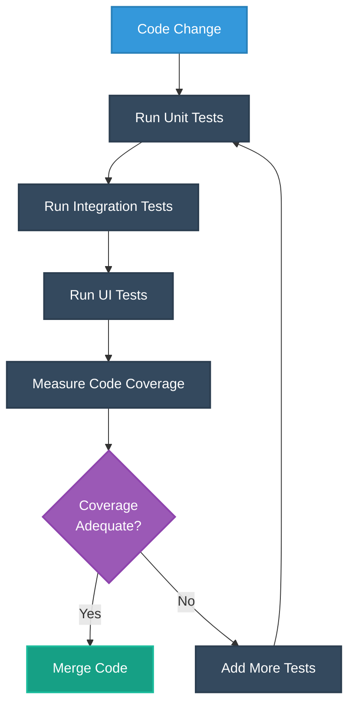
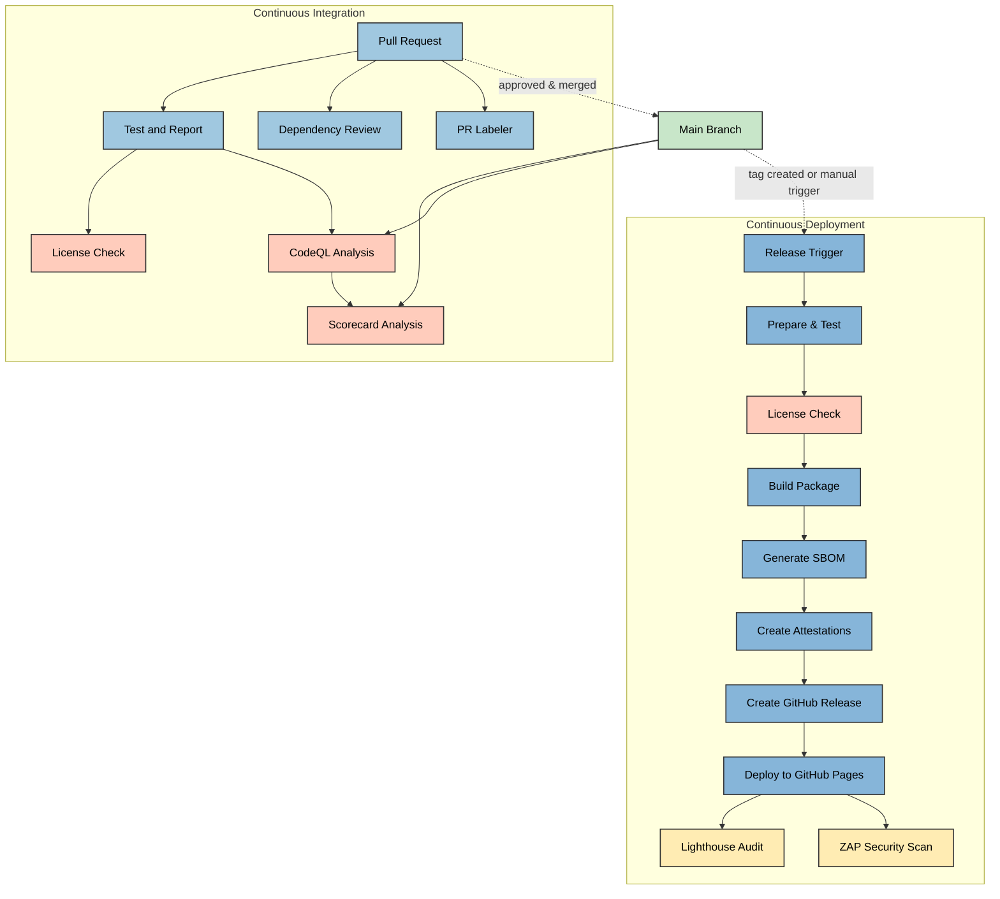
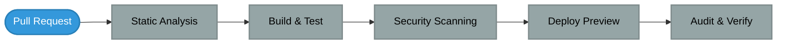

# 🔁 CIA Compliance Manager CI/CD Workflows

This document details the continuous integration and deployment workflows used in the CIA Compliance Manager project. The workflows automate testing, security scanning, and release procedures to ensure code quality and security compliance.

## 📚 Related Architecture Documentation

<div class="documentation-map">

| Document                                            | Focus           | Description                               |
| --------------------------------------------------- | --------------- | ----------------------------------------- |
| **[Current Architecture](ARCHITECTURE.md)**         | 🏛️ Architecture | C4 model showing current system structure |
| **[Future Architecture](FUTURE_ARCHITECTURE.md)**   | 🏛️ Architecture | Vision for context-aware platform         |
| **[State Diagrams](STATEDIAGRAM.md)**               | 🔄 Behavior     | Current system state transitions          |
| **[Future State Diagrams](FUTURE_STATEDIAGRAM.md)** | 🔄 Behavior     | Enhanced adaptive state transitions       |
| **[Process Flowcharts](FLOWCHART.md)**              | 🔄 Process      | Current security workflows                |
| **[Future Flowcharts](FUTURE_FLOWCHART.md)**        | 🔄 Process      | Enhanced context-aware workflows          |
| **[Mindmaps](MINDMAP.md)**                          | 🧠 Concept      | Current system component relationships    |
| **[Future Mindmaps](FUTURE_MINDMAP.md)**            | 🧠 Concept      | Future capability evolution               |
| **[SWOT Analysis](SWOT.md)**                        | 💼 Business     | Current strategic assessment              |
| **[Future SWOT Analysis](FUTURE_SWOT.md)**          | 💼 Business     | Future strategic opportunities            |
| **[Future Workflows](FUTURE_WORKFLOWS.md)**         | 🔧 DevOps       | Enhanced CI/CD with ML                    |
| **[Future Data Model](FUTURE_DATA_MODEL.md)**       | 📊 Data         | Context-aware data architecture           |

</div>

## 🔄 Workflow Overview

The project uses GitHub Actions for automation with the following workflows:

1. **🚀 Build, Attest and Release**: Builds, attests, and releases new versions with security scanning
2. **🧪 Test and Report**: Runs unit and E2E tests with coverage reporting
3. **🔍 CodeQL Analysis**: Security scanning for code vulnerabilities
4. **📦 Dependency Review**: Scanning of dependency changes for vulnerabilities
5. **⭐ Scorecard Analysis**: OSSF security scorecard for supply chain security
6. **📜 License Checking**: Verification of dependency licenses for compliance
7. **🏷️ PR Labeler**: Automated labeling of pull requests
8. **🔆 Lighthouse**: Performance, accessibility, and best practices auditing
9. **🔒 ZAP Scan**: Dynamic security scanning of deployed application

## 🔐 Security Hardening Practices

The CIA Compliance Manager implements industry best practices for securing CI/CD pipelines, with a particular focus on GitHub Action hardening using StepSecurity recommendations:


### Specific Hardening Measures

The project employs the following security hardening techniques in its workflows:

1. **🔒 Permissions Restriction**: Every workflow uses the principle of least privilege with explicit permissions declarations
   
   ```yaml
   permissions:
     contents: read
     actions: read
     checks: write
     pull-requests: write
   ```

2. **📌 SHA Pinning**: External actions are pinned to specific SHA hashes for immutability
   
   ```yaml
   - uses: actions/checkout@8ade135a41bc03ea155e62e844d188df1ea18608 # v4.1.0
   ```

3. **🪄 StepSecurity Auto-hardening**: Workflows are periodically scanned and updated with StepSecurity best practices

4. **📜 SBOM Generation**: Software Bill of Materials is generated during the release process for transparency

5. **✅ Attestation Creation**: Build and dependency attestations are created and signed during release

6. **⏱️ Timeout Limits**: All jobs have appropriate timeout limits to prevent resource exhaustion

7. **🔑 OIDC Token Usage**: GitHub OIDC tokens are used for secure authenticated deployments instead of long-lived secrets

## 🧪 Test and Report Workflow

The test-and-report workflow runs comprehensive testing and generates quality metrics for pull requests and pushes to the main branch:



### Test Workflow Implementation

The test-and-report workflow is implemented as a GitHub Action and includes the following key steps:

1. **Repository Checkout**: Securely checks out code with proper permissions
2. **Node.js Setup**: Sets up Node.js environment with caching for faster builds
3. **Dependency Installation**: Installs dependencies with audit checks
4. **Linting**: Runs code quality checks with ESLint
5. **Unit Tests**: Runs Vitest unit tests with coverage reporting
6. **E2E Tests**: Runs end-to-end tests with Cypress
7. **Report Generation**: Creates and uploads coverage and test reports

### Test Report and Metrics Generation

The workflow automatically generates and publishes the following metrics and reports:

1. **Code Coverage**: Vitest generates detailed code coverage reports showing statement, branch, function, and line coverage.

2. **Test Results**: All test results are aggregated and published as GitHub artifacts and comments on PRs.

3. **Performance Metrics**: Key performance metrics including:
   - Test execution times
   - Build performance metrics
   - Component rendering benchmarks

4. **Quality Gates**: The workflow enforces quality gates including:
   - Minimum 80% code coverage threshold
   - Zero failing tests
   - No TypeScript or linting errors
   - All security checks passing

## 🔐 Security Testing Integration

The workflow integrates with security testing tools to provide immediate feedback on potential security issues:


## 📊 Audit Reports and Security Artifacts

The CIA Compliance Manager automatically generates comprehensive security and quality audit reports:


### Audit Artifact Generation

The following audit artifacts are generated during the CI/CD process:

1. **📦 SBOM Generation**: A Software Bill of Materials is created using `cyclonedx-bom` during release:
   - Provides a complete inventory of all dependencies
   - Includes versions, licenses, and package metadata
   - Published as a release artifact
   - Used for vulnerability tracking

2. **🔏 Build Attestations**: The release workflow creates and signs attestations:
   - Build provenance attestations using SLSA framework
   - Dependency attestation documenting package sources
   - All attestations stored with release artifacts

3. **📈 Coverage Reports**: The test-and-report workflow generates and publishes:
   - Code coverage reports from Vitest
   - Unit and integration test results
   - Performance test metrics

4. **🔍 Security Scanning Results**: Multiple security scanning outputs are produced:
   - CodeQL vulnerability reports
   - ZAP scan findings
   - Dependency vulnerability assessments
   - OSSF Scorecard with supply chain security metrics

## Workflow Relationships



## 📜 License Checking Workflow

The project includes license checking as part of the CI/CD process to ensure all dependencies comply with the project's license requirements:


License checks are run both during PR verification and before releases to ensure compliance.

## 🚀 Release Workflow

The release workflow handles the build, attestation, and deployment process for new versions, triggered by version tags or manual workflow dispatch:


### Key Release Steps

The release workflow includes the following key steps:

1. **Setup Environment**: Configures Node.js with dependency caching
2. **Install Dependencies**: Uses `npm ci` with audit checks
3. **License Verification**: Ensures all dependencies have acceptable licenses
4. **Build Package**: Creates optimized production build
5. **SBOM Generation**: Creates Software Bill of Materials
6. **Create Attestations**: Generates and signs build provenance and dependency attestations
7. **Release Creation**: Creates GitHub release with artifacts
8. **GitHub Pages Deployment**: Deploys to GitHub Pages
9. **Post-Deployment Tests**: Runs Lighthouse and ZAP security scans

## 🔍 Security and Quality Scanning Workflows

Multiple security and quality scanning workflows validate different aspects of the codebase and deployed application.


### 🔍 CodeQL Analysis Workflow

Analyzes code for security vulnerabilities using GitHub's CodeQL engine. Runs on:

- Push to main branch
- Pull requests to main branch
- Weekly schedule (Mondays)

The CodeQL workflow uses customized query packs for JavaScript/TypeScript that include:
- Security vulnerability detection
- Code quality issues
- Control flow analysis
- Data flow analysis
- Type checking

Findings are reported directly to the GitHub Security tab with severity ratings and remediation guidance.

### 📦 Dependency Review

Scans dependency manifest changes in pull requests to identify vulnerable packages:

1. Checks for known vulnerabilities in new or updated dependencies
2. Flags vulnerabilities based on severity level
3. Provides remediation advice in PR comments
4. Enforces dependency policy requirements

### ⭐ Scorecard Analysis

Evaluates the project against OSSF security best practices:

1. Branch protection rules
2. Dependency management
3. Code signing
4. Other supply chain security practices

The Scorecard workflow runs weekly and uploads results to the GitHub Security tab, providing:
- Overall security score
- Individual scores for each category
- Improvement recommendations
- Trending information

### 🔆 Lighthouse Audit

Runs performance and best practices audits on the deployed application:

1. Performance metrics
2. Accessibility compliance
3. SEO optimization
4. PWA compatibility
5. Best practices adherence

The workflow uses a budget.json file to define performance budgets and thresholds, uploading results as artifacts and to temporary public storage for viewing.

### 🔒 ZAP Security Scan

Performs dynamic application security testing (DAST) on the deployed application:

1. Identifies common web vulnerabilities
2. API security scanning
3. Checks for OWASP Top 10 vulnerabilities
4. Generates comprehensive security reports

ZAP scans are performed using the OWASP ZAP Docker container against the deployed GitHub Pages site to identify runtime security issues that static analysis might miss.

## CI/CD Integration

Performance tests and license checks are integrated with CI/CD pipelines to catch performance regressions and licensing issues.

The integration approach follows a layered security model:



Each phase adds additional security and quality validation:

1. **Static Analysis**: ESLint, TypeScript, Dependency Review
2. **Build & Test**: Unit tests, E2E tests, Coverage checks
3. **Security Scanning**: CodeQL, License verification
4. **Deploy Preview**: Preview environments, Smoke tests
5. **Audit & Verify**: Lighthouse, ZAP, Accessibility testing

## Future CI/CD Improvements

While focusing on stabilizing the current workflows for the v1.0 release, the following enhancements are planned for future pipeline improvements:

1. **Automated Versioning**: Semantic versioning based on commit messages
2. **Performance Testing**: Expanding performance benchmarks with more metrics
3. **Security Scanning Enhancement**: Additional security scanners and threat modeling
4. **Containerization**: Docker image building and container scanning
5. **Environment-Specific Deployments**: Staging and production deployment pipelines
6. **Automated Accessibility Testing**: Extended accessibility compliance validation
7. **Continuous Performance Monitoring**: Trend analysis for performance metrics
8. **Vulnerability Management**: Automated vulnerability tracking and remediation workflows
9. **Compliance Reporting**: Automated compliance status reporting and auditing

For details on the future architecture direction, see [FUTURE_ARCHITECTURE.md](FUTURE_ARCHITECTURE.md).
