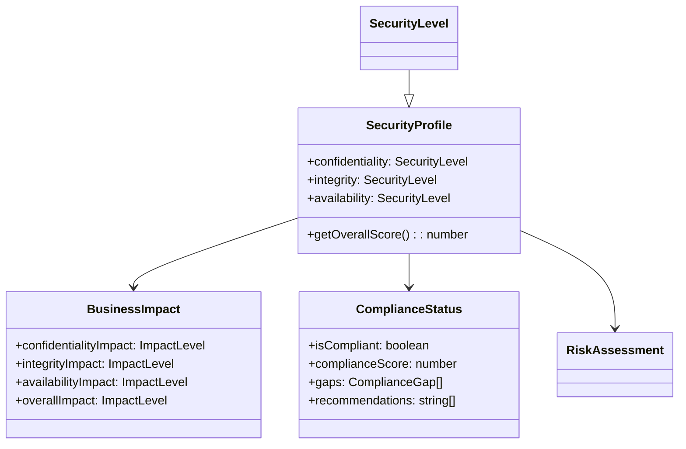
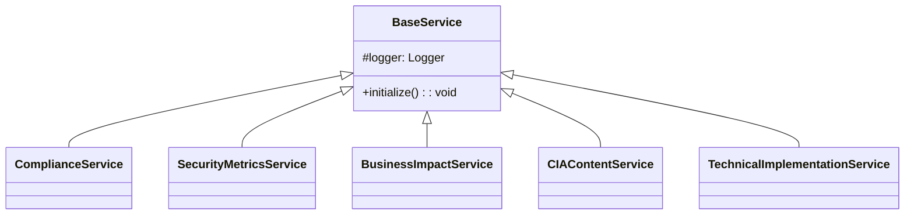

**CIA Compliance Manager Diagrams v1.1.3**

***

# CIA Compliance Manager - Architecture Diagrams

This documentation provides visual representations of the CIA Compliance Manager architecture through generated diagrams that help developers understand the system structure.

## About the Diagrams

These diagrams are automatically generated from the TypeScript codebase using TypeDoc and Mermaid. They provide insights into:

- Class relationships and inheritance hierarchies
- Component dependencies and composition patterns
- State and data flow
- Type relationships and interfaces

## Core Domain Model

At the heart of CIA Compliance Manager is the CIA Triad model, represented in these key relationships:

## Component Hierarchy

The diagrams illustrate the component hierarchy and relationships between:

### Application Structure
- **Root Application**: Main entry point and context providers
- **Widget Containers**: Layout components for organizing security widgets
- **Domain-Specific Widgets**: Specialized components for security assessment

### Component Organization
- **Assessment Widgets**: For security level selection and overview
- **Impact Analysis Widgets**: For visualizing CIA impact analysis
- **Implementation Widgets**: For security implementation guidance
- **Business Value Widgets**: For ROI and compliance analysis

## Service Architecture 

The service layer follows a well-defined hierarchy:

## Data Flow Diagrams

The data flow diagrams illustrate how information moves through the application:

### User Input Flow
- From security level selectors to security level context
- Through hooks to component props
- To visualization components and calculated metrics

### Service Interaction Patterns
- Component-to-service communication
- Service dependency hierarchies
- Data transformation patterns

## Type Relationship Diagrams

The type diagrams provide insights into the domain model:

### Core Domain Types
- **CIA Security Model**: Confidentiality, Integrity, and Availability types
- **Business Impact Model**: How security levels affect business outcomes
- **Compliance Model**: Framework requirements and compliance status

### Component Interface Hierarchy
- Widget prop interfaces and their relationships
- Common prop patterns and inheritance
- Type composition patterns

## Implementation Patterns

The diagrams reveal common implementation patterns:

### Service Architecture
- Base service patterns and inheritance
- Service adapter implementations
- Service composition patterns

### Component Composition
- Higher-order component patterns
- Component composition strategies
- Reusable UI building blocks

## How to Use These Diagrams

- **Architectural Understanding**: Use these diagrams to understand the overall structure
- **Component Selection**: Identify which components to use for specific requirements
- **Extension Planning**: Plan how to extend the system by understanding relationships
- **Dependency Analysis**: Identify component and service dependencies

These visualizations help developers understand the application structure and make informed design decisions when maintaining or extending the system.
