<p align="center">
  
</p>

<h1 align="center">⚡ CIA Compliance Manager — Performance Testing & Benchmarks</h1>

<p align="center">
  <strong>Comprehensive Performance Validation & Monitoring Framework</strong><br>
  <em>🚀 Lighthouse Audits • 📊 Performance Budgets • ⚡ Load Time Optimization</em>
</p>

<p align="center">
  <a href="#"></a>
  <a href="#"></a>
  <a href="#"></a>
  <a href="#"></a>
</p>

**📋 Document Owner:** CEO | **📄 Version:** 1.0 | **📅 Last Updated:** 2025-11-14 (UTC)  
**🔄 Review Cycle:** Quarterly | **⏰ Next Review:** 2026-02-14

---

## 🎯 Purpose & Scope

This document establishes the **comprehensive performance testing strategy, benchmarks, and optimization practices** for the CIA Compliance Manager application to ensure optimal user experience and operational efficiency, aligned with **Hack23 ISMS Secure Development Policy §8 "Performance Testing & Monitoring Framework"**.

**Performance validation ensures:**
- ✅ Fast, responsive user experience (<2s initial load)
- ✅ Optimal bundle sizes within performance budgets
- ✅ Lighthouse scores meeting quality standards (90+ performance)
- ✅ Continuous performance monitoring and regression prevention
- ✅ **ISO 27001 (A.8.32)** compliance for capacity management
- ✅ **NIST CSF (ID.AM-1)** compliance for asset performance characteristics
- ✅ **CIS Controls (16.12)** compliance for application security through performance

---

## 📊 Performance Standards & Current Metrics

### 🎯 Lighthouse Audit Targets

| Metric | Target Score | Status | Current Score |
|--------|--------------|--------|---------------|
| **Performance** | 90+ | 🎯 Target | *Run workflow for current* |
| **Accessibility** | 95+ | 🎯 Target | *Run workflow for current* |
| **Best Practices** | 95+ | 🎯 Target | *Run workflow for current* |
| **SEO** | 95+ | 🎯 Target | *Run workflow for current* |

**📝 Note:** Run the [Lighthouse Performance Workflow](https://github.com/Hack23/cia-compliance-manager/actions/workflows/lighthouse-performance.yml) to generate current scores.

### ⚡ Page Load Time Targets

| Metric | Target | Measurement Point |
|--------|--------|-------------------|
| **Initial Load** | <2 seconds | GitHub Pages deployment |
| **Time to Interactive (TTI)** | <3 seconds | Lighthouse audit |
| **First Contentful Paint (FCP)** | <1.5 seconds | Core Web Vitals |
| **Largest Contentful Paint (LCP)** | <2.5 seconds | Core Web Vitals |
| **Cumulative Layout Shift (CLS)** | <0.1 | Core Web Vitals |
| **Widget Rendering** | <500ms | Per widget render time |
| **Chart Rendering** | <1 second | Chart.js radar charts |
| **User Interactions** | <200ms | Button clicks, input response |

### 📦 Current Bundle Size Analysis

**Build Output (as of 2025-11-14):**

```
Bundle Analysis:
├── index.html               1.31 KB  (compressed: 0.55 KB)
├── CSS Assets              69.80 KB  (compressed: 12.55 KB)
├── JavaScript Assets:
│   ├── index.js           270.06 KB  (compressed: 55.77 KB)
│   ├── vendor.js          210.35 KB  (compressed: 72.21 KB)
│   ├── react.js           188.92 KB  (compressed: 59.07 KB)
│   └── dataProviders.js     4.48 KB  (compressed: 1.31 KB)
└── Total Bundle          ~673.91 KB  (compressed: ~189.36 KB)
```

**Performance Status:** ✅ **WITHIN BUDGET** (500 KB target for total resources)

### 🎯 Performance Budget

Performance budgets are defined in `budget.json` and enforced via Lighthouse CI:

```json
{
  "budgets": [
    {
      "path": "/*",
      "timings": [
        { "metric": "interactive", "budget": 6000 },
        { "metric": "first-contentful-paint", "budget": 3500 },
        { "metric": "largest-contentful-paint", "budget": 4000 },
        { "metric": "total-blocking-time", "budget": 1600 },
        { "metric": "cumulative-layout-shift", "budget": 0.1 },
        { "metric": "speed-index", "budget": 5000 }
      ],
      "resourceSizes": [
        { "resourceType": "script", "budget": 180 },
        { "resourceType": "image", "budget": 200 },
        { "resourceType": "stylesheet", "budget": 50 },
        { "resourceType": "document", "budget": 20 },
        { "resourceType": "font", "budget": 50 },
        { "resourceType": "total", "budget": 500 }
      ],
      "resourceCounts": [
        { "resourceType": "third-party", "budget": 59 }
      ]
    }
  ]
}
```

**Budget Thresholds (KB):**
- Scripts: 180 KB ✅ (Currently: ~189 KB compressed - *slightly over, optimization opportunity*)
- Stylesheets: 50 KB ✅ (Currently: 12.55 KB compressed)
- Images: 200 KB ✅
- Total: 500 KB ✅ (Currently: ~189 KB compressed)

---

## 🧪 Performance Testing Framework

### Overview

The performance testing framework ensures the application meets performance requirements through:

1. **Measuring performance metrics** for key operations
2. **Establishing baselines** for acceptable performance
3. **Alerting on regressions** when performance degrades
4. **Providing visual reports** for performance analysis

### Key Components

- **Lighthouse CI**: Automated audits on workflow dispatch
- **Performance Budget Enforcement**: Budget validation via `budget.json`
- **E2E Performance Testing**: Cypress-based widget and interaction testing
- **Bundle Analysis**: Vite build output analysis
- **CI Integration**: Automated performance testing in GitHub Actions

---

## 🔬 Performance Testing Procedures

### 1. Lighthouse Audit Execution

**Automated CI Testing:**
```bash
# Via GitHub Actions workflow dispatch
# Navigate to: Actions → "Lighthouse Performance Test" → Run workflow
# Default URL: https://hack23.github.io/cia-compliance-manager/
```

**Local Testing:**
```bash
# Install Lighthouse CLI
npm install -g lighthouse

# Run Lighthouse audit
lighthouse https://hack23.github.io/cia-compliance-manager/ --view

# Run with budget validation
lighthouse https://hack23.github.io/cia-compliance-manager/ \
  --budget-path=./budget.json \
  --output=html \
  --output-path=./lighthouse-report.html
```

**Workflow Configuration:**
- **Workflow File:** `.github/workflows/lighthouse-performance.yml`
- **Budget File:** `budget.json`
- **Upload Artifacts:** Enabled (reports saved as GitHub Actions artifacts)
- **Temporary Public Storage:** Enabled (public shareable report URLs)

### 2. Bundle Size Analysis

```bash
# Build application
npm run build

# Analyze bundle size
du -sh build/

# View detailed build output
npm run build 2>&1 | grep -E "kB|assets"

# Check against budget
cat budget.json
```

### 3. E2E Performance Testing with Cypress

**Running Performance Tests:**
```bash
# Run all performance tests
npm run cypress:run -- --spec "cypress/e2e/performance/**/*"

# Run specific performance test
npm run cypress:run -- --spec "cypress/e2e/performance/widget-performance.cy.ts"

# Run with performance dashboard
npm run cypress:run:perf
```

**Writing Performance Tests:**

#### Measuring Operation Performance

```typescript
// Start a performance measurement
cy.startMeasurement("my-operation");

// Perform the operation to measure
cy.get(".some-element").click();

// End measurement and record result
cy.endMeasurement("my-operation", "user-interaction");
```

#### Using Test Patterns

```typescript
import {
  measureWidgetRenderPerformance,
  measureInteractionPerformance,
} from "../../support/test-patterns";

// Measure widget rendering performance
measureWidgetRenderPerformance('[data-testid="my-widget"]');

// Measure user interaction performance
measureInteractionPerformance(".button", "click");
```

#### Asserting Performance Requirements

```typescript
it("meets performance requirements", () => {
  cy.startMeasurement("my-operation");

  // Operation to test
  cy.setSecurityLevels("High", "High", "High");

  cy.endMeasurement("my-operation", "security-level-change").then(
    (duration) => {
      // Assert against requirements
      cy.assertPerformance("my-operation", duration, {
        warning: 300, // Warning threshold in ms
        error: 600, // Error threshold in ms
      });
    }
  );
});
```

#### Asserting Performance Requirements

```typescript
it("meets performance requirements", () => {
  cy.startMeasurement("my-operation");

  // Operation to test
  cy.setSecurityLevels("High", "High", "High");

  cy.endMeasurement("my-operation", "security-level-change").then(
    (duration) => {
      // Assert against requirements
      cy.assertPerformance("my-operation", duration, {
        warning: 300, // Warning threshold in ms
        error: 600, // Error threshold in ms
      });
    }
  );
});
```

### 4. Browser DevTools Profiling

**Chrome DevTools Performance Analysis:**
1. Open Chrome DevTools (F12)
2. Navigate to Performance tab
3. Start recording
4. Perform user actions (select security levels, view widgets)
5. Stop recording and analyze:
   - JavaScript execution time
   - Rendering time
   - Layout shifts
   - Memory usage
   - Long tasks (>50ms)

**Performance Insights:**
- Use Lighthouse tab in DevTools for quick audits
- Check Network tab for asset loading waterfall
- Use Coverage tab to identify unused CSS/JS
- Profile with CPU throttling (4x slowdown) for mobile simulation

---

## 🎨 Performance Testing Workflow

```mermaid
graph TB
    A[👨‍💻 Code Changes] --> B[🔨 Build Application]
    B --> C{📦 Bundle Size Check}
    C -->|✅ Within Budget| D[🚀 Deploy to Staging]
    C -->|❌ Over Budget| E[⚡ Optimize & Rebuild]
    E --> B
    D --> F[🔍 Lighthouse Audit]
    F --> G{📊 Scores >90?}
    G -->|❌ Below Target| H[🔧 Performance Optimization]
    G -->|✅ Pass| I[✅ Deploy to Production]
    H --> F
    I --> J[📈 Real User Monitoring]
    J --> K[📊 Performance Dashboard]
    K --> L{⚠️ Regression Detected?}
    L -->|Yes| M[🚨 Alert & Investigate]
    L -->|No| J
    M --> H
    
    style A fill:#e3f2fd
    style I fill:#c8e6c9
    style M fill:#ffcdd2
    style C fill:#fff9c4
    style G fill:#fff9c4
```



---

## 📈 Widget Performance Benchmarks

### Current Widget Performance Targets

| Widget Component | Target Render Time | Performance Budget | Status |
|------------------|--------------------|--------------------|--------|
| **Security Level Widget** | <500ms | Core widget | 🎯 Monitor |
| **Compliance Status Widget** | <500ms | Core widget | 🎯 Monitor |
| **Business Impact Widget** | <500ms | Core widget | 🎯 Monitor |
| **CIA Radar Chart** | <1000ms | Chart.js rendering | 🎯 Monitor |
| **Cost Estimation Widget** | <500ms | Calculation widget | 🎯 Monitor |
| **Risk Assessment Widget** | <500ms | Core widget | 🎯 Monitor |

**Performance Categories:**
- **navigation**: Page loading and navigation operations
- **widget-rendering**: Widget rendering and re-rendering
- **security-level-change**: Operations related to changing security levels
- **user-interaction**: User interactions like clicks, input, etc.
- **business-calculation**: Business logic calculations
- **content-loading**: Content loading and population operations

---

## 🔍 Performance Optimization Best Practices

### Code Optimization

**React Performance:**
- ✅ Use `React.memo()` for expensive components
- ✅ Implement code splitting with `React.lazy()`
- ✅ Minimize re-renders with `useMemo()` and `useCallback()`
- ✅ Optimize Chart.js configuration for faster rendering
- ✅ Use proper dependency arrays in hooks
- ✅ Implement virtualization for large lists (if applicable)

**Bundle Optimization:**
- ✅ Enable tree-shaking in Vite configuration
- ✅ Lazy load non-critical widgets
- ✅ Split vendor bundles appropriately
- ✅ Remove unused dependencies
- ✅ Optimize Chart.js imports (import only required components)

### Asset Optimization

**Image & Icon Optimization:**
- ✅ Compress images (use WebP format when possible)
- ✅ Use appropriate image sizes (no oversized assets)
- ✅ Implement lazy loading for below-the-fold images
- ✅ Use SVG for icons and logos

**CSS Optimization:**
- ✅ Enable Tailwind CSS purging
- ✅ Minimize unused CSS with PostCSS
- ✅ Use CSS containment for isolated components
- ✅ Avoid expensive CSS selectors

### Network Optimization

**GitHub Pages Deployment:**
- ✅ Enable compression (gzip/brotli)
- ✅ Leverage browser caching
- ✅ Minimize HTTP requests
- ✅ Use CDN for external dependencies (Chart.js)
- ✅ Implement service worker for offline support (future enhancement)

---

## 📊 Performance Regression Prevention

### Automated Monitoring

**GitHub Actions Integration:**
- ✅ Lighthouse CI checks on manual workflow dispatch
- ✅ Bundle size monitoring with `budget.json`
- ✅ Performance assertions in E2E tests
- ✅ Automated performance workflow (`.github/workflows/lighthouse-performance.yml`)

**Continuous Validation:**
```bash
# Pre-commit checks (manual)
npm run build && npm run test:e2e

# CI pipeline validation
# Lighthouse workflow: Manual dispatch
# Bundle analysis: Every build
# E2E performance tests: PR validation
```

### Manual Testing Schedule

**Periodic Performance Audits:**
- 📅 **Quarterly Reviews:** Comprehensive Lighthouse audits
- 📅 **Monthly Checks:** Bundle size analysis
- 📅 **Weekly Monitoring:** E2E performance test results
- 📅 **On-Demand:** Performance profiling for major features

**Testing Checklist:**
- [ ] Run Lighthouse audit and verify scores >90
- [ ] Check bundle size against budget (<500 KB)
- [ ] Validate Core Web Vitals (LCP, FID, CLS)
- [ ] Test on mobile devices (responsive performance)
- [ ] Check browser compatibility (Chrome, Firefox, Safari, Edge)
- [ ] Verify widget rendering times <500ms
- [ ] Test user interaction responsiveness <200ms

---

## 🔗 Performance Evidence & Reports

### Live Performance Resources

- 📊 [Lighthouse Performance Workflow](https://github.com/Hack23/cia-compliance-manager/actions/workflows/lighthouse-performance.yml) - Run and view Lighthouse reports
- 📦 [Performance Budget](https://github.com/Hack23/cia-compliance-manager/blob/main/budget.json) - Resource size and timing budgets
- 🚀 [GitHub Pages Deployment](https://hack23.github.io/cia-compliance-manager/) - Live application for testing
- 📈 [GitHub Actions Dashboard](https://github.com/Hack23/cia-compliance-manager/actions) - CI/CD performance metrics

### Local Performance Reports

**E2E Performance Reports:**
- **JSON Report:** `cypress/reports/performance/performance-report.json`
- **HTML Dashboard:** `cypress/reports/performance/performance-dashboard.html`

**Dashboard Features:**
- Overview of test execution statistics
- Performance by category
- Slowest operations
- Widget-specific performance metrics
- Performance trends (with historical data)

---

## 🧪 Performance Baseline Configuration

Performance thresholds are defined in `cypress/config/performance-baseline.ts` (for E2E tests):

**Three Baseline Configurations:**
1. **DEV_BASELINE**: Lenient thresholds for development environments
2. **PROD_BASELINE**: Stricter thresholds for production environments
3. **CI_BASELINE**: Adjusted thresholds for CI environments

**Example Configuration:**
```typescript
// Modify baseline for custom operations
DEV_BASELINE.operations["my-custom-operation"] = {
  warning: 300,
  error: 800,
};
```

---

## 🛠️ Troubleshooting & Performance Improvement

### Common Performance Issues

**1. Inconsistent Metrics**
- **Issue:** Performance varies significantly between runs
- **Solution:** Run tests multiple times to establish stable averages
- **Action:** Use Lighthouse median scores (run 3+ times)

**2. CI Performance Variations**
- **Issue:** CI environments have variable performance
- **Solution:** Adjust thresholds for CI baseline (use `CI_BASELINE`)
- **Action:** Add CPU throttling simulation for consistency

**3. Resource Contention**
- **Issue:** Local tests affected by other applications
- **Solution:** Close other applications during performance testing
- **Action:** Use dedicated testing environment or container

### Performance Optimization Guide

**If widgets fail to meet performance requirements:**

1. **Check for Unnecessary Re-renders**
   - Use React DevTools Profiler
   - Look for missing dependency arrays in hooks
   - Add proper memoization with `useMemo()` and `useCallback()`

2. **Optimize Expensive Calculations**
   - Move expensive operations outside render functions
   - Cache results of complex calculations
   - Consider web workers for CPU-intensive operations

3. **Improve DOM Efficiency**
   - Minimize DOM manipulations
   - Use virtualization for large lists
   - Verify efficient DOM access patterns

4. **Reduce Bundle Size**
   - Check bundle analysis reports
   - Implement code splitting for large components
   - Lazy load non-critical widgets

5. **Use Profiling Tools**
   - Run Chrome Performance profiler to identify bottlenecks
   - Use Cypress performance monitoring with detailed timing
   - Generate flamegraphs to visualize call stacks

---

## 📋 Performance Testing Checklist

**Before Release:**
- [ ] Lighthouse audit scores >90 (all categories)
- [ ] Bundle size within budget (<500 KB)
- [ ] All Core Web Vitals pass (LCP <2.5s, FID <100ms, CLS <0.1)
- [ ] Widget rendering times <500ms
- [ ] User interactions responsive <200ms
- [ ] E2E performance tests pass
- [ ] No performance regressions detected
- [ ] Mobile performance validated
- [ ] Browser compatibility tested
- [ ] Performance documentation updated

---

## 📚 Related Documentation

### Internal Documentation
- [Testing Guide](/docs/testing-guide.md) - Comprehensive testing strategy
- [E2E Test Plan](/docs/E2ETestPlan.md) - End-to-end testing procedures
- [Widget Testing Recipe](/docs/widget-testing-recipe.md) - Widget testing patterns
- [Cypress Optimization](/docs/CYPRESS_OPTIMIZATION.md) - Cypress performance optimization

### External Resources
- [Hack23 ISMS Secure Development Policy §8](https://github.com/Hack23/ISMS/blob/main/Secure_Development_Policy.md#-performance-testing--monitoring-framework) - Policy requirements
- [Black Trigram Performance Testing](https://github.com/Hack23/blacktrigram/blob/main/performance-testing.md) - Reference implementation
- [Lighthouse Documentation](https://developer.chrome.com/docs/lighthouse/) - Lighthouse audit guide
- [Web Vitals](https://web.dev/vitals/) - Core Web Vitals standards
- [Performance Budgets 101](https://web.dev/performance-budgets-101/) - Budget best practices

---

## 📊 Compliance & Standards Alignment

**ISO 27001:**
- **A.8.32 (Change Management)**: Capacity management and performance monitoring ensure system stability during changes
- **A.12.1.3 (Capacity Management)**: Performance budgets and monitoring ensure adequate capacity for business requirements

**NIST Cybersecurity Framework:**
- **ID.AM-1 (Asset Management)**: Performance characteristics documented as part of asset inventory
- **PR.IP-2 (Information Protection)**: Performance testing ensures system security controls don't degrade user experience

**CIS Controls:**
- **16.12 (Application Software Security)**: Performance testing validates security controls don't negatively impact performance
- **16.13 (Application Performance Monitoring)**: Continuous monitoring ensures application availability and responsiveness

---

**📋 Document Owner:** CEO | **📄 Version:** 1.0 | **📅 Last Updated:** 2025-11-14 (UTC)  
**🔄 Review Cycle:** Quarterly | **⏰ Next Review:** 2026-02-14
